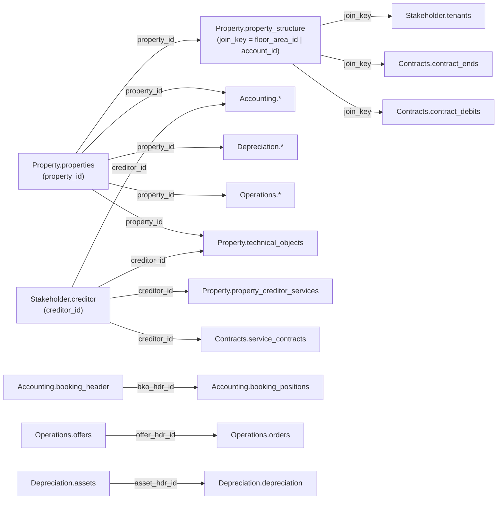

The Trassets Data API organises real-estate data into six domains, matching the category
tags exposed by the API itself (`GET /catalog` lists them live). Each domain contains
normalised category endpoints under `/{category}/{table}`, plus corresponding raw tables
under `/raw/{table_name}` for bulk export.

<CardGroup cols={2}>
  <Card title="Property" icon="building" href="/data-model/property">
    Objects, property-creditor services, the property structure tree, and technical objects.
  </Card>

  <Card title="Contracts" icon="file-contract" href="/data-model/contracts">
    Rental debits, debit diffs, service contracts, and contract ends.
  </Card>

  <Card title="Accounting" icon="book" href="/data-model/accounting">
    Chart of accounts, booking headers and positions, budgets, and account-range mappings.
  </Card>

  <Card title="Depreciation" icon="chart-line-down" href="/data-model/depreciation">
    Fixed assets and their depreciation postings.
  </Card>

  <Card title="Operations" icon="clipboard-list" href="/data-model/operations">
    Notifications, offers, orders, and projects.
  </Card>

  <Card title="Stakeholder" icon="users" href="/data-model/stakeholder">
    Creditors, employees, owners, and tenants.
  </Card>
</CardGroup>

<Note>
  Two domains referenced in earlier drafts of this documentation — **Meters** and
  **Market Data** — do not exist as live API categories. There is no meter-reading or
  consumption-data endpoint, and no market-benchmark endpoint. The only trace of metering
  in the current data model is an `is_meter` flag on individual `technical_objects` rows;
  utility consumption history is processed in a separate, internal pipeline that is not
  exposed through this API. Do not build integrations against a Meters or Market Data
  endpoint — they will 404.
</Note>

## How the domains connect

`property_id` is the primary join key. Every domain except `Stakeholder.creditor` carries
`property_id`, so any record can be attributed back to a property in `Property.properties`.

### Join keys in detail

| Key | Meaning | Cardinality |
|---|---|---|
| `property_id` | Identifies a property object in `Property.properties`. Present on nearly every table as a foreign key. | 1 property → many rows in every other domain |
| `join_key` | Produced by `Property.property_structure` (`= floor_area_id` for floor areas, `= account_id` for cost centres). Bridges bookings and tenancy data to a specific unit or cost centre. | 1 structure node → many bookings/tenancies |
| `floor_area_id` / `floor_area_person_id` / `property_id_person_id` | Composite keys that pin a tenancy to a specific unit (`floor_area_id`) or a specific tenant-in-unit (`floor_area_person_id`, `property_id_person_id`). Used by `Contracts.*` and `Stakeholder.tenants`. | 1 property → many units; 1 unit → many tenancies over time |
| `creditor_id` | Identifies a vendor/creditor in `Stakeholder.creditor`. | 1 creditor → many service contracts, bookings, technical objects |
| `bko_hdr_id` / `booking_hdr_id` | Groups booking line items under one booking header. | 1 `booking_header` → many `booking_positions` |
| `account_hdr_id` | Identifies a ledger account. Referenced by `budgets` and `booking_positions`. | 1 `accounts` row → many bookings/budgets |
| `offer_hdr_id` | Links an offer to the orders placed against it. | 1 `offers` row → many `orders` |
| `asset_hdr_id` | Identifies a fixed asset. Referenced by `depreciation` postings. | 1 `assets` row → many `depreciation` postings |

<Note>
  Cardinalities above describe the intended data model (1:N via foreign key columns). They
  are not independently verified against live row counts — if you rely on strict uniqueness
  for a key, validate it against your own dataset first.
</Note>
