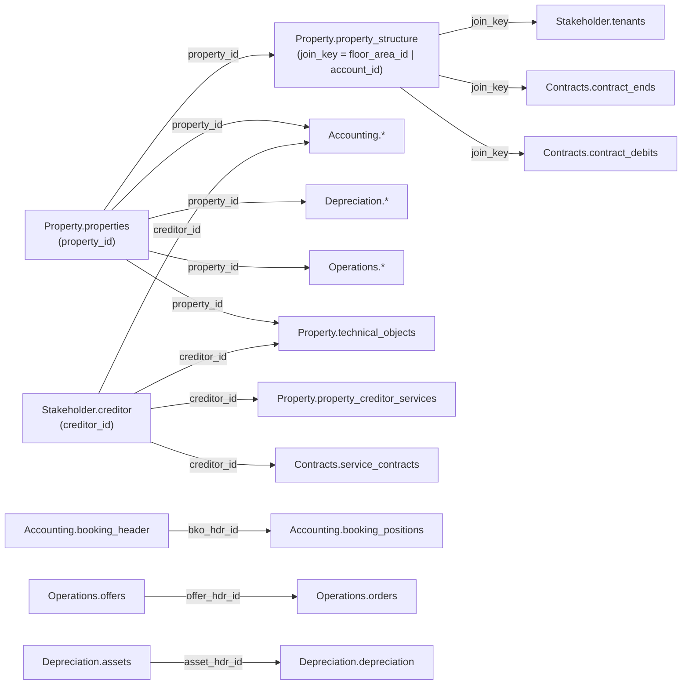

Die Trassets Data API organisiert Immobiliendaten in sechs Domänen, die den Kategorie-Tags
entsprechen, die die API selbst offenlegt (`GET /catalog` listet sie live auf). Jede Domäne
enthält normalisierte Category-Endpunkte unter `/{category}/{table}`, sowie entsprechende
Raw-Tabellen unter `/raw/{table_name}` für den Bulk-Export.

<CardGroup cols={2}>
  <Card title="Property" icon="building" href="/de/data-model/property">
    Objekte, Objekt-Kreditor-Dienstleistungen, der Objektstrukturbaum und technische Objekte.
  </Card>

  <Card title="Contracts" icon="file-contract" href="/de/data-model/contracts">
    Mietsollstellungen, Sollstellungsabweichungen, Dienstleistungsverträge und Vertragsenden.
  </Card>

  <Card title="Accounting" icon="book" href="/de/data-model/accounting">
    Kontenplan, Buchungsköpfe und -positionen, Budgets und Kontenmapping-Bereiche.
  </Card>

  <Card title="Depreciation" icon="chart-line-down" href="/de/data-model/depreciation">
    Anlagegüter und ihre Abschreibungsbuchungen.
  </Card>

  <Card title="Operations" icon="clipboard-list" href="/de/data-model/operations">
    Meldungen, Angebote, Aufträge und Projekte.
  </Card>

  <Card title="Stakeholder" icon="users" href="/de/data-model/stakeholder">
    Kreditoren, Mitarbeiter, Eigentümer und Mieter.
  </Card>
</CardGroup>

<Note>
  Zwei Domänen, auf die in früheren Entwürfen dieser Dokumentation verwiesen wurde — **Meters**
  und **Market Data** — existieren nicht als Live-API-Kategorien. Es gibt keinen Endpunkt für
  Zählerstände oder Verbrauchsdaten und keinen Endpunkt für Marktvergleichswerte. Die einzige
  Spur von Metering im aktuellen Datenmodell ist ein `is_meter`-Flag auf einzelnen
  `technical_objects`-Zeilen; der Verlauf des Energieverbrauchs wird in einer separaten,
  internen Pipeline verarbeitet, die nicht über diese API bereitgestellt wird. Baue keine
  Integrationen gegen einen Meters- oder Market-Data-Endpunkt — sie liefern einen 404-Fehler.
</Note>

## Wie die Domänen zusammenhängen

`property_id` ist der primäre Verknüpfungsschlüssel. Jede Domäne außer `Stakeholder.creditor`
führt `property_id`, sodass sich jeder Datensatz auf ein Objekt in `Property.properties`
zurückführen lässt.

### Verknüpfungsschlüssel im Detail

| Key | Bedeutung | Kardinalität |
|---|---|---|
| `property_id` | Identifiziert ein Objekt in `Property.properties`. Auf fast jeder Tabelle als Fremdschlüssel vorhanden. | 1 Objekt → viele Zeilen in jeder anderen Domäne |
| `join_key` | Wird von `Property.property_structure` erzeugt (`= floor_area_id` für Flächen, `= account_id` für Kostenstellen). Verbindet Buchungs- und Mietvertragsdaten als Bridge-Key mit einer bestimmten Einheit oder Kostenstelle. | 1 Strukturknoten → viele Buchungen/Mietverhältnisse |
| `floor_area_id` / `floor_area_person_id` / `property_id_person_id` | Zusammengesetzte Schlüssel, die ein Mietverhältnis an eine bestimmte Einheit (`floor_area_id`) oder einen bestimmten Mieter in einer Einheit (`floor_area_person_id`, `property_id_person_id`) binden. Werden von `Contracts.*` und `Stakeholder.tenants` verwendet. | 1 Objekt → viele Einheiten; 1 Einheit → viele Mietverhältnisse über die Zeit |
| `creditor_id` | Identifiziert einen Dienstleister/Kreditor in `Stakeholder.creditor`. | 1 Kreditor → viele Dienstleistungsverträge, Buchungen, technische Objekte |
| `bko_hdr_id` / `booking_hdr_id` | Gruppiert Buchungspositionen unter einem Buchungskopf. | 1 `booking_header` → viele `booking_positions` |
| `account_hdr_id` | Identifiziert ein Konto im Hauptbuch. Wird von `budgets` und `booking_positions` referenziert. | 1 `accounts`-Zeile → viele Buchungen/Budgets |
| `offer_hdr_id` | Verknüpft ein Angebot mit den dazu erstellten Aufträgen. | 1 `offers`-Zeile → viele `orders` |
| `asset_hdr_id` | Identifiziert ein Anlagegut. Wird von `depreciation`-Buchungen referenziert. | 1 `assets`-Zeile → viele `depreciation`-Buchungen |

<Note>
  Die oben genannten Kardinalitäten beschreiben das beabsichtigte Datenmodell (1:N über
  Fremdschlüsselspalten). Sie sind nicht unabhängig gegen Live-Zeilenzahlen verifiziert — wenn
  du dich auf strikte Eindeutigkeit eines Schlüssels verlässt, validiere dies zuerst gegen
  deinen eigenen Datensatz.
</Note>
