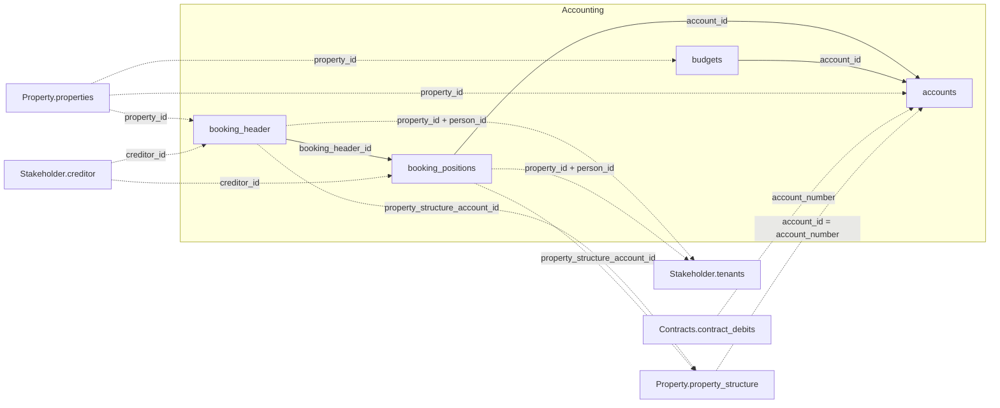

Die vier Tabellen unten verknüpfen sich untereinander und mit drei weiteren Domänen —
Property, Contracts und Stakeholder. Das vollständige Cross-Domain-Diagramm steht in der
[Datenmodell-Übersicht](/de/v1/data-model/overview).

*Durchgezogene Kanten sind Joins innerhalb von Accounting; gestrichelte Kanten gehen in eine
andere Domäne.*

### So hängt das Buchungsmodell zusammen

Ein Buchungsvorgang hat einen `booking_header`, der alle dabei ausgelösten Buchungen
(`booking_positions`) vereint. Eine Buchung kann ein Sachkonto, ein Personenkonto, ein
Kreditorkonto, ein Projektkonto oder eine Kostenstelle betreffen — siehe
`accounts.account_type_name`. Da es je Vorgang in der Regel nur eine Buchung auf ein
Kreditor-, Personen- oder Kostenstellenkonto gibt, stehen diese bereits direkt auf
`booking_header` (`creditor_id`, `person_id`, `property_structure_account_id`) — eine
Verknüpfung über `accounts` ist dafür nicht nötig.

Jeder Buchungsvorgang gehört zu genau einem Objekt. Zu einem Konto kann es ein Budget
(`budgets`) für einen bestimmten Monat geben. Eine Kostenstelle ist immer mit einem Teil
der Objektstruktur (`property_structure`) verbunden. Sollstellungen
(`Contracts.contract_debits`, `Contracts.contract_debit_diffs`) referenzieren immer ein in
`accounts` gelistetes Personenkonto, über `account_number`.

<Note>
  `accounts`-Zeilen mit `account_type_name` `"Kreditorkonto"` stehen für ein
  Kreditor-Buchungsziel, aber ihre `account_id` entspricht nicht
  `Stakeholder.creditor.creditor_id` — dafür gibt es keine direkte Verknüpfung. Der
  Kreditor eines Vorgangs steht stattdessen direkt auf `booking_header.creditor_id` /
  `booking_positions.creditor_id`.
</Note>

<Note>
  Buchungen auf einem Personenkonto (Mieter) sind nur auf Objektebene mit einem Mieter
  verknüpfbar (`property_id` + `person_id`), nicht bis auf eine bestimmte Einheit herunter.
  Bewohnt ein Mieter mehrere Einheiten desselben Objekts, lassen sich seine Buchungen nicht
  zwischen ihnen aufteilen.
</Note>

## accounts

`GET /v1/accounting/accounts` — der Kontenplan. Umfasst Sachkonten, Personenkonten,
Kreditorkonten, Projektkonten, Kostenstellen und Anlagenkonten — siehe
`account_type_name`.

<ResponseField name="property_id" type="string" required>
  Eindeutige Objekt-ID.
</ResponseField>

<ResponseField name="account_id" type="integer" required>
  Interne Konto-ID. Wird von `booking_positions` und `budgets` als `account_id`
  referenziert.
</ResponseField>

<ResponseField name="account_number" type="string">
  Kontonummer. `null` bei Kontoarten, die keine Nummer führen (z. B. Personen- und
  Kreditorkonten).
</ResponseField>

<ResponseField name="account_name" type="string">
  Kontoname.
</ResponseField>

<ResponseField name="account_type_name" type="string">
  Kontoart: Sachkonto, Personenkonto, Kreditorkonto, Projektkonto, Kostenstelle oder
  Anlagenkonto.
</ResponseField>

<ResponseField name="category" type="string">
  Reporting-Kategorie des Kontos (z. B. Einnahmen, Ausgaben, Abschreibungen).
</ResponseField>

<ResponseField name="group" type="string">
  Ob das Konto ergebniswirksam oder bilanzneutral ist.
</ResponseField>

<ResponseField name="nr" type="integer">
  Sortiernummer der Position innerhalb ihrer Kategorie.
</ResponseField>

<Note>
  `nr` ist bei manchen Konten `null`, je nachdem wie das Konto klassifiziert wurde.
  `category` und `group` sind in dem Fall trotzdem befüllt.
</Note>

<ResponseField name="account_group" type="string">
  Kontengruppe, der das Konto zugeordnet ist.
</ResponseField>

<ResponseField name="account_tax_code" type="integer">
  Steuerschlüssel des Kontos.
</ResponseField>

<ResponseField name="account_tax_appliance" type="integer">
  MwSt-Behandlungsmethode.
</ResponseField>

<ResponseField name="account_balance_type" type="object">
  Bilanzseiten-Klassifizierung, wie auf dem Konto hinterlegt.
  <Expandable title="properties">
    <ResponseField name="code" type="integer">
      Bilanzseiten-Code: `1` oder `2`; `0` wenn nicht klassifiziert.
    </ResponseField>
    <ResponseField name="label" type="string">
      Lesbare Bezeichnung zum Code.
    </ResponseField>
  </Expandable>
</ResponseField>

<ResponseField name="accounting_entity" type="string">
  Objekt-ID der buchenden Einheit.
</ResponseField>

<ResponseField name="property_success_model" type="integer">
  Erfolgsmodell-Code des Objekts.
</ResponseField>

<ResponseField name="property_tax_type" type="integer">
  Steuermodell-Code des Objekts.
</ResponseField>

## booking_header

`GET /v1/accounting/booking_header` — Hauptbuch-Buchungsköpfe. Jeder Kopf gruppiert
zusammengehörige Positionen.

<ResponseField name="property_id" type="string" required>
  Eindeutige Objekt-ID.
</ResponseField>

<ResponseField name="booking_header_id" type="integer" required>
  Eindeutige ID des Buchungskopfs. `booking_positions` referenziert dies als
  `booking_header_id`.
</ResponseField>

<ResponseField name="booking_nr" type="integer">
  Laufende Nummer der Buchung im Journal (Primanota) — dem chronologischen Buchungsprotokoll.
</ResponseField>

<ResponseField name="creditor_id" type="string">
  Mit der Buchung verknüpfter Kreditor. Referenziert `Stakeholder.creditor`.
</ResponseField>

<ResponseField name="person_id" type="string">
  Mit der Buchung verknüpfter Mieter oder Ansprechpartner.
</ResponseField>

<ResponseField name="booking_date" type="date">
  Datum der Buchung.
</ResponseField>

<ResponseField name="booking_value" type="number">
  Gesamtwert des Buchungskopfs.
</ResponseField>

<ResponseField name="m2" type="number">
  Mit der Buchung verbundene Fläche in Quadratmetern, falls zutreffend.
</ResponseField>

<ResponseField name="booking_text" type="string">
  Freitextbeschreibung des gesamten Buchungsvorgangs. Einzelne Positionen können einen
  abweichenden Text tragen — siehe `booking_positions.booking_position_text`.
</ResponseField>

<ResponseField name="initial_booking_text" type="string">
  Ursprünglicher Buchungstext, vor Bearbeitungen.
</ResponseField>

<ResponseField name="booking_barcode" type="string">
  Belegnummer / Barcode.
</ResponseField>

<ResponseField name="dms_link" type="string">
  Link zum verknüpften Dokument im DMS.
</ResponseField>

<ResponseField name="cost_center_id_name_concat" type="string">
  Kostenstellen-ID und -Name, zur Anzeige (z. B. in Power BI) bereits kombiniert. Kein
  Verknüpfungsschlüssel.
</ResponseField>

<ResponseField name="property_structure_account_id" type="string">
  Verbindet diese Buchung mit einer Kostenstelle oder Einheit in
  `Property.property_structure`.
</ResponseField>

## booking_positions

`GET /v1/accounting/booking_positions` — einzelne Buchungspositionen. Jede Position
gehört über `booking_header_id` zu genau einem Buchungskopf.

<ResponseField name="booking_position_id" type="integer" required>
  Eindeutige ID der Position.
</ResponseField>

<ResponseField name="booking_header_id" type="integer" required>
  ID des übergeordneten Buchungskopfs. Verknüpft sich mit
  `booking_header.booking_header_id`.
</ResponseField>

<ResponseField name="account_id" type="integer" required>
  Konto, auf das die Position gebucht wird. Verknüpft sich mit `accounts.account_id`.
</ResponseField>

<ResponseField name="contra_account_id" type="integer">
  Gegenkonto für die Buchung, als Kontonummer — nicht derselbe Wertebereich wie
  `accounts.account_id`.
</ResponseField>

<ResponseField name="property_id" type="string" required>
  Eindeutige Objekt-ID.
</ResponseField>

<ResponseField name="property_id_person_id" type="integer">
  Zusammengesetzter Schlüssel, der den Mieter identifiziert, auf den sich diese Buchung
  bezieht. Nicht verlässlich aus `property_id` und `person_id` rekonstruierbar — direkt
  lesen.
</ResponseField>

<ResponseField name="creditor_id" type="string">
  Mit der Buchung verknüpfter Kreditor. Referenziert `Stakeholder.creditor`.
</ResponseField>

<ResponseField name="person_id" type="integer">
  Mit der Buchung verknüpfter Mieter oder Ansprechpartner.
</ResponseField>

<ResponseField name="property_structure_account_id" type="string">
  Verbindet diese Buchung mit einer Kostenstelle oder Einheit in
  `Property.property_structure`.
</ResponseField>

<ResponseField name="period" type="object">
  Leistungszeitraum, den die Position abdeckt.
  <Expandable title="properties">
    <ResponseField name="start" type="date">
      Beginn des Leistungszeitraums.
    </ResponseField>
    <ResponseField name="end" type="date">
      Ende des Leistungszeitraums.
    </ResponseField>
  </Expandable>
</ResponseField>

<ResponseField name="amount" type="object">
  Netto-, Steuer- und Bruttobetrag der Position.
  <Expandable title="properties">
    <ResponseField name="net" type="number">
      Nettobetrag.
    </ResponseField>
    <ResponseField name="tax" type="number">
      Steuerbetrag.
    </ResponseField>
    <ResponseField name="gross" type="number">
      Bruttobetrag inklusive Steuer.
    </ResponseField>
  </Expandable>
</ResponseField>

<ResponseField name="amount_per_sqm" type="object">
  `amount`, je Quadratmeter normalisiert.
  <Expandable title="properties">
    <ResponseField name="net" type="number">
      Nettobetrag je Quadratmeter.
    </ResponseField>
    <ResponseField name="tax" type="number">
      Steuerbetrag je Quadratmeter.
    </ResponseField>
    <ResponseField name="gross" type="number">
      Bruttobetrag je Quadratmeter.
    </ResponseField>
  </Expandable>
</ResponseField>

<ResponseField name="account_group" type="string">
  Kontengruppe aus dem Kontenmapping.
</ResponseField>

<ResponseField name="booking_date" type="date">
  Datum der Buchung.
</ResponseField>

<ResponseField name="booking_nr" type="integer">
  Laufende Nummer der Buchung im Journal (Primanota) — dem chronologischen Buchungsprotokoll.
</ResponseField>

<ResponseField name="booking_Lfd_nr" type="integer">
  Laufende Positionsnummer innerhalb der Buchung.
</ResponseField>

<ResponseField name="booking_type" type="integer">
  Buchungsart-Code.
</ResponseField>

<ResponseField name="contra_account_name" type="string">
  Name des Gegenkontos. Direkt auf dieser Tabelle geführt — nicht durch eine Verknüpfung
  von `contra_account_id` gegen `accounts` ableitbar.
</ResponseField>

<ResponseField name="booking_position_text" type="string">
  Freitextbeschreibung dieser Position. Kann vom Buchungstext des Buchungskopfs
  (`booking_header.booking_text`) abweichen.
</ResponseField>

<ResponseField name="sh" type="string">
  Soll/Haben-Kennzeichen. Nicht verlässlich aus dem Vorzeichen von `amount.net` ableitbar.
</ResponseField>

<ResponseField name="HNDL" type="number">
  Bedeutung mit dem Quellsystem noch nicht geklärt — keine Bedeutung aus dem Namen ableiten.
</ResponseField>

## budgets

`GET /v1/accounting/budgets` — Budgetbeträge, eine Zeile pro Objekt, Konto und Monat.

<ResponseField name="property_id" type="string" required>
  Eindeutige Objekt-ID.
</ResponseField>

<ResponseField name="account_id" type="integer" required>
  Konto, auf das sich das Budget bezieht. Verknüpft sich mit `accounts.account_id`.
</ResponseField>

<ResponseField name="account_number" type="string">
  Kontonummer.
</ResponseField>

<ResponseField name="date" type="date" required>
  Monat, auf den sich die Budgetzeile bezieht.
</ResponseField>

<ResponseField name="budget" type="number" required>
  Budgetbetrag für den spezifischen Monat und das Konto.
</ResponseField>
