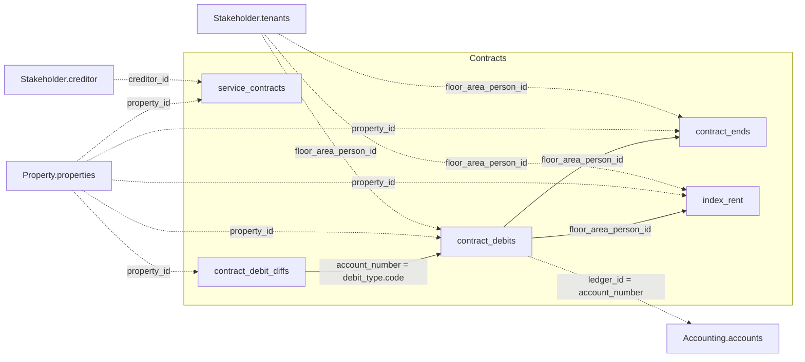

Die fünf Tabellen unten verknüpfen sich untereinander und mit drei weiteren Domänen —
Property, Accounting und Stakeholder. Das vollständige Cross-Domain-Diagramm steht in der
[Datenmodell-Übersicht](/de/v1/data-model/overview).

*Durchgezogene Kanten sind Joins innerhalb von Contracts; gestrichelte Kanten gehen in eine
andere Domäne.*

## service_contracts

`GET /v1/contracts/service_contracts` — Wartungs- und Dienstleistungsverträge.

<ResponseField name="property_id" type="string" required>
  Eindeutige Objekt-ID.
</ResponseField>

<ResponseField name="contract_period" type="object">
  Gültigkeitszeitraum des Vertrags.
  <Expandable title="properties">
    <ResponseField name="start" type="date">
      Vertragsbeginn.
    </ResponseField>
    <ResponseField name="end" type="date">
      Vertragsende.
    </ResponseField>
  </Expandable>
</ResponseField>

<ResponseField name="creditor_id" type="string" required>
  Identifiziert den Dienstleister. Referenziert `Stakeholder.creditor`.
</ResponseField>

<ResponseField name="creditor_name" type="string">
  Anzeigename des Dienstleisters.
</ResponseField>

<ResponseField name="contract_id" type="string" required>
  Vertrags-ID.
</ResponseField>

<ResponseField name="contract_number" type="string">
  Lesbare Vertragsnummer.
</ResponseField>

<ResponseField name="contract_name" type="string">
  Vertragsname.
</ResponseField>

<ResponseField name="contract_category" type="string">
  Vertragskategorie.
</ResponseField>

<ResponseField name="contract_type" type="string">
  Vertragstyp.
</ResponseField>

<ResponseField name="contract_value" type="number">
  Vertragswert.
</ResponseField>

<ResponseField name="contract_value_year" type="number">
  Vertragswert, auf einen Jahreswert normalisiert.
</ResponseField>

<ResponseField name="contract_reasoning" type="string">
  Begründungscode für den Vertrag.
</ResponseField>

<ResponseField name="contract_reasoning_comment" type="string">
  Freitextkommentar zur Vertragsbegründung.
</ResponseField>

## contract_debit_diffs

`GET /v1/contracts/contract_debit_diffs` — monatliche Abweichungen zwischen dem
Sollstellungsziel und den tatsächlichen Kontobewegungen. Nutze dies, um geplante
Sollstellungen mit dem realisierten Zahlungsfluss abzugleichen.

<ResponseField name="property_id" type="string" required>
  Eindeutige Objekt-ID.
</ResponseField>

<ResponseField name="debit_diff_value" type="object">
  Netto-, Steuer- und Bruttoabweichungsbetrag für den Zeitraum.
  <Expandable title="properties">
    <ResponseField name="net" type="number">
      Netto-Abweichungsbetrag.
    </ResponseField>
    <ResponseField name="tax" type="number">
      Steueranteil der Abweichung.
    </ResponseField>
    <ResponseField name="gross" type="number">
      Brutto-Abweichungsbetrag inklusive Steuer.
    </ResponseField>
  </Expandable>
</ResponseField>

<ResponseField name="account_number" type="string">
  Sollart-Code, auf den sich die Abweichung bezieht. Trotz des Feldnamens kein
  Kontenbezug — entspricht `contract_debits.debit_type.code`, nicht
  `Accounting.accounts`.
</ResponseField>

<ResponseField name="person_id" type="string">
  Mieter-ID.
</ResponseField>

<ResponseField name="valid_from" type="date" required>
  Monat, auf den sich die Abweichung bezieht.
</ResponseField>

<ResponseField name="debit_diff_reminder_from" type="date">
  Datum, von dem an eine Zahlungserinnerung für diese Abweichung gilt, falls vorhanden.
</ResponseField>

<ResponseField name="debit_diff_reminder_manual" type="boolean">
  Ob die Erinnerung manuell gesetzt wurde statt automatisch erzeugt.
</ResponseField>

## contract_debits

`GET /v1/contracts/contract_debits` — Mietsollstellungspositionen als Zeitreihe. Jeder
Datensatz repräsentiert eine geplante Sollstellung mit einem Gültigkeitsintervall.

<ResponseField name="property_id" type="string" required>
  Eindeutige Objekt-ID.
</ResponseField>

<ResponseField name="floor_area_id" type="string">
  Referenziert die Einheit in `Property.property_structure`.
</ResponseField>

<ResponseField name="floor_area_person_id" type="string">
  Identifiziert das Mietverhältnis, auf das sich diese Sollstellung bezieht.
</ResponseField>

<ResponseField name="property_id_person_id" type="integer">
  Zusammengesetzter Schlüssel, der den Mieter auf Objektebene identifiziert.
</ResponseField>

<ResponseField name="ledger_id" type="string">
  Konto, auf das die Sollstellung gebucht wird. Entspricht
  `Accounting.accounts.account_number`, nicht `account_id`.
</ResponseField>

<ResponseField name="debit_period" type="object">
  Gültigkeitsintervall der Sollstellung.
  <Expandable title="properties">
    <ResponseField name="start" type="date">
      Beginn des Gültigkeitsintervalls.
    </ResponseField>
    <ResponseField name="end" type="date">
      Ende des Gültigkeitsintervalls. `null` bei unbefristeter Sollstellung.
    </ResponseField>
  </Expandable>
</ResponseField>

<ResponseField name="due_date_day" type="integer">
  Tag des Monats, an dem die Sollstellung fällig ist. `null`, wenn im Quellsystem kein
  Tag gesetzt ist.
</ResponseField>

<ResponseField name="debit_type" type="object">
  Art der Sollstellung als Code+Label-Paar (z. B. Miete oder Nebenkosten).
  <Expandable title="properties">
    <ResponseField name="code" type="integer">
      Sollart-Code. Entspricht `contract_debit_diffs.account_number` — trotz ähnlichen
      Namens kein Konto.
    </ResponseField>
    <ResponseField name="label" type="string">
      Lesbares Label, z. B. "Nettokaltmiete Wohnung".
    </ResponseField>
  </Expandable>
</ResponseField>

<ResponseField name="debit_amount" type="number" required>
  Der Sollstellungsbetrag für das Gültigkeitsintervall.
</ResponseField>

<ResponseField name="account_group" type="string">
  Kontengruppe aus dem Kontenmapping.
</ResponseField>

<ResponseField name="state" type="string">
  Status des Sollstellungsdatensatzes.
</ResponseField>

<ResponseField name="tax_type" type="boolean">
  Ob die Sollstellung umsatzsteuerpflichtig ist.
</ResponseField>

<ResponseField name="net_rent" type="boolean">
  Ob die Sollstellung einen Nettomietanteil enthält.
</ResponseField>

<ResponseField name="side_costs" type="boolean">
  Ob die Sollstellung einen Nebenkostenanteil enthält.
</ResponseField>

<Tip>
  Nutze `floor_area_id`, um Sollstellungsdaten mit `Property.property_structure` zu
  verknüpfen, oder `floor_area_person_id`, um sie mit einem bestimmten Mietverhältnis in
  `Stakeholder.tenants` zu verknüpfen.
</Tip>

## contract_ends

`GET /v1/contracts/contract_ends` — Mietvertragsenden und die Handhabung von
Verlängerungen/Optionen. Nutze dies, um anstehende Vertragsabläufe, Fristen für die
Ausübung von Optionen und den aktuellen Ausübungsstatus zu verfolgen.

<Note>
  Dieser Endpunkt verlangt den Query-Parameter `property_id` — eine Anfrage ohne ihn
  beantwortet die API mit `400 Bad Request` und `"Missing required filter(s):
  ['property_id']"`. Siehe [Filterung](/de/concepts/filtering).
</Note>

<ResponseField name="property_id" type="string" required>
  Eindeutige Objekt-ID.
</ResponseField>

<ResponseField name="floor_area_id" type="integer">
  Referenziert die Einheit in `Property.property_structure`.
</ResponseField>

<ResponseField name="floor_area_person_id" type="string">
  Identifiziert das Mietverhältnis, auf das sich dieser Datensatz bezieht.
</ResponseField>

<ResponseField name="period" type="object">
  Beginn des Mietverhältnisses und dessen tatsächliches Ende nach Anwendung jeglicher
  Optionslogik.
  <Expandable title="properties">
    <ResponseField name="start" type="date">
      Beginn des Mietverhältnisses.
    </ResponseField>
    <ResponseField name="end" type="date">
      Tatsächliches Ende des Mietverhältnisses.
    </ResponseField>
  </Expandable>
</ResponseField>

<ResponseField name="contract_end_new" type="date">
  Neues Enddatum, falls das Mietverhältnis verlängert wurde.
</ResponseField>

<ResponseField name="contract_prolongation_months" type="integer">
  Verlängerungsdauer in Monaten.
</ResponseField>

<ResponseField name="request_date" type="date">
  Datum, an dem der Mieter aufgefordert wurde, über eine Verlängerungsoption zu
  entscheiden.
</ResponseField>

<ResponseField name="response_deadline" type="date">
  Frist für die Antwort des Mieters.
</ResponseField>

<ResponseField name="tenant_response_date" type="date">
  Datum, an dem der Mieter tatsächlich geantwortet hat.
</ResponseField>

<ResponseField name="response_type" type="integer">
  Code dafür, wie der Mieter geantwortet hat.
</ResponseField>

<ResponseField name="option_deadline" type="date">
  Frist, bis zu der eine Verlängerungsoption ausgeübt werden muss.
</ResponseField>

<ResponseField name="deadline_lead_time" type="integer">
  Vorlaufzeit in Tagen vor `option_deadline`, ab der Erinnerungen ausgelöst werden.
</ResponseField>

<ResponseField name="auto_use_option" type="boolean">
  Ob die Option automatisch ausgeübt wird, wenn der Mieter nicht antwortet.
</ResponseField>

<ResponseField name="options_used" type="integer">
  Anzahl der bereits genutzten Verlängerungsoptionen.
</ResponseField>

<ResponseField name="options_not_used" type="integer">
  Anzahl der noch verfügbaren Verlängerungsoptionen.
</ResponseField>

<ResponseField name="is_terminated" type="boolean">
  Ob das Mietverhältnis gekündigt wurde.
</ResponseField>

<ResponseField name="termination_reason" type="string">
  Kündigungsgrund, falls `is_terminated` gleich `true` ist.
</ResponseField>

<ResponseField name="option_state" type="object">
  Status der Verlängerungsoption als Code+Label-Paar.
  <Expandable title="properties">
    <ResponseField name="code" type="integer">
      Statuscode, `1`–`4`.
    </ResponseField>
    <ResponseField name="label" type="string">
      Label zum Code: `1` = "Offen", `2` = "Ausgeübt", `3` = "Nicht ausgeübt",
      `4` = "Abgelaufen".
    </ResponseField>
  </Expandable>
</ResponseField>

<ResponseField name="option_remarks" type="string[]">
  Freitextanmerkungen zur Verlängerungsoption. Leere Positionen werden aus dem Array
  weggelassen.
</ResponseField>

<Warning>
  `floor_area_person_id` allein identifiziert eine Zeile nicht eindeutig, da ein
  Mietverhältnis mehrere Options-/Verlängerungseinträge haben kann. Behandle Zeilen als
  Menge pro `floor_area_person_id`, nicht als einzeln adressierbare Datensätze.
</Warning>

## index_rent

`GET /v1/contracts/index_rent` — Konfiguration und Zustand der Indexmietanpassung, auf
Basis eines Verbraucherpreisindex (VPI).

<ResponseField name="property_id" type="string" required>
  Eindeutige Objekt-ID.
</ResponseField>

<ResponseField name="floor_area_person_id" type="string">
  Identifiziert das Mietverhältnis, auf das sich dieser Indexmietzustand bezieht.
</ResponseField>

<ResponseField name="validity_period" type="object">
  Gültigkeitsintervall dieses Indexmietzustands.
  <Expandable title="properties">
    <ResponseField name="start" type="date">
      Beginn des Gültigkeitsintervalls.
    </ResponseField>
    <ResponseField name="end" type="date">
      Ende des Gültigkeitsintervalls.
    </ResponseField>
  </Expandable>
</ResponseField>

<ResponseField name="calculation_model" type="object">
  Das angewendete Berechnungsmodell für den Index, als Code+Label-Paar.
  <Expandable title="properties">
    <ResponseField name="code" type="integer">
      Modellcode. `label` ist `null` bei den wenigen Zeilen, die noch Code `0` tragen —
      dafür ist im Quellsystem kein Label definiert.
    </ResponseField>
    <ResponseField name="label" type="string">
      Lesbarer Modellname.
    </ResponseField>
  </Expandable>
</ResponseField>

<ResponseField name="is_current" type="boolean">
  Ob dies der aktuell gültige Indexmietzustand für das Mietverhältnis ist, im Gegensatz zu
  einem historischen, überholten Zustand.
</ResponseField>

<ResponseField name="account_id" type="integer">
  Sollart-Code, auf den sich dieser Indexmietzustand bezieht. Kein Kontenbezug — entspricht
  `contract_debits.debit_type.code`.
</ResponseField>

<ResponseField name="index_name" type="string">
  Name der zugrunde liegenden Verbraucherpreisindex-Reihe, z. B. "VPI 2020".
</ResponseField>

<ResponseField name="base_year" type="integer">
  Basisjahr, auf das die Indexreihe normalisiert ist (Index = 100).
</ResponseField>

<ResponseField name="index_value_used" type="number">
  Indexwert für den Kalendermonat, in dem dieser Zustand beginnt — der Basiswert, gegen
  den der aktuelle Index zur Berechnung einer Änderung verglichen wird.
</ResponseField>

<ResponseField name="adjustment_threshold" type="number">
  Mindest-Indexänderung, die eine Mietanpassung auslöst, in der durch `adjustment_unit`
  vorgegebenen Einheit.
</ResponseField>

<ResponseField name="adjustment_unit" type="string">
  Einheit von `adjustment_threshold` und des Indexänderungsvergleichs: `"Prozent"`
  (prozentuale Änderung) oder `"Punkte"` (absolute Indexpunkte).
</ResponseField>

<ResponseField name="passing_value" type="number">
  Prozentsatz der Indexänderung, der tatsächlich an die Miete weitergegeben wird — `100`
  gibt die volle Änderung weiter, ein niedrigerer Wert nur einen Teil davon.
</ResponseField>

<ResponseField name="adjustment_locked" type="boolean">
  Ob eine Mietanpassung für dieses Mietverhältnis aktuell gesperrt ist.
</ResponseField>

<ResponseField name="adjustment_locked_until" type="date">
  Datum, bis zu dem `adjustment_locked` gilt.
</ResponseField>

<ResponseField name="notification_required" type="boolean">
  Ob eine förmliche Mitteilung an den Mieter erforderlich ist, damit die Anpassung wirksam
  wird — relevant, wenn `adjustment_type` datumsbasiert ist.
</ResponseField>

<ResponseField name="adjustment_after_months" type="integer">
  Anzahl Monate, nach denen eine Anpassung möglich wird. Wird zusammen mit
  `adjustment_type = "Anpassung nach Ablauf Monaten"` verwendet.
</ResponseField>

<ResponseField name="calculation_period" type="integer">
  Numerischer Periodenparameter, den `calculation_model` verwendet. Einheit und genaue
  Bedeutung je Modell sind im Quellsystem nicht dokumentiert.
</ResponseField>

<ResponseField name="recalculation_after_months" type="integer">
  Maximale Anzahl Monate, nach denen eine Neuberechnung erfolgen muss.
</ResponseField>

<ResponseField name="adjustment_type" type="string">
  Ob die Anpassung zu einem festen Kalenderdatum (`"Anpassung zu Datum"`) oder nach
  Ablauf einer definierten Anzahl Monate (`"Anpassung nach Ablauf Monaten"`) ausgelöst
  wird.
</ResponseField>

<ResponseField name="comment" type="string">
  Freitextkommentar.
</ResponseField>

<ResponseField name="min_date" type="date">
  Beginn einer vertragsbeschnittenen Variante des Gültigkeitsintervalls.
</ResponseField>

<ResponseField name="max_date" type="date">
  Ende einer vertragsbeschnittenen Variante des Gültigkeitsintervalls.
</ResponseField>

<ResponseField name="begin_contract" type="date">
  Beginn des Mietverhältnisses, wie auf diesem Datensatz geführt.
</ResponseField>

<ResponseField name="end_contract" type="date">
  Ende des Mietverhältnisses, wie auf diesem Datensatz geführt.
</ResponseField>

<Warning>
  `min_date`/`max_date` und `begin_contract`/`end_contract` sind zwei weitere
  Zeitraum-Paare neben `validity_period`, bewusst getrennt gehalten. Ihre genaue Beziehung
  zu `validity_period` und zueinander ist nicht gegen das Quellsystem bestätigt — geh
  nicht davon aus, dass die drei Paare austauschbar sind.
</Warning>
