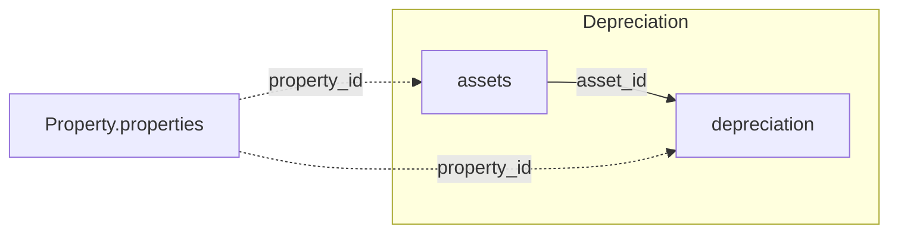

Die zwei Tabellen unten verknüpfen sich untereinander und mit der Property-Domäne. Das
vollständige Cross-Domain-Diagramm steht in der
[Datenmodell-Übersicht](/de/v1/data-model/overview).

*Durchgezogene Kanten sind Joins innerhalb von Depreciation; gestrichelte Kanten gehen in eine
andere Domäne.*

## assets

`GET /v1/depreciation/assets` — Anlagen-Stammdaten inklusive der AfA-Konfiguration
(Absetzung für Abnutzung) je Anlage.

<ResponseField name="property_id" type="string" required>
  Eindeutige Objekt-ID.
</ResponseField>

<ResponseField name="asset_id" type="integer" required>
  Interne Anlagen-ID. Wird von `depreciation.asset_id` referenziert.
</ResponseField>

<ResponseField name="acquisition_date" type="date">
  Anschaffungsdatum der Anlage.
</ResponseField>

<ResponseField name="built_date" type="date">
  Datum der Inbetriebnahme der Anlage.
</ResponseField>

<ResponseField name="afa_period" type="object">
  Beginn und Ende des Abschreibungszeitraums dieser Anlage.
  <Expandable title="properties">
    <ResponseField name="start" type="date">
      Beginn des Abschreibungszeitraums.
    </ResponseField>
    <ResponseField name="end" type="date">
      Ende des Abschreibungszeitraums.
    </ResponseField>
  </Expandable>
</ResponseField>

<ResponseField name="depreciation_active" type="boolean">
  Ob für diese Anlage aktuell abgeschrieben wird.
</ResponseField>

<ResponseField name="asset_name" type="string">
  Anlagebezeichnung.
</ResponseField>

<ResponseField name="afa_duration" type="string">
  Nutzungsdauer der Anlage, in Monaten.
</ResponseField>

<ResponseField name="afa_validity" type="string">
  Gültigkeitsdatum der AfA-Konfiguration, die für diese Anlage angewendet wird. In der
  Praxis immer identisch mit `afa_period.start` — ein ETL-Duplikat, kein eigenständiges
  Signal. Für eine künftige API-Version zur Entfernung vorgesehen.
</ResponseField>

<ResponseField name="afa_method" type="string">
  Angewendete Abschreibungsmethode, als Bezeichnung (z. B. linear).
</ResponseField>

<ResponseField name="afa_buch_id" type="string">
  ID des Anlagenkontos, auf das die Buchungen dieser Anlage laufen.
</ResponseField>

<ResponseField name="afa_group" type="string">
  Anlagenbuchungsgruppe, der diese Anlage zugeordnet ist.
</ResponseField>

<ResponseField name="account_name" type="string">
  Name des Anlagenkontos, auf das die Buchungen dieser Anlage laufen.
</ResponseField>

<ResponseField name="asset_number" type="string">
  Anlagennummer (fachliche Kennung), unterscheidet sich von `asset_id`.
</ResponseField>

## depreciation

`GET /v1/depreciation/depreciation` — einzelne Abschreibungsbuchungen, eine Zeile je Buchung.

<ResponseField name="property_id" type="string" required>
  Eindeutige Objekt-ID.
</ResponseField>

<ResponseField name="asset_id" type="integer" required>
  Referenziert die Anlage, die mit dieser Buchung abgeschrieben wird. Verknüpft sich mit
  `assets.asset_id`.
</ResponseField>

<ResponseField name="booking_date" type="date" required>
  Datum der Abschreibungsbuchung.
</ResponseField>

<ResponseField name="booking_net_value" type="number" required>
  Nettowert dieser Abschreibungsbuchung.
</ResponseField>

<ResponseField name="booking_text" type="string">
  Freitextbeschreibung der Buchung.
</ResponseField>

<ResponseField name="asset_number" type="string">
  Anlagennummer (fachliche Kennung), identisch mit dem gleichnamigen Feld auf `assets`.
</ResponseField>

<Tip>
  Eine `assets`-Zeile hat über ihre Nutzungsdauer typischerweise viele `depreciation`-Zeilen
  — über `asset_id` verknüpfen, um den vollständigen Abschreibungsverlauf einer Anlage zu
  bilden.
</Tip>
