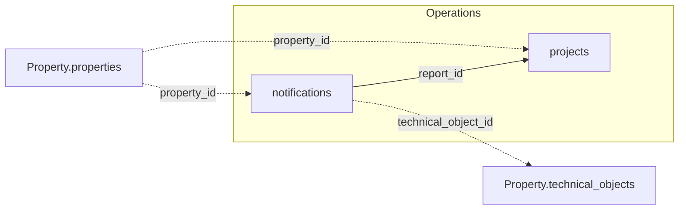

Die beiden Tabellen unten verknüpfen sich untereinander und mit der Property-Domäne. Das
vollständige Cross-Domain-Diagramm steht in der
[Datenmodell-Übersicht](/de/v1/data-model/overview).

*Durchgezogene Kanten sind Joins innerhalb von Operations; gestrichelte Kanten gehen in eine
andere Domäne.*

## notifications

`GET /v1/operations/notifications` — Wartungsmeldungen und Schadensmeldungen.

<ResponseField name="property_id" type="string" required>
  Eindeutige Objekt-ID.
</ResponseField>

<ResponseField name="report_id" type="integer" required>
  Eindeutige Meldungs-ID. `projects` referenziert dies als `report_id` — ein verifizierter
  Fremdschlüssel.
</ResponseField>

<ResponseField name="technical_object_id" type="integer">
  Technisches Objekt, auf das sich die Meldung bezieht.
</ResponseField>

<ResponseField name="person_id" type="integer">
  Person, die die Meldung erstellt hat. Nutzt einen anderen ID-Raum als
  `Stakeholder.tenants.person_id` — nicht als dieselbe Entität behandeln.
</ResponseField>

<ResponseField name="cost_center" type="object">
  Kostenstelle, gegen die die Meldung gebucht wird, als strukturiertes Objekt.
  <Expandable title="properties">
    <ResponseField name="code" type="string">
      Kostenstellen-Code.
    </ResponseField>
    <ResponseField name="label" type="string">
      Kostenstellen-Bezeichnung.
    </ResponseField>
  </Expandable>
</ResponseField>

<ResponseField name="to_do_period" type="object">
  Erledigungsfenster für die Meldung.
  <Expandable title="properties">
    <ResponseField name="start" type="date">
      Beginn des Fensters.
    </ResponseField>
    <ResponseField name="end" type="date">
      Frist zur Erledigung.
    </ResponseField>
  </Expandable>
</ResponseField>

<ResponseField name="report_name" type="string">
  Betreff / Bezeichnung der Meldung.
</ResponseField>

<ResponseField name="report_type" type="string">
  Art der Meldung.
</ResponseField>

<ResponseField name="reporter_type" type="string">
  Wer die Meldung erstellt hat: Mieter, Kreditor, Eigentümer, Benutzer oder Partner.
</ResponseField>

<ResponseField name="reporter_person" type="string">
  Angaben zur meldenden Person.
</ResponseField>

<ResponseField name="report_nr" type="string">
  Meldungsnummer.
</ResponseField>

<ResponseField name="user_creation" type="string">
  Ersteller der Meldung.
</ResponseField>

<ResponseField name="report_date" type="date">
  Datum der Meldungserstellung.
</ResponseField>

<ResponseField name="responsible_team" type="string">
  Für die Bearbeitung zuständiges Team.
</ResponseField>

<ResponseField name="responsible_user" type="string">
  Für die Bearbeitung zuständige Person.
</ResponseField>

<ResponseField name="priority_text" type="string">
  Prioritätsstufe.
</ResponseField>

<ResponseField name="status" type="string">
  Aktueller Status der Meldung.
</ResponseField>

<ResponseField name="status_date" type="date">
  Datum der letzten Statusänderung.
</ResponseField>

<ResponseField name="duration_days" type="integer">
  Anzahl Tage, die die Meldung schon in Bearbeitung ist.
</ResponseField>

<ResponseField name="insurance_case" type="boolean">
  Ob es sich um einen Versicherungsfall handelt.
</ResponseField>

<ResponseField name="comment" type="string">
  Freitextkommentar.
</ResponseField>

## projects

`GET /v1/operations/projects` — Investitionsprojekte und größere Wartungsvorhaben.

<ResponseField name="property_id" type="string" required>
  Eindeutige Objekt-ID.
</ResponseField>

<ResponseField name="project_id" type="integer" required>
  Eindeutige Projekt-ID. Nicht derselbe Wert wie `project_number` weiter unten.
</ResponseField>

<ResponseField name="report_id" type="integer">
  Meldung, aus der das Projekt entstanden ist, falls zutreffend. Verifizierter
  Fremdschlüssel zu `notifications.report_id`.
</ResponseField>

<ResponseField name="to_hdr_id" type="integer">
  Interne Referenz auf das technische Objekt.
</ResponseField>

<ResponseField name="request_hdr_id" type="integer">
  Interne Referenz auf die ursprüngliche Anfrage.
</ResponseField>

<ResponseField name="creditor_id" type="string">
  Hauptkreditor für das Projekt.
</ResponseField>

<ResponseField name="offer_id" type="integer">
  Interne Referenz auf ein zugehöriges Angebot.
</ResponseField>

<ResponseField name="hierarchy" type="string[]">
  Position des Projekts in einer Kostenaufschlüsselungs-Hierarchie, als geordnete Liste von
  Ebenen. Leere Ebenen werden weggelassen.
</ResponseField>

<ResponseField name="cost_center" type="object">
  Kostenstelle, gegen die das Projekt gebucht wird, als strukturiertes Objekt.
  <Expandable title="properties">
    <ResponseField name="code" type="string">
      Kostenstellen-Code.
    </ResponseField>
    <ResponseField name="label" type="string">
      Kostenstellen-Bezeichnung.
    </ResponseField>
  </Expandable>
</ResponseField>

<ResponseField name="project_period" type="object">
  Geplante Projektlaufzeit.
  <Expandable title="properties">
    <ResponseField name="start" type="date">
      Projektbeginn.
    </ResponseField>
    <ResponseField name="end" type="date">
      Projektende.
    </ResponseField>
  </Expandable>
</ResponseField>

<ResponseField name="budget_period" type="object">
  Zeitraum, den das Projektbudget abdeckt.
  <Expandable title="properties">
    <ResponseField name="start" type="date">
      Beginn des Budgetzeitraums.
    </ResponseField>
    <ResponseField name="end" type="date">
      Ende des Budgetzeitraums.
    </ResponseField>
  </Expandable>
</ResponseField>

<ResponseField name="account_name" type="string">
  Bezeichnung des Projektkontos.
</ResponseField>

<ResponseField name="ledger_account" type="string">
  Sachkontonummer für das Projekt.
</ResponseField>

<ResponseField name="ledger_account_nr" type="string">
  Interne ID des Sachkontos — trotz des Namens nicht die Kontonummer. Dafür `ledger_account`
  verwenden.
</ResponseField>

<ResponseField name="project_type" type="string">
  Projektart.
</ResponseField>

<ResponseField name="status" type="string">
  Aktueller Projektstatus.
</ResponseField>

<ResponseField name="comments" type="object[]">
  Kommentare und Hinweise als Liste von Objekten. Fasst vier vormals getrennte Felder
  zusammen — `comment` (ein Statuskommentar) und `comment_1`/`comment_2`/`comment_3`
  (Hinweise) — leere Einträge werden weggelassen. Jeder Eintrag behält seine Herkunft über
  `type`.
  <Expandable title="properties">
    <ResponseField name="type" type="string">
      Herkunft des Eintrags: `status`, `hint_1`, `hint_2` oder `hint_3`.
    </ResponseField>
    <ResponseField name="text" type="string">
      Der Kommentar- bzw. Hinweistext.
    </ResponseField>
  </Expandable>
</ResponseField>

<ResponseField name="percentage_completed" type="number">
  Fertigstellungsgrad in Prozent.
</ResponseField>

<ResponseField name="project_budget" type="number">
  Gesamtbudget des Projekts.
</ResponseField>

<ResponseField name="funding_limit_obligo" type="number">
  Obligo-Limit (zugesagt, aber noch nicht in Rechnung gestellt).
</ResponseField>

<ResponseField name="is_value" type="number">
  Ist-Wert (gebucht) bis heute.
</ResponseField>

<ResponseField name="entered_value" type="number">
  Erfasster Wert.
</ResponseField>

<ResponseField name="activated_value" type="number">
  Aktivierter Wert.
</ResponseField>

<ResponseField name="modernized_value" type="number">
  Modernisierungswert.
</ResponseField>

<ResponseField name="maintenance_value" type="number">
  Instandhaltungswert.
</ResponseField>

<ResponseField name="projektleitung" type="string">
  Name der Projektleitung.
</ResponseField>

<ResponseField name="project_lead_budget" type="number">
  Budget der Projektleitung.
</ResponseField>

<ResponseField name="overhead_charge_mode" type="integer">
  Berechnungsmodus für den Overhead.
</ResponseField>

<ResponseField name="overhead_charge_percent" type="number">
  Overhead-Zuschlag in Prozent.
</ResponseField>

<ResponseField name="overhead_charge_value" type="number">
  Overhead-Betrag.
</ResponseField>

<ResponseField name="industry_name" type="string">
  Gewerk / Branche des Projekts.
</ResponseField>

<ResponseField name="responsible_team" type="string">
  Für das Projekt zuständiges Team.
</ResponseField>

<ResponseField name="responsible_user" type="string">
  Für das Projekt zuständige Person.
</ResponseField>

<ResponseField name="to_name" type="string">
  Bezeichnung des zugehörigen technischen Objekts.
</ResponseField>

<ResponseField name="request_nr" type="string">
  Geschäftsnummer der ursprünglichen Anfrage.
</ResponseField>

<ResponseField name="offer_nr" type="string">
  Geschäftsnummer des zugehörigen Angebots.
</ResponseField>

<ResponseField name="budget_text" type="string">
  Budgetbeschreibung.
</ResponseField>

<ResponseField name="budget_comment" type="string">
  Kommentar zum Budget.
</ResponseField>

<ResponseField name="dms_link" type="string">
  Link zum verknüpften Dokument im DMS.
</ResponseField>

<ResponseField name="project_number" type="string">
  Geschäfts-/Anzeige-Projektnummer. Nicht dieselbe ID wie `project_id` oben.
</ResponseField>

<ResponseField name="report_number" type="string">
  Geschäfts-/Anzeigenummer der ursprünglichen Meldung. Nicht dieselbe ID wie `report_id`
  oben.
</ResponseField>
