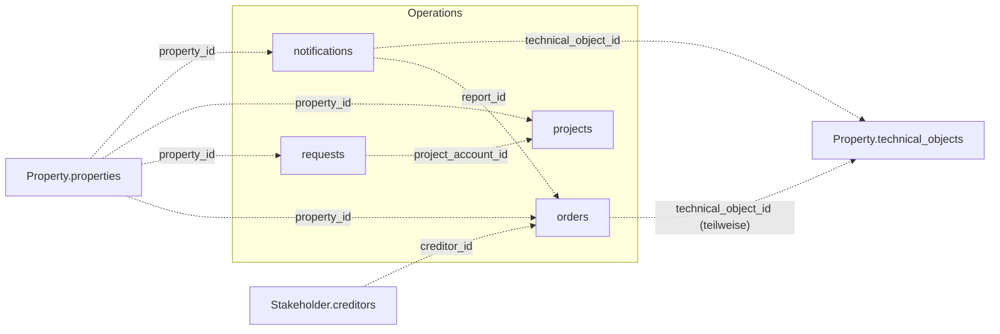

Die vier Tabellen unten verknüpfen sich mit der Property-Domäne; `orders` verweist zusätzlich auf `notifications`
und auf Kreditoren aus Stakeholder, `requests` auf `projects`. Das
vollständige Cross-Domain-Diagramm steht in der
[Datenmodell-Übersicht](/de/v1/data-model/overview).

```mermaid
graph LR
  subgraph Operations
    notifications["notifications"]
    orders["orders"]
    projects["projects"]
    requests["requests"]
  end

  properties["Property.properties"]
  technical_objects["Property.technical_objects"]
  creditor["Stakeholder.creditors"]

  properties -.->|property_id| notifications
  properties -.->|property_id| projects
  properties -.->|property_id| requests
  requests -.->|project_account_id| projects
  notifications -.->|technical_object_id| technical_objects
  properties -.->|property_id| orders
  notifications -.->|report_id| orders
  creditor -.->|creditor_id| orders
  orders -.->|"technical_object_id (teilweise)"| technical_objects
```

## notifications

`GET /v1/operations/notifications` — Wartungsmeldungen und Schadensmeldungen.

<ResponseField name="property_id" type="string" required>
  Eindeutige Objekt-ID.
</ResponseField>

<ResponseField name="report_id" type="integer" required>
  Eindeutige Meldungs-ID.
</ResponseField>

<ResponseField name="technical_object_id" type="integer">
  Technisches Objekt, auf das sich die Meldung bezieht.
</ResponseField>

<ResponseField name="reporter_key" type="integer">
  Schlüssel für den Melder: Objekt, Einheit und Meldernummer zu einer Zahl zusammengesetzt,
  ohne Trennzeichen. Keine Personen-ID — verknüpft sich nicht mit `Stakeholder.tenants.person_id`.
</ResponseField>

<ResponseField name="cost_center" type="object">
  Kostenstelle, gegen die die Meldung gebucht wird, als strukturiertes Objekt — gleicher
  Aufbau wie `projects.cost_center`.
  <Expandable title="properties">
    <ResponseField name="code" type="string">
      Kostenstellen-Code.
    </ResponseField>
    <ResponseField name="label" type="string">
      Kostenstellen-Bezeichnung.
    </ResponseField>
  </Expandable>
</ResponseField>

<ResponseField name="to_do_period" type="object">
  Erledigungsfenster für die Meldung.
  <Expandable title="properties">
    <ResponseField name="start" type="date">
      Beginn des Fensters.
    </ResponseField>
    <ResponseField name="end" type="date">
      Frist zur Erledigung.
    </ResponseField>
  </Expandable>
</ResponseField>

<ResponseField name="report_name" type="string">
  Betreff / Bezeichnung der Meldung.
</ResponseField>

<ResponseField name="report_type" type="string">
  Art der Meldung.
</ResponseField>

<ResponseField name="reporter_type" type="string">
  Wer die Meldung erstellt hat: Mieter, Kreditor, Eigentümer, Benutzer oder Partner.
</ResponseField>

<ResponseField name="report_number" type="string">
  Meldungsnummer.
</ResponseField>

<ResponseField name="user_creation" type="string">
  Nur mit dem [Grant `personal`](/de/v1/authentication#grants-für-personenbezogene-daten) sichtbar.
  Ersteller der Meldung.
</ResponseField>

<ResponseField name="report_date" type="date">
  Datum der Meldungserstellung.
</ResponseField>

<ResponseField name="responsible_team" type="string">
  Für die Bearbeitung zuständiges Team.
</ResponseField>

<ResponseField name="responsible_user" type="string">
  Nur mit dem [Grant `personal`](/de/v1/authentication#grants-für-personenbezogene-daten) sichtbar.
  Für die Bearbeitung zuständige Person.
</ResponseField>

<ResponseField name="priority_text" type="string">
  Prioritätsstufe.
</ResponseField>

<ResponseField name="status" type="string">
  Aktueller Status der Meldung.
</ResponseField>

<ResponseField name="status_date" type="date">
  Datum der letzten Statusänderung.
</ResponseField>

<ResponseField name="duration_days" type="integer">
  Anzahl Tage, die die Meldung schon in Bearbeitung ist.
</ResponseField>

<ResponseField name="is_insurance_case" type="boolean">
  Ob es sich um einen Versicherungsfall handelt.
</ResponseField>

<ResponseField name="comment" type="string">
  Nur mit dem [Grant `personal`](/de/v1/authentication#grants-für-personenbezogene-daten) sichtbar.
  Freitextkommentar.
</ResponseField>

## orders

`GET /v1/operations/orders` — Instandhaltungs- und Reparaturaufträge an Dienstleister, eine Zeile
pro Auftrag.

<Note>
  Alle Felder auf Positionsebene (`position_amount`, `position_description`, `quantity`, `unit`,
  `price`, `vat_rate_position`, `position_*_amount`, `position_obligo_net`, `invoice_status`)
  stammen **nur aus der ersten Position** des Auftrags. Für Aufträge mit mehreren Positionen
  liefern die Felder auf Auftragsebene (`total_amount`, `order_*_amount`, `order_obligo_net`)
  die Summen.
</Note>

<ResponseField name="order_id" type="integer" required>
  Eindeutige ID des Auftrags. Nicht derselbe Wert wie `order_number` unten.
</ResponseField>

<ResponseField name="person_id" type="string">
  Zusammengesetzter Schlüssel aus Objekt, Fläche und Personennummer, ohne Trennzeichen. Er
  bezeichnet den Nutzer der Fläche, die der Auftrag betrifft, verknüpft sich aber nicht mit
  `Stakeholder.tenants.person_id`.
</ResponseField>

<ResponseField name="property_id" type="string" required>
  Eindeutige Objekt-ID. Verknüpft mit `Property.properties.property_id`.
</ResponseField>

<ResponseField name="offer_reference_id" type="integer">
  Angebotsnummer, auf die sich der Auftrag bezieht, als Zahl. Kein Join-Schlüssel: Sie passt
  nicht zu `offers.offer_id`.
</ResponseField>

<ResponseField name="project_reference_id" type="integer">
  Projektkonto, auf das der Auftrag gebucht wird, falls vorhanden. Kein Join-Schlüssel: Es passt
  nicht zu `projects.project_id`.
</ResponseField>

<ResponseField name="cost_center_id" type="string">
  Kostenstelle des Auftrags: Objektnummer plus Fläche, Geschoss oder Gebäude (zum Beispiel
  `1101/20022`) oder nur die Objektnummer.
</ResponseField>

<ResponseField name="technical_object_id" type="integer">
  Technisches Objekt, das der Auftrag betrifft. Verknüpft mit
  `Property.technical_objects.technical_object_id`, aber nicht jeder Wert hat ein passendes
  technisches Objekt.
</ResponseField>

<ResponseField name="report_id" type="integer">
  Meldung, aus der der Auftrag entstanden ist, falls vorhanden. Verknüpft mit
  `notifications.report_id`.
</ResponseField>

<ResponseField name="creditor_id" type="string">
  Dienstleister, an den der Auftrag vergeben wurde. Verknüpft mit
  `Stakeholder.creditors.creditor_id`.
</ResponseField>

<ResponseField name="total_amount" type="object">
  Gesamtkosten des Auftrags über alle Positionen.
  <Expandable title="properties">
    <ResponseField name="net" type="number">
      Nettobetrag.
    </ResponseField>
    <ResponseField name="gross" type="number">
      Bruttobetrag inklusive Umsatzsteuer.
    </ResponseField>
  </Expandable>
</ResponseField>

<ResponseField name="position_amount" type="object">
  Kosten der ersten Position.
  <Expandable title="properties">
    <ResponseField name="net" type="number">
      Nettobetrag.
    </ResponseField>
    <ResponseField name="gross" type="number">
      Bruttobetrag inklusive Umsatzsteuer.
    </ResponseField>
  </Expandable>
</ResponseField>

<ResponseField name="ledger_account" type="object">
  Sachkonto, auf das die Auftragskosten gebucht werden.
  <Expandable title="properties">
    <ResponseField name="code" type="string">
      Buchungskreis und Kontonummer, verbunden mit `+` (zum Beispiel `1101+641005`).
    </ResponseField>
    <ResponseField name="label" type="string">
      Kontobezeichnung, z. B. „Laufende Reparaturen Wohnung“.
    </ResponseField>
  </Expandable>
</ResponseField>

<ResponseField name="runtime_period" type="object">
  Zeitraum, in dem die Arbeiten ausgeführt werden sollen.
  <Expandable title="properties">
    <ResponseField name="start" type="date">
      Beginn.
    </ResponseField>
    <ResponseField name="end" type="date">
      Ende.
    </ResponseField>
  </Expandable>
</ResponseField>

<ResponseField name="order_number" type="string">
  Fachliche Auftragsnummer zur Anzeige, z. B. `2018/00001`. Nicht dieselbe Kennung wie `order_id`.
</ResponseField>

<ResponseField name="order_name" type="string">
  Betreff des Auftrags.
</ResponseField>

<ResponseField name="offer_number" type="string">
  Angebotsnummer wie am Auftrag erfasst, wenn der Auftrag auf einem Angebot beruht.
</ResponseField>

<ResponseField name="order_type" type="string">
  Auftragsart, z. B. „Laufende Instandhaltung“.
</ResponseField>

<ResponseField name="object_description" type="string">
  Nur mit dem [Grant `personal`](/de/v1/authentication#grants-für-personenbezogene-daten) sichtbar.
  Bezeichnung des Objekts, zu dem der Auftrag gehört.
</ResponseField>

<ResponseField name="creditor_name" type="string">
  Nur mit dem [Grant `personal`](/de/v1/authentication#grants-für-personenbezogene-daten) sichtbar.
  Name des Dienstleisters.
</ResponseField>

<ResponseField name="project_nr" type="string">
  Projektkonto, auf das der Auftrag gebucht wird, als Buchungskreis und Kontonummer verbunden mit
  `+`. Leer bei Aufträgen außerhalb eines Projekts.
</ResponseField>

<ResponseField name="cost_center_id_name" type="string">
  `cost_center_id` und Kostenstellenbezeichnung als ein Anzeigetext. Nur zur Anzeige, nicht zum
  Verknüpfen.
</ResponseField>

<ResponseField name="vat_code" type="integer">
  Umsatzsteuer-Code der ersten Position.
</ResponseField>

<ResponseField name="vat_rate" type="number">
  Umsatzsteuersatz in Prozent, der am Stichtag des Auftrags für `vat_code` galt.
</ResponseField>

<ResponseField name="vat_code_type" type="string">
  Zweistellige Art des Umsatzsteuer-Codes aus dem ERP, z. B. `VN`.
</ResponseField>

<ResponseField name="position_description" type="string">
  Nur mit dem [Grant `personal`](/de/v1/authentication#grants-für-personenbezogene-daten) sichtbar.
  Freitextbeschreibung der ersten Position.
</ResponseField>

<ResponseField name="order_recorder_name" type="string">
  Nur mit dem [Grant `personal`](/de/v1/authentication#grants-für-personenbezogene-daten) sichtbar.
  Nicht befüllt, immer ein leerer String.
</ResponseField>

<ResponseField name="order_recorder_mail" type="string">
  Nur mit dem [Grant `personal`](/de/v1/authentication#grants-für-personenbezogene-daten) sichtbar.
  Nicht befüllt, immer ein leerer String.
</ResponseField>

<ResponseField name="order_processor_name" type="string">
  Nur mit dem [Grant `personal`](/de/v1/authentication#grants-für-personenbezogene-daten) sichtbar.
  Nicht befüllt, immer ein leerer String.
</ResponseField>

<ResponseField name="order_processor_mail" type="string">
  Nur mit dem [Grant `personal`](/de/v1/authentication#grants-für-personenbezogene-daten) sichtbar.
  Nicht befüllt, immer ein leerer String.
</ResponseField>

<ResponseField name="order_responsible_name" type="string">
  Nur mit dem [Grant `personal`](/de/v1/authentication#grants-für-personenbezogene-daten) sichtbar.
  Nicht befüllt, immer ein leerer String.
</ResponseField>

<ResponseField name="order_responsible_mail" type="string">
  Nur mit dem [Grant `personal`](/de/v1/authentication#grants-für-personenbezogene-daten) sichtbar.
  Nicht befüllt, immer ein leerer String.
</ResponseField>

<ResponseField name="report_number" type="string">
  Anzeigenummer der Meldung aus `report_id`.
</ResponseField>

<ResponseField name="to_number" type="string">
  Anzeigenummer des technischen Objekts aus `technical_object_id`.
</ResponseField>

<ResponseField name="to_number_internal" type="string">
  Interne Nummer des technischen Objekts.
</ResponseField>

<ResponseField name="to_description" type="string">
  Bezeichnung des technischen Objekts.
</ResponseField>

<ResponseField name="note1" type="string">
  Nur mit dem [Grant `personal`](/de/v1/authentication#grants-für-personenbezogene-daten) sichtbar.
  Freitext-Hinweis zum Auftrag.
</ResponseField>

<ResponseField name="damage_date" type="date">
  Datum des Schadens, bei Reparaturaufträgen.
</ResponseField>

<ResponseField name="handyman_portal_transfer" type="boolean">
  Ob Aufträge dieser Art an das Handwerkerportal übergeben werden.
</ResponseField>

<ResponseField name="status_type_description" type="string">
  Bearbeitungsstand: `Neu`, `In Genehmigung`, `Genehmigt`, `In Bearbeitung`, `Erledigt` oder
  `Storniert`.
</ResponseField>

<ResponseField name="priority_description" type="string">
  Priorität.
</ResponseField>

<ResponseField name="reporter_type_description" type="string">
  Wer den Fall gemeldet hat: `Personen` (eine Person, etwa ein Mieter), `Kreditor` (ein
  Dienstleister) oder `Benutzer` (ein Benutzer der Verwaltungssoftware).
</ResponseField>

<ResponseField name="reporter_info" type="string">
  Nur mit dem [Grant `personal`](/de/v1/authentication#grants-für-personenbezogene-daten) sichtbar.
  Freitext-Angaben zum Melder, oft Name und Telefonnummer.
</ResponseField>

<ResponseField name="reporter_person_full_name" type="string">
  Nur mit dem [Grant `personal`](/de/v1/authentication#grants-für-personenbezogene-daten) sichtbar.
  Vollständiger Name des Melders, wenn er eine bekannte Person ist, sonst derselbe Text wie
  `reporter_info`.
</ResponseField>

<ResponseField name="quantity" type="number">
  Menge der ersten Position.
</ResponseField>

<ResponseField name="unit" type="number">
  Einheitenfeld der ersten Position, als Zahl geliefert.
</ResponseField>

<ResponseField name="price" type="number">
  Einzelpreis der ersten Position.
</ResponseField>

<ResponseField name="vat_rate_position" type="number">
  Umsatzsteuersatz in Prozent, wie an der ersten Position erfasst.
</ResponseField>

<ResponseField name="invoice_status" type="string">
  Zahlungsstand der ersten Position, abgeleitet aus ihren Beträgen: `Bezahlt` (vollständig
  bezahlt), `Gebucht`, `Erfasst` (Rechnung erfasst), `Obligo` (beauftragt, noch nicht
  abgerechnet) oder `Offen`.
</ResponseField>

<ResponseField name="position_obligo_net" type="number">
  Netto-Obligo der ersten Position.
</ResponseField>

<ResponseField name="position_recorded_amount" type="number">
  Erfasster Rechnungsbetrag der ersten Position.
</ResponseField>

<ResponseField name="position_booked_amount" type="number">
  Gebuchter Betrag der ersten Position.
</ResponseField>

<ResponseField name="position_paid_amount" type="number">
  Bezahlter Betrag der ersten Position.
</ResponseField>

<ResponseField name="order_obligo_net" type="number">
  Netto-Obligo des gesamten Auftrags.
</ResponseField>

<ResponseField name="order_recorded_amount" type="number">
  Erfasster Rechnungsbetrag des gesamten Auftrags.
</ResponseField>

<ResponseField name="order_booked_amount" type="number">
  Gebuchter Betrag des gesamten Auftrags.
</ResponseField>

<ResponseField name="order_paid_amount" type="number">
  Bezahlter Betrag des gesamten Auftrags.
</ResponseField>

<ResponseField name="dms_link" type="string">
  Link auf die Dokumente des Auftrags im Dokumentenmanagementsystem, falls eingerichtet.
</ResponseField>

## projects

`GET /v1/operations/projects` — Investitionsprojekte und größere Wartungsvorhaben, eine Zeile
je Projekt.

<Note>
  Die Tabelle liefert alle Projekte der Verwaltung, unabhängig vom Status — auch Projekte,
  die erst geplant oder beantragt, schon abgerechnet oder vom Eigentümer selbst ausgeführt
  sind. Wer nur einen Teil braucht, filtert auf `status`. Felder, die auf ein einzelnes
  Angebot, einen Auftrag oder eine Meldung zeigten (`offer_id`, `creditor_id`, `report_id`
  und die zugehörigen Nummern), gehören nicht mehr zu `projects`: Ein Projekt kann von
  allem mehrere haben. Die Anfragen eines Projekts findet man über `project_account_id`.
</Note>

<ResponseField name="property_id" type="string" required>
  Eindeutige Objekt-ID.
</ResponseField>

<ResponseField name="project_id" type="integer" required>
  Eindeutige Projekt-ID. Nicht derselbe Wert wie `project_number` weiter unten.
</ResponseField>

<ResponseField name="project_account_id" type="integer">
  Projektkonto, auf dem das Projekt gebucht wird. `requests.project_account_id` verweist
  hierauf — darüber findet man die Anfragen eines Projekts.
</ResponseField>

<ResponseField name="hierarchy" type="string[]">
  Wo das Projekt im Kontenbaum der Buchhaltung "aufgehängt" ist, als geordnete Liste von
  grob nach fein (z. B. `["1000/10/20/01", "1000/10/20/01.1", "1000/10/20/01.1.5"]`). Die
  Segmente sind auf den oberen Ebenen durch `/` getrennt, auf den feineren durch `.` —
  nicht rein numerisch mit Punkt-Trennung. Leere, tiefere Ebenen werden weggelassen.
</ResponseField>

<ResponseField name="cost_center" type="object">
  Kostenstelle, gegen die das Projekt gebucht wird, als strukturiertes Objekt.
  <Expandable title="properties">
    <ResponseField name="code" type="string">
      Kostenstellen-Code.
    </ResponseField>
    <ResponseField name="label" type="string">
      Kostenstellen-Bezeichnung.
    </ResponseField>
  </Expandable>
</ResponseField>

<ResponseField name="project_period" type="object">
  Geplante Projektlaufzeit.
  <Expandable title="properties">
    <ResponseField name="start" type="date">
      Projektbeginn.
    </ResponseField>
    <ResponseField name="end" type="date">
      Projektende.
    </ResponseField>
  </Expandable>
</ResponseField>

<ResponseField name="budget_period" type="object">
  Zeitraum, den das Projektbudget abdeckt.
  <Expandable title="properties">
    <ResponseField name="start" type="date">
      Beginn des Budgetzeitraums.
    </ResponseField>
    <ResponseField name="end" type="date">
      Ende des Budgetzeitraums.
    </ResponseField>
  </Expandable>
</ResponseField>

<ResponseField name="account_name" type="string">
  Bezeichnung des Projektkontos.
</ResponseField>

<ResponseField name="ledger_account" type="string">
  Kommagetrennte Liste von Sachkontonummern für das Projekt — meist mehrere, nicht nur
  eine.
</ResponseField>

<ResponseField name="ledger_account_number" type="string">
  Trotz des Namens keine sachkontobezogene ID — identischer Wert wie `cost_center.code`, nur
  unter anderem Feldnamen (beide stammen aus derselben Rohspalte). Für die
  tatsächliche(n) Sachkontonummer(n) `ledger_account` verwenden.
</ResponseField>

<ResponseField name="project_type" type="string">
  Projektart.
</ResponseField>

<ResponseField name="status" type="string">
  Aktueller Projektstatus als Textbezeichnung der Verwaltung (zum Beispiel `in Planung`,
  `genehmigt`, `abgerechnet`). Die Bezeichnungen unterscheiden sich je Kunde.
</ResponseField>

<ResponseField name="comments" type="object[]">
  Nur mit dem [Grant `personal`](/de/v1/authentication#grants-für-personenbezogene-daten) sichtbar.
  Kommentare und Hinweise als Liste von Objekten. Fasst vier vormals getrennte Felder
  zusammen — `comment` (ein Statuskommentar) und `comment_1`/`comment_2`/`comment_3`
  (Hinweise) — leere Einträge werden weggelassen. Jeder Eintrag behält seine Herkunft über
  `type`.
  <Expandable title="properties">
    <ResponseField name="type" type="string">
      Herkunft des Eintrags: `status`, `hint_1`, `hint_2` oder `hint_3`.
    </ResponseField>
    <ResponseField name="text" type="string">
      Der Kommentar- bzw. Hinweistext.
    </ResponseField>
  </Expandable>
</ResponseField>

<ResponseField name="percentage_completed" type="number">
  Fertigstellungsgrad in Prozent.
</ResponseField>

<ResponseField name="project_budget" type="number">
  Gesamtbudget des Projekts.
</ResponseField>

<ResponseField name="funding_limit_obligo" type="number">
  Obligo-Limit (zugesagt, aber noch nicht in Rechnung gestellt).
</ResponseField>

<ResponseField name="actual_value" type="number">
  Ist-Wert (gebucht) bis heute.
</ResponseField>

<ResponseField name="entered_value" type="number">
  Erfasster Wert.
</ResponseField>

<ResponseField name="activated_value" type="number">
  Aktivierter Wert.
</ResponseField>

<ResponseField name="modernized_value" type="number">
  Modernisierungswert.
</ResponseField>

<ResponseField name="maintenance_value" type="number">
  Instandhaltungswert.
</ResponseField>

<ResponseField name="is_project_management" type="string">
  Klassifizierungs-Flag zur Projektleitung (`"0"`/`"1"`).
</ResponseField>

<ResponseField name="project_lead_budget" type="number">
  Budget der Projektleitung.
</ResponseField>

<ResponseField name="overhead_charge_mode" type="integer">
  Berechnungsmodus für den Overhead.
</ResponseField>

<ResponseField name="overhead_charge_percent" type="number">
  Overhead-Zuschlag in Prozent.
</ResponseField>

<ResponseField name="overhead_charge_value" type="number">
  Overhead-Betrag.
</ResponseField>

<ResponseField name="industry_name" type="string">
  Gewerk / Branche des Projekts.
</ResponseField>

<ResponseField name="responsible_team" type="string">
  Für das Projekt zuständiges Team.
</ResponseField>

<ResponseField name="responsible_user" type="string">
  Nur mit dem [Grant `personal`](/de/v1/authentication#grants-für-personenbezogene-daten) sichtbar.
  Für das Projekt zuständige Person.
</ResponseField>

<ResponseField name="budget_text" type="string">
  Budgetbeschreibung.
</ResponseField>

<ResponseField name="budget_comment" type="string">
  Nur mit dem [Grant `personal`](/de/v1/authentication#grants-für-personenbezogene-daten) sichtbar.
  Kommentar zum Budget.
</ResponseField>

<ResponseField name="dms_link" type="string">
  Link zum verknüpften Dokument im DMS.
</ResponseField>

<ResponseField name="project_number" type="string">
  Geschäfts-/Anzeige-Projektnummer. Nicht dieselbe ID wie `project_id` oben.
</ResponseField>

## requests

`GET /v1/operations/requests` — Angebotsanfragen aus dem Instandhaltungsprozess, eine Zeile je
Anfrage, auch wenn noch kein Angebot eingegangen ist.

<ResponseField name="property_id" type="string" required>
  Eindeutige Objekt-ID.
</ResponseField>

<ResponseField name="request_id" type="integer" required>
  Eindeutige Anfrage-ID. Nicht derselbe Wert wie `request_number` unten.
</ResponseField>

<ResponseField name="project_account_id" type="integer">
  Projektkonto, zu dem die Anfrage gehört, falls vorhanden. Verknüpft mit
  `projects.project_account_id`. Leer bei Anfragen ohne Projekt; einzelne Werte haben
  kein passendes Projekt.
</ResponseField>

<ResponseField name="cost_center" type="object">
  Kostenstelle, gegen die die Anfrage gebucht wird, gleicher Aufbau wie `projects.cost_center`.
  <Expandable title="properties">
    <ResponseField name="code" type="string">
      Kostenstellen-Code.
    </ResponseField>
    <ResponseField name="label" type="string">
      Kostenstellen-Bezeichnung.
    </ResponseField>
  </Expandable>
</ResponseField>

<ResponseField name="floor_area_id" type="string">
  Einheit, die die Anfrage betrifft, falls sie eine einzelne Einheit betrifft.
</ResponseField>

<ResponseField name="request_period" type="object">
  Zeitraum der angefragten Leistung.
  <Expandable title="properties">
    <ResponseField name="start" type="date">
      Beginn.
    </ResponseField>
    <ResponseField name="end" type="date">
      Ende.
    </ResponseField>
  </Expandable>
</ResponseField>

<ResponseField name="request_name" type="string">
  Betreff / Titel der Anfrage.
</ResponseField>

<ResponseField name="request_type" type="string">
  Art der Anfrage.
</ResponseField>

<ResponseField name="status_text" type="string">
  Aktueller Status der Anfrage.
</ResponseField>

<ResponseField name="priority_text" type="string">
  Priorität.
</ResponseField>

<ResponseField name="request_number" type="string">
  Fachliche Anfragenummer. Nicht dieselbe Kennung wie `request_id` oben.
</ResponseField>
