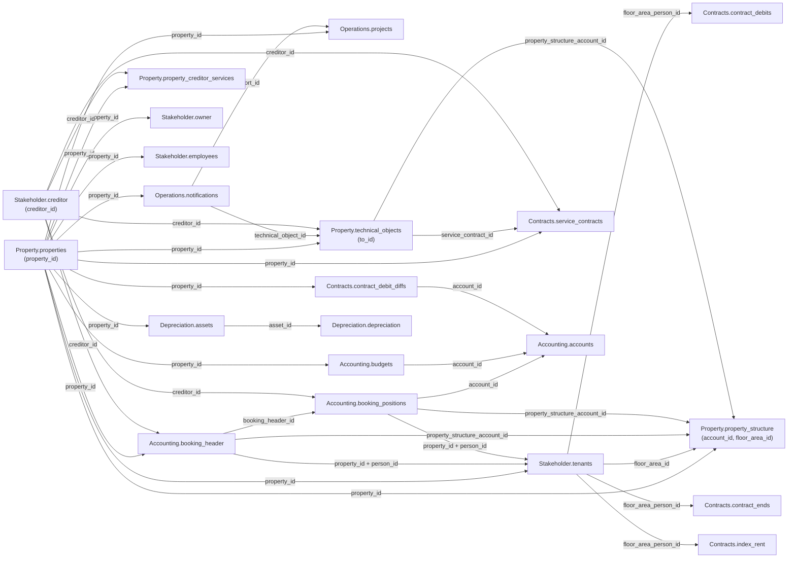

`/v1/` umfasst sechs Datendomänen. Jede Domänenseite enthält die Feldreferenz ihrer
Tabellen.

<CardGroup cols={2}>
  <Card title="Accounting" icon="book" href="/de/v1/data-model/accounting">
    `accounts`, `booking_header`, `booking_positions` und `budgets`, mit `period`-,
    `amount`- und `amount_per_sqm`-Objekten.
  </Card>

  <Card title="Contracts" icon="file-contract" href="/de/v1/data-model/contracts">
    `service_contracts`, `contract_debits`, `contract_debit_diffs`, `contract_ends` und
    `index_rent`, mit den Objekten `contract_period`, `debit_period`, `debit_type`, `period`,
    `option_state`, `validity_period` und `calculation_model`.
  </Card>

  <Card title="Depreciation" icon="chart-line-down" href="/de/v1/data-model/depreciation">
    `assets` und `depreciation`, mit dem `afa_period`-Objekt und dem Paar
    `asset_id`/`asset_number`.
  </Card>

  <Card title="Operations" icon="clipboard-list" href="/de/v1/data-model/operations">
    `notifications` und `projects`, mit `technical_object_id` und dem `hierarchy`-Array.
  </Card>

  <Card title="Property" icon="building" href="/de/v1/data-model/property">
    `properties`, `property_structure`, `property_creditor_services` und
    `technical_objects`, mit dem `entrances`-Array, dem `mandate_period`-Objekt, dem
    `levels`-Array und dem bedingten `property_structure_account_id`-Fallback.
  </Card>

  <Card title="Stakeholder" icon="users" href="/de/v1/data-model/stakeholder">
    `creditor`, `employees`, `owner` und `tenants`, mit einem `phones`-Array auf `creditor`
    und `tenants`.
  </Card>
</CardGroup>

<Note>
  `Operations.offers` und `orders` haben noch keinen `/v1/`-Endpunkt — bis dahin über den
  unversionierten Pfad abrufen. `Accounting.kontenmapping_ranges` bekommt keinen und bleibt
  dauerhaft auf dem unversionierten Pfad. Alle drei sind im
  [vollständigen Datenmodell](/de/data-model/overview) dokumentiert.
</Note>

## Wie die v1-Tabellen zusammenhängen

`property_id` ist der Join-Key, den sich alle Tabellen auf dieser Seite teilen.



### Verknüpfungsschlüssel im Detail

| Key | Bedeutung | Kardinalität |
|---|---|---|
| `property_id` | Identifiziert ein Objekt. Auf jeder Tabelle dieser Seite vorhanden, außer `creditor` (eine eigenständige Entität, referenziert über `creditor_id`). | 1 Objekt → viele Zeilen in jeder Domäne |
| `booking_header_id` | Gruppiert Buchungspositionen unter einem Buchungskopf. | 1 `booking_header` → viele `booking_positions` |
| `account_id` | Interne Konto-ID. | 1 `accounts`-Zeile → viele `booking_positions`/`budgets`-Zeilen |
| `creditor_id` | Identifiziert einen Kreditor. Referenziert von `technical_objects`, `property_creditor_services`, `service_contracts`, `booking_header` und `booking_positions` — bei `projects` unzuverlässig, siehe unten. | 1 Kreditor → viele Zeilen über Domänen hinweg |
| `technical_object_id` | Verknüpft eine Meldung mit dem technischen Objekt, auf das sie sich bezieht. Referenziert `technical_objects.to_id`. | 1 technisches Objekt → viele Meldungen |
| `report_id` | Verknüpft ein Projekt mit der Meldung, aus der es entstanden ist, falls zutreffend. | 1 Meldung → 0..N Projekte |
| `service_contract_id` | Verknüpft ein technisches Objekt mit dem Wartungsvertrag, der es abdeckt. Referenziert `service_contracts.contract_id`. | 1 Vertrag → viele technische Objekte |
| `person_id` | Verknüpft eine Buchung mit dem Mieter, auf den sie sich bezieht. Nur gemeinsam mit `property_id` gültig, da die Nummerierung pro Objekt neu beginnt. Bei `tenants`/`booking_header` ein String, bei `booking_positions` eine Zahl — vor einem Join über diese Grenze den Warnhinweis unten lesen. | 1 Person → 1..N Mietverhältnisse pro Objekt |
| `floor_area_person_id` | Identifiziert ein Mietverhältnis. `tenants`, `contract_debits`, `contract_ends` und `index_rent` teilen denselben Wert und denselben Typ (String) — direkt darüber verknüpfen, ohne `property_id` und ohne Cast. | 1 Mietverhältnis → viele Soll-/Ende-/Index-Zeilen |
| `floor_area_id` | Identifiziert eine Einheit in `property_structure`. Außerdem vorhanden auf `technical_objects`, `tenants`, `contract_debits` und `contract_ends`. | 1 Einheit → viele Zeilen |
| `asset_id` | Verknüpft eine Abschreibungsbuchung mit dem Anlagegut, auf das sie abschreibt. Jede `depreciation`-Zeile löst sich gegen `assets` auf. | 1 Anlagegut → viele Buchungen |
| `property_structure_account_id` | Fremdschlüssel auf [`Property.property_structure`](/de/v1/data-model/property#property_structure), vorhanden auf `booking_header`, `booking_positions` und `technical_objects`. Auf den beiden Buchungstabellen immer befüllt und dort der einzige Weg von einer Buchung zu einer Einheit; auf `technical_objects` der Fallback für Zeilen ohne `floor_area_id`. | 1 Einheit → viele Zeilen |

<Note>
  Die oben genannten Kardinalitäten beschreiben das beabsichtigte Datenmodell, nicht
  unabhängig verifizierte Zeilenzahlen. `projects.creditor_id` und `projects.to_hdr_id` sind
  bewusst nicht Teil dieses Diagramms — beide sind in der [Operations-Feldreferenz](/de/v1/data-model/operations)
  als unzuverlässig markiert, also nicht als funktionierende Verknüpfung behandeln.
</Note>

<Warning>
  `person_id` kommt bei `tenants` und `booking_header` als JSON-String zurück, bei
  `booking_positions` dagegen als Zahl — und die String-Form ist opak: führende Nullen in
  wechselnder Breite, manche Werte mit einem Suffix der Art `"2001-1"`. Ein Cast der Zahl auf
  String ergibt den Wert **nicht**. `booking_positions` deshalb gar nicht über `person_id` mit
  einem Mieter verknüpfen, sondern über `booking_header_id` gehen und die `person_id` des
  Buchungskopfs nutzen. `floor_area_id` hat eine mildere Variante desselben Problems: überall
  eine Zahl, außer bei `contract_debits`, wo es ein String ist — dort genügt aber ein einfacher
  Cast. `floor_area_person_id` ist nicht betroffen — auf allen vier Tabellen, die es führen, ein
  String.
</Warning>

### Schlüsselaufbau: zusammengesetzt, aber nicht zerlegbar

Die Identifikatoren sind hierarchisch. Jeder trägt den darüberliegenden als wörtliches
Links-Präfix, ein Mietverhältnis-Schlüssel nennt also Einheit und Objekt gleich mit:

```
property_id                    1002
└─ floor_area_id               100210001         property_id + Flächennummer
   └─ floor_area_person_id     100210001100001   floor_area_id + person_id
```

Gegen Live-Daten geprüft, gilt für jede Zeile, in der der Schlüssel befüllt ist:

| Regel | Gilt auf |
|---|---|
| `floor_area_id` beginnt mit `property_id` | `property_structure`, `tenants`, `contract_debits`, `contract_ends` |
| `floor_area_person_id` beginnt mit `floor_area_id` | `tenants`, `contract_debits`, `contract_ends` |
| `property_id_person_id` beginnt mit `property_id` | `contract_debits`, `booking_positions` — dort null bei Zeilen ohne Person, aber nie abweichend |
| `property_structure.account_id` beginnt mit `property_id` | jede Zeile außer Sammelkonten, die stattdessen wie `ALLE/5` aussehen |

<Warning>
  Die Präfixe eignen sich zum Filtern und Gruppieren nach Objekt, nicht zum Zerlegen eines
  Schlüssels. Drei Gründe: Die Segmentbreiten sind nicht fest — sie unterscheiden sich je
  Datenbestand und sogar innerhalb eines Objekts, in dem dasselbe Objekt sowohl `45111` als auch
  `451110` als `floor_area_id` führt. Damit ist auch ein Präfix-Vergleich mehrdeutig, denn
  `45111` ist selbst ein Präfix von `451110`. Und beim Bilden des Schlüssels fallen Trennzeichen
  weg: Eine `person_id` `"010-1"` landet als Suffix `0101` und lässt sich nicht zurückgewinnen.

  Jede Komponente ist ein eigenes Feld in der Antwort. Also `property_id`, `floor_area_id` und
  `person_id` direkt lesen statt den zusammengesetzten Wert zu zerschneiden.
</Warning>
