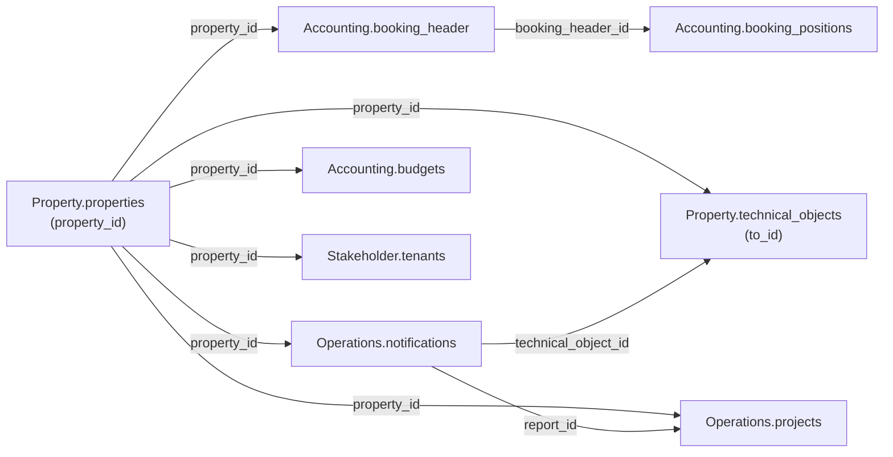

`/v1/` dokumentiert eine Tabelle erst, sobald sie live ist. Aktuell haben vier Domänen
mindestens eine dokumentierte Tabelle.

<CardGroup cols={2}>
  <Card title="Accounting" icon="book" href="/de/v1/data-model/accounting">
    `booking_header`, `booking_positions` und `budgets`, mit `period`-, `amount`- und
    `amount_per_sqm`-Objekten.
  </Card>

  <Card title="Operations" icon="clipboard-list" href="/de/v1/data-model/operations">
    `notifications` und `projects`, mit der Umbenennung zu `technical_object_id` und dem
    `hierarchy`-Array.
  </Card>

  <Card title="Property" icon="building" href="/de/v1/data-model/property">
    `properties`, mit dem `entrances`-Array und dem `mandate_period`-Objekt, und
    `technical_objects`, mit dem bedingten `property_structure_account_id`-Fallback.
  </Card>

  <Card title="Stakeholder" icon="users" href="/de/v1/data-model/stakeholder">
    `tenants`, mit Mietvertrags-Datumsfeldern, Kontaktdaten und dem `phones`-Array.
  </Card>
</CardGroup>

<Note>
  Der Rest des unversionierten Datenmodells ist noch nicht live unter `/v1/`: die
  kompletten Domänen Contracts und Depreciation, sowie `Accounting.accounts`,
  `Operations.offers`/`orders`, `Property.property_structure`/`property_creditor_services`
  und `Stakeholder.creditor`/`employees`/`owner`. Nutze vorerst ihre unversionierten
  Entsprechungen im [vollständigen Datenmodell](/de/data-model/overview).
</Note>

## Wie die v1-Tabellen zusammenhängen

`property_id` ist der Join-Key, den sich alle Tabellen auf dieser Seite teilen.

### Verknüpfungsschlüssel im Detail

| Key | Bedeutung | Kardinalität |
|---|---|---|
| `property_id` | Identifiziert ein Objekt. Auf jeder Tabelle dieser Seite vorhanden. | 1 Objekt → viele Zeilen in jeder Domäne |
| `booking_header_id` | Gruppiert Buchungspositionen unter einem Buchungskopf. | 1 `booking_header` → viele `booking_positions` |
| `technical_object_id` | Verknüpft eine Meldung mit dem technischen Objekt, auf das sie sich bezieht. Referenziert `technical_objects.to_id`. | 1 technisches Objekt → viele Meldungen |
| `report_id` | Verknüpft ein Projekt mit der Meldung, aus der es entstanden ist, falls zutreffend. | 1 Meldung → 0..N Projekte |
| `property_structure_account_id` | Bedingter Fallback-Fremdschlüssel auf das unversionierte `Property.property_structure`, vorhanden auf `booking_header`, `booking_positions` und `technical_objects`. Nur befüllt, wenn der primäre Join-Key der Tabelle die Zeile nicht abdeckt — die genaue Bedingung steht in der jeweiligen Feldreferenz. | variiert pro Tabelle, siehe Feldreferenz |

`budgets` und `tenants` tragen als Join-Key in die Tabellen dieser Seite nur `property_id`
— weitere, externe Join-Keys (`account_id`, `floor_area_id`) stehen in ihren jeweiligen
Feldreferenzen.

<Note>
  Die oben genannten Kardinalitäten beschreiben das beabsichtigte Datenmodell, nicht
  unabhängig verifizierte Zeilenzahlen. `projects.creditor_id` und `projects.to_hdr_id` sind
  bewusst nicht Teil dieses Diagramms — beide sind in der [Operations-Feldreferenz](/de/v1/data-model/operations)
  als unzuverlässig markiert, also nicht als funktionierende Verknüpfung behandeln.
</Note>
