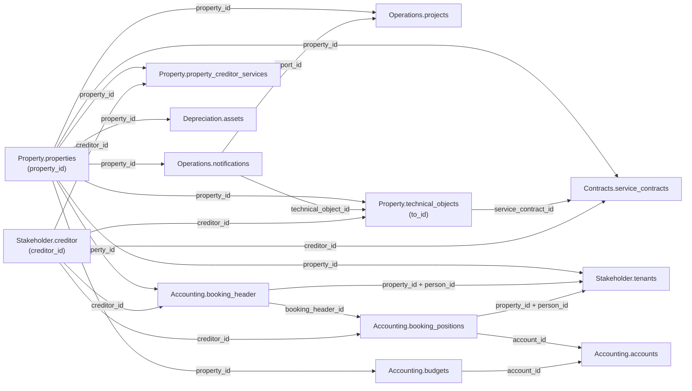

`/v1/` umfasst sechs Datendomänen. Jede Domänenseite enthält die Feldreferenz ihrer
Tabellen.

<CardGroup cols={2}>
  <Card title="Accounting" icon="book" href="/de/v1/data-model/accounting">
    `accounts`, `booking_header`, `booking_positions` und `budgets`, mit `period`-,
    `amount`- und `amount_per_sqm`-Objekten.
  </Card>

  <Card title="Contracts" icon="file-contract" href="/de/v1/data-model/contracts">
    `service_contracts`, `contract_debits`, `contract_debit_diffs` und `contract_ends`, mit
    den Objekten `contract_period`, `debit_period`, `debit_type`, `period` und
    `option_state`.
  </Card>

  <Card title="Depreciation" icon="chart-line-down" href="/de/v1/data-model/depreciation">
    `assets`, mit dem `afa_period`-Objekt und dem Paar `asset_id`/`asset_number`.
  </Card>

  <Card title="Operations" icon="clipboard-list" href="/de/v1/data-model/operations">
    `notifications` und `projects`, mit `technical_object_id` und dem `hierarchy`-Array.
  </Card>

  <Card title="Property" icon="building" href="/de/v1/data-model/property">
    `properties`, `property_structure`, `property_creditor_services` und
    `technical_objects`, mit dem `entrances`-Array, dem `mandate_period`-Objekt, dem
    `levels`-Array und dem bedingten `property_structure_account_id`-Fallback.
  </Card>

  <Card title="Stakeholder" icon="users" href="/de/v1/data-model/stakeholder">
    `creditor`, `employees`, `owner` und `tenants`, mit einem `phones`-Array auf `creditor`
    und `tenants`.
  </Card>
</CardGroup>

<Note>
  Diese Tabellen haben noch keinen `/v1/`-Endpunkt: `Accounting.kontenmapping_ranges`,
  `Depreciation.depreciation` (die Buchungstabelle — `assets` ist verfügbar, die Buchungen
  nicht) und `Operations.offers`/`orders`. Bis dahin über den unversionierten Pfad abrufen —
  siehe das [vollständige Datenmodell](/de/data-model/overview).
</Note>

## Wie die v1-Tabellen zusammenhängen

`property_id` ist der Join-Key, den sich alle Tabellen auf dieser Seite teilen.

### Verknüpfungsschlüssel im Detail

| Key | Bedeutung | Kardinalität |
|---|---|---|
| `property_id` | Identifiziert ein Objekt. Auf jeder Tabelle dieser Seite vorhanden, außer `creditor` (eine eigenständige Entität, referenziert über `creditor_id`). | 1 Objekt → viele Zeilen in jeder Domäne |
| `booking_header_id` | Gruppiert Buchungspositionen unter einem Buchungskopf. | 1 `booking_header` → viele `booking_positions` |
| `account_id` | Interne Konto-ID. | 1 `accounts`-Zeile → viele `booking_positions`/`budgets`-Zeilen |
| `creditor_id` | Identifiziert einen Kreditor. Referenziert von `technical_objects`, `property_creditor_services`, `service_contracts`, `booking_header` und `booking_positions` — bei `projects` unzuverlässig, siehe unten. | 1 Kreditor → viele Zeilen über Domänen hinweg |
| `technical_object_id` | Verknüpft eine Meldung mit dem technischen Objekt, auf das sie sich bezieht. Referenziert `technical_objects.to_id`. | 1 technisches Objekt → viele Meldungen |
| `report_id` | Verknüpft ein Projekt mit der Meldung, aus der es entstanden ist, falls zutreffend. | 1 Meldung → 0..N Projekte |
| `service_contract_id` | Verknüpft ein technisches Objekt mit dem Wartungsvertrag, der es abdeckt. Referenziert `service_contracts.contract_id`. | 1 Vertrag → viele technische Objekte |
| `person_id` | Verknüpft eine Buchung mit dem Mieter, auf den sie sich bezieht. Nur gemeinsam mit `property_id` gültig, da die Nummerierung pro Objekt neu beginnt. | 1 Person → 1..N Mietverhältnisse pro Objekt |
| `property_structure_account_id` | Fremdschlüssel auf [`Property.property_structure`](/de/v1/data-model/property#property_structure), vorhanden auf `booking_header`, `booking_positions` und `technical_objects`. Auf den beiden Buchungstabellen immer befüllt und dort der einzige Weg von einer Buchung zu einer Einheit; auf `technical_objects` der Fallback für Zeilen ohne `floor_area_id`. | 1 Einheit → viele Zeilen |

<Note>
  Die oben genannten Kardinalitäten beschreiben das beabsichtigte Datenmodell, nicht
  unabhängig verifizierte Zeilenzahlen. `projects.creditor_id` und `projects.to_hdr_id` sind
  bewusst nicht Teil dieses Diagramms — beide sind in der [Operations-Feldreferenz](/de/v1/data-model/operations)
  als unzuverlässig markiert, also nicht als funktionierende Verknüpfung behandeln.
</Note>

<Warning>
  `property_id` und `creditor_id` kommen bei den meisten Endpunkten als JSON-String zurück,
  bei `booking_positions` und `projects` dagegen als Zahl; `person_id` ist bei `tenants` und
  `booking_header` ein String, bei `booking_positions` eine Zahl. Vor einem Join über diese
  Grenzen hinweg auf einen gemeinsamen Typ casten — ein strikter Gleichheitsvergleich auf den
  Rohwerten liefert stillschweigend keine Zeilen.
</Warning>
