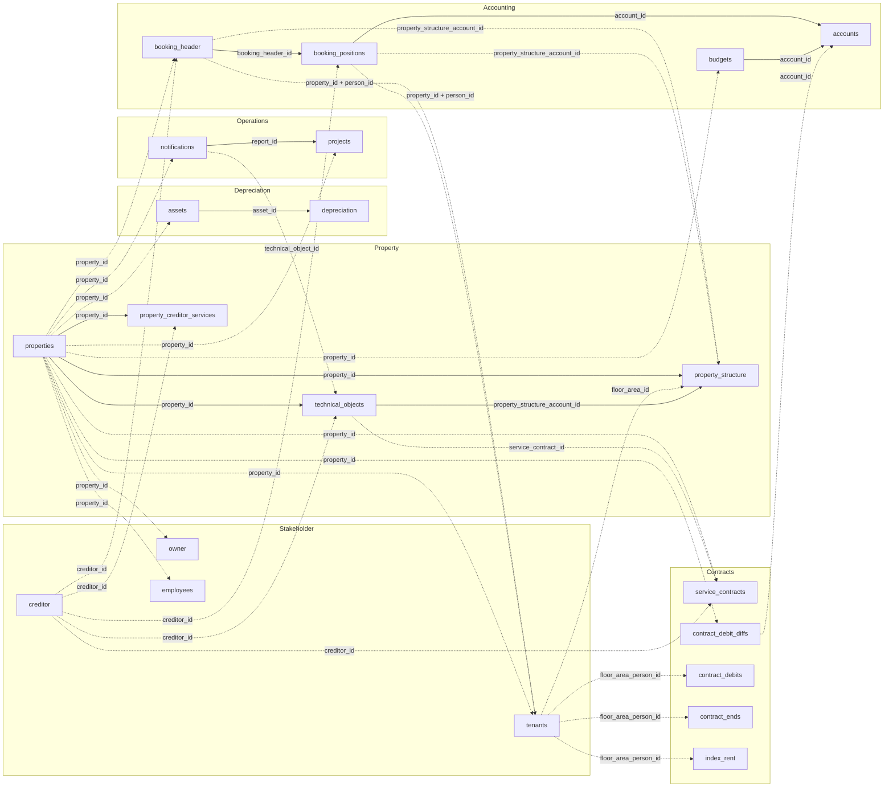

`/v1/` umfasst sechs Datendomänen, unten nach Tabelle aufgeschlüsselt. Die Feldreferenz je
Endpunkt steht in der [API-Referenz](/de/v1/api-reference/introduction).

<CardGroup cols={2}>
  <Card title="Accounting" icon="book">
    `accounts`, `booking_header`, `booking_positions` und `budgets`.
  </Card>

  <Card title="Contracts" icon="file-contract">
    `service_contracts`, `contract_debits`, `contract_debit_diffs`, `contract_ends` und
    `index_rent`.
  </Card>

  <Card title="Depreciation" icon="chart-line-down">
    `assets` und `depreciation`.
  </Card>

  <Card title="Operations" icon="clipboard-list">
    `notifications` und `projects`.
  </Card>

  <Card title="Property" icon="building">
    `properties`, `property_structure`, `property_creditor_services` und
    `technical_objects`.
  </Card>

  <Card title="Stakeholder" icon="users">
    `creditor`, `employees`, `owner` und `tenants`.
  </Card>
</CardGroup>

## Wie die Tabellen zusammenhängen

`property_id` ist der Join-Key, den sich alle Tabellen auf dieser Seite teilen.



*Durchgezogene Kanten sind Joins innerhalb einer Domäne; gestrichelte Kanten gehen in eine andere Domäne.*

### Verknüpfungsschlüssel im Detail

| Key | Bedeutung | Kardinalität |
|---|---|---|
| `property_id` | Identifiziert ein Objekt. Auf jeder Tabelle dieser Seite vorhanden, außer `creditor` (eine eigenständige Entität, referenziert über `creditor_id`). | 1 Objekt → viele Zeilen in jeder Domäne |
| `booking_header_id` | Gruppiert Buchungspositionen unter einem Buchungskopf. | 1 `booking_header` → viele `booking_positions` |
| `account_id` | Interne Konto-ID bei `accounts`, `booking_positions` und `budgets` — darüber verknüpfbar. Bei `index_rent` und `contract_debit_diffs` bedeutet derselbe Feldname etwas anderes: den Sollart-Code (entspricht `contract_debits.debit_type.code`) — nicht mit `accounts` verknüpfen. | 1 `accounts`-Zeile → viele `booking_positions`/`budgets`-Zeilen |
| `creditor_id` | Identifiziert einen Kreditor. Referenziert von `technical_objects`, `property_creditor_services`, `service_contracts`, `booking_header` und `booking_positions`. | 1 Kreditor → viele Zeilen über Domänen hinweg |
| `technical_object_id` | Vorhanden auf `notifications` und `orders`, löst sich gegen `technical_objects.to_id` auf. | 1 technisches Objekt → viele Meldungen |
| `report_id` | Verknüpft ein Projekt mit der Meldung, aus der es entstanden ist, falls zutreffend. | 1 Meldung → 0..N Projekte |
| `service_contract_id` | Verknüpft ein technisches Objekt mit dem Wartungsvertrag, der es abdeckt. Referenziert `service_contracts.contract_id`. | 1 Vertrag → viele technische Objekte |
| `person_id` | Verknüpft eine Buchung mit dem Mieter, auf den sie sich bezieht. Nur gemeinsam mit `property_id` gültig, da die Nummerierung pro Objekt neu beginnt. Bei `tenants`/`booking_header` ein String, bei `booking_positions` eine Zahl — `booking_positions` nicht direkt über `person_id` mit einem Mieter verknüpfen, sondern über `booking_header_id` gehen. | 1 Person → 1..N Mietverhältnisse pro Objekt |
| `floor_area_person_id` | Identifiziert ein Mietverhältnis. `tenants`, `contract_debits`, `contract_ends` und `index_rent` teilen denselben Wert und denselben Typ (String) — direkt darüber verknüpfen, ohne `property_id` und ohne Cast. | 1 Mietverhältnis → viele Soll-/Ende-/Index-Zeilen |
| `floor_area_id` | Identifiziert eine Einheit in `property_structure`. Außerdem vorhanden auf `technical_objects`, `tenants`, `contract_debits` und `contract_ends`. | 1 Einheit → viele Zeilen |
| `asset_id` | Verknüpft eine Abschreibungsbuchung mit dem Anlagegut, auf das sie abschreibt. Jede `depreciation`-Zeile löst sich gegen `assets` auf. | 1 Anlagegut → viele Buchungen |
| `property_structure_account_id` | Fremdschlüssel auf `property_structure`, vorhanden auf `booking_header`, `booking_positions` und `technical_objects`. Auf den beiden Buchungstabellen immer befüllt und dort der einzige Weg von einer Buchung zu einer Einheit; auf `technical_objects` der Fallback für Zeilen ohne `floor_area_id`. | 1 Einheit → viele Zeilen |

<Note>
  Die oben genannten Kardinalitäten beschreiben das beabsichtigte Datenmodell.
</Note>

### Schlüsselaufbau: zusammengesetzt, aber nicht zerlegbar

Die Identifikatoren sind hierarchisch. Jeder trägt den darüberliegenden als wörtliches
Links-Präfix, ein Mietverhältnis-Schlüssel nennt also Einheit und Objekt gleich mit:

```
property_id                    1002
└─ floor_area_id               100210001         property_id + Flächennummer
   └─ floor_area_person_id     100210001100001   floor_area_id + person_id
```

<Warning>
  Der Schlüssel entsteht durch Anhängen: `1002` (Objekt) + `10001` (Flächennummer) =
  `floor_area_id` `100210001`; `100210001` + `100001` (Mieter-Nummer) = `floor_area_person_id`
  `100210001100001`. Trotzdem nicht zurückzerlegen, um die Bestandteile zu ermitteln. Die
  Segmentbreiten sind nicht fest — dasselbe Objekt kann sowohl `45111` als auch `451110` als
  `floor_area_id` führen, `45111` ist also selbst ein Präfix von `451110` und ein
  Präfix-Vergleich damit mehrdeutig. Beim Bilden des Schlüssels fallen außerdem Trennzeichen weg:
  eine `person_id` `"010-1"` landet als Suffix `0101` und lässt sich nicht zurückgewinnen.
  `property_id`, `floor_area_id` und `person_id` direkt lesen statt den zusammengesetzten Wert
  zu zerschneiden.
</Warning>

