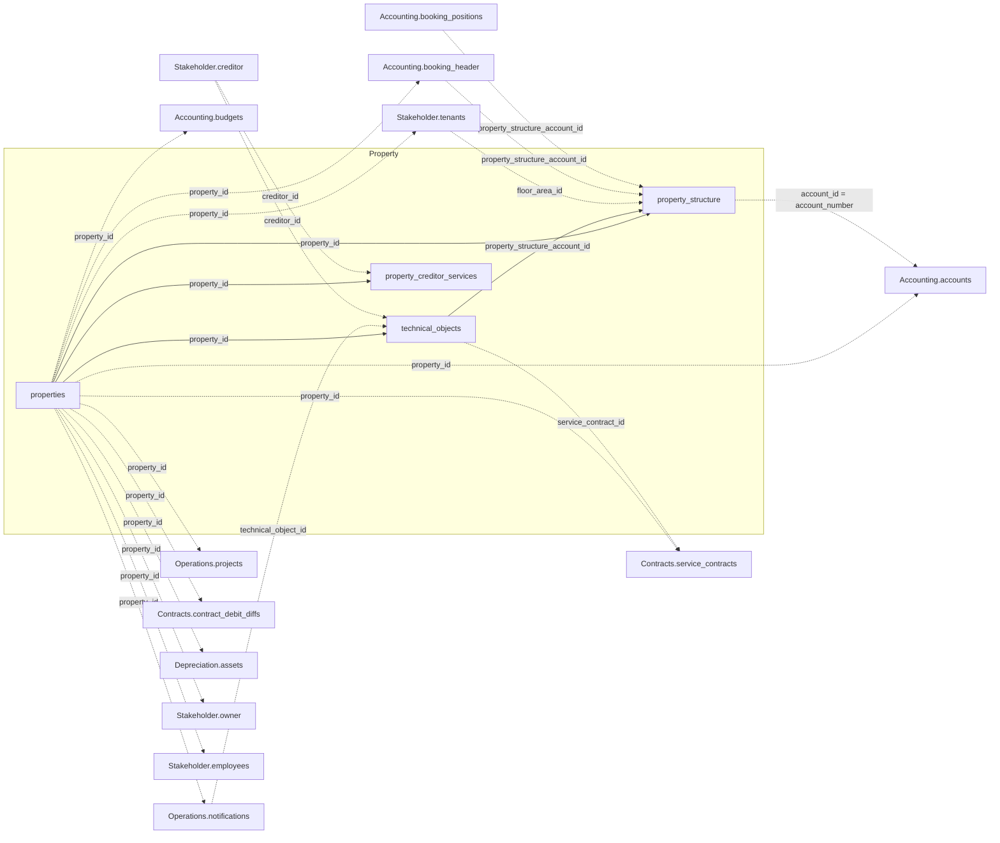

`property_id` ist der Verknüpfungsschlüssel, den sich Property mit jeder anderen Domäne teilt
— das komplette domänenübergreifende Diagramm sowie die Schlüsselreferenz stehen in der
[Datenmodell-Übersicht](/de/v1/data-model/overview). Das Diagramm unten zeigt die
Property-internen Verknüpfungen (durchgezogen) zusammen mit jeder Kante, die von außen auf
eine Property-Tabelle zeigt (gestrichelt).

*Durchgezogene Kanten sind Verknüpfungen innerhalb von Property; gestrichelte Kanten
wechseln in eine andere Domäne.*

## properties

`GET /v1/property/properties` — Objekt-Stammdaten: Adresse, Nutzungsart und Koordinaten.

<ResponseField name="property_id" type="string" required>
  Eindeutige Objektkennung.
</ResponseField>

<ResponseField name="entrances" type="string[]">
  Eingangs-/Straßenbezeichnungen des Objekts, bis zu fünf. Leere Einträge werden weggelassen.
</ResponseField>

<ResponseField name="mandate_period" type="object">
  Verwaltungsmandat für dieses Objekt.
  <Expandable title="properties">
    <ResponseField name="start" type="date">
      Beginn des Mandats.
    </ResponseField>
    <ResponseField name="end" type="date">
      Ende des Mandats.
    </ResponseField>
  </Expandable>
</ResponseField>

<ResponseField name="accounting_property_id" type="string">
  Objektnummer der buchenden Einheit, unter der dieses Objekt bucht. Ein verifizierter,
  selbstreferenzierender Fremdschlüssel auf `property_id` — gegen eine andere Zeile desselben
  Endpunkts auflösen.
</ResponseField>

<ResponseField name="obj_name" type="string">
  Objektbezeichnung.
</ResponseField>

<ResponseField name="postcode" type="string">
  Postleitzahl.
</ResponseField>

<ResponseField name="adr_city" type="string">
  Ort, bereinigt.
</ResponseField>

<ResponseField name="city" type="string">
  Ort, wie ursprünglich erfasst — kann von der bereinigten Fassung in `adr_city` abweichen.
</ResponseField>

<ResponseField name="country" type="string">
  Land. Aktuell bei allen Objekten immer leer.
</ResponseField>

<ResponseField name="construction_year" type="integer">
  Baujahr.
</ResponseField>

<ResponseField name="longitude" type="number">
  Geografische Länge.
</ResponseField>

<ResponseField name="latitude" type="number">
  Geografische Breite.
</ResponseField>

<ResponseField name="state_name" type="string">
  Bundesland.
</ResponseField>

<ResponseField name="use_type" type="string">
  Nutzungsart des Objekts.
</ResponseField>

<ResponseField name="property_type" type="string">
  Objektkategorie: Mietobjekt, Hauptbuchhaltung, Mandant oder Verwaltung.
</ResponseField>

<ResponseField name="tax_model" type="string">
  Steuermodell-Code. Für diesen Code existiert keine dokumentierte Label-Zuordnung.
</ResponseField>

<ResponseField name="dms_link" type="string">
  Link zum verknüpften Dokument im DMS.
</ResponseField>

## property_structure

`GET /v1/property/property_structure` — jeder Strukturbestandteil eines Objekts, flach als
eine Zeile pro Bestandteil: das Objekt selbst, ein Gebäude, ein Gebäudeteil/Eingang, eine
Etage oder eine Fläche/Mieteinheit.

<ResponseField name="property_id" type="string" required>
  Eindeutige Objektkennung.
</ResponseField>

<ResponseField name="account_id" type="string">
  Kostenstellen-Geschäftscode dieser Zeile. Matcht `accounts.account_number`, nicht
  `accounts.account_id` — die vollständige Schlüsselreferenz steht in der
  [Übersicht](/de/v1/data-model/overview).
</ResponseField>

<ResponseField name="floor_area_id" type="integer">
  Kennzeichnet eine Fläche. Nur befüllt für Zeilen, die eine Fläche/Mieteinheit darstellen.
</ResponseField>

<ResponseField name="levels" type="object[]">
  Position des Bestandteils in der Objekt-Strukturhierarchie, als geordnete Liste von
  `{name, type}`-Ebenen. Leere Ebenen werden weggelassen.
</ResponseField>

<ResponseField name="account_type" type="object">
  Um welche Art Strukturbestandteil es sich bei dieser Zeile handelt.
  <Expandable title="properties">
    <ResponseField name="code" type="string">
      Kurzcode.
    </ResponseField>
    <ResponseField name="label" type="string">
      Fläche, Gebäude, Etage, Objekt oder Person.
    </ResponseField>
  </Expandable>
</ResponseField>

<ResponseField name="mandate_period" type="object">
  Mandatszeitraum für diesen Bestandteil.
  <Expandable title="properties">
    <ResponseField name="start" type="date">
      Beginn des Mandats.
    </ResponseField>
    <ResponseField name="end" type="date">
      Ende des Mandats.
    </ResponseField>
  </Expandable>
</ResponseField>

<ResponseField name="floor_area_period" type="object">
  Gültigkeitszeitraum der Fläche.
  <Expandable title="properties">
    <ResponseField name="start" type="date">
      Beginn der Gültigkeit.
    </ResponseField>
    <ResponseField name="end" type="date">
      Ende der Gültigkeit.
    </ResponseField>
  </Expandable>
</ResponseField>

<ResponseField name="active_period" type="object">
  Kombiniertes Aktiv-Fenster über die zugrundeliegenden Quellzeiträume.
  <Expandable title="properties">
    <ResponseField name="start" type="date">
      Spätestes der zugrundeliegenden Startdaten.
    </ResponseField>
    <ResponseField name="end" type="date">
      Frühestes der zugrundeliegenden Enddaten.
    </ResponseField>
  </Expandable>
</ResponseField>

<ResponseField name="is_beteiligungskreis" type="boolean">
  Ob diese Zeile aus einem echten Beteiligungskreis stammt, mandantenunabhängig.
</ResponseField>

<ResponseField name="is_core_structure" type="boolean">
  Ob diese Zeile zur Kern-Gebäudestruktur des Objekts gehört (Gebäude, Gebäudeteil oder
  Etage) statt zu einer Fläche.
</ResponseField>

<ResponseField name="structure_level_type" type="string">
  Ebene der Kern-Gebäudestruktur: Gebäude, Gebäudeteil oder Etage. `null`, wenn
  `is_core_structure` `false` ist.
</ResponseField>

<ResponseField name="property_name" type="string">
  Objektname.
</ResponseField>

<ResponseField name="account_name" type="string">
  Kostenstellenbezeichnung.
</ResponseField>

<ResponseField name="floor_area_nr" type="string">
  Flächennummer.
</ResponseField>

<ResponseField name="address" type="string">
  Adresse dieses Bestandteils.
</ResponseField>

<ResponseField name="entrance" type="string">
  Eingangsbezeichnung.
</ResponseField>

<ResponseField name="building_part" type="string">
  Gebäudeteilbezeichnung.
</ResponseField>

<ResponseField name="floor" type="string">
  Etagenbezeichnung.
</ResponseField>

<ResponseField name="floor_area_name" type="string">
  Flächenbezeichnung.
</ResponseField>

<ResponseField name="location" type="string">
  Lageangabe.
</ResponseField>

<ResponseField name="floor_area_type" type="string">
  Nutzungsart der Fläche.
</ResponseField>

<ResponseField name="no_marketing" type="boolean">
  Ob diese Fläche von der Vermarktung ausgeschlossen ist.
</ResponseField>

<ResponseField name="target_rent_per_m2" type="number">
  Sollmiete je Quadratmeter.
</ResponseField>

<ResponseField name="market_rent_per_m2" type="number">
  Marktmiete je Quadratmeter.
</ResponseField>

<ResponseField name="heating" type="string">
  Heizungsart.
</ResponseField>

<ResponseField name="vacancy_reason" type="string">
  Leerstandsgrund-Code.
</ResponseField>

<ResponseField name="vacancy_reason_comment" type="string">
  Freitext-Kommentar zum Leerstandsgrund.
</ResponseField>

<ResponseField name="vacancy_reason_begin_date" type="date">
  Beginn des Leerstands.
</ResponseField>

<ResponseField name="url" type="string">
  URL eines Fotos der Fläche.
</ResponseField>

<ResponseField name="m2" type="number">
  Flächengröße in Quadratmetern.
</ResponseField>

<ResponseField name="target_rent_total" type="number">
  Sollmiete gesamt.
</ResponseField>

<ResponseField name="market_rent_total" type="number">
  Marktmiete gesamt.
</ResponseField>

<ResponseField name="dms_link" type="string">
  Link zum verknüpften Dokument im DMS.
</ResponseField>

## property_creditor_services

`GET /v1/property/property_creditor_services` — welche Kreditoren (Dienstleister) einem
Objekt nach Gewerk zugeordnet sind.

<ResponseField name="property_id" type="string" required>
  Eindeutige Objektkennung.
</ResponseField>

<ResponseField name="creditor_id" type="string" required>
  Kennzeichnet den Kreditor. Siehe `Stakeholder.creditor`.
</ResponseField>

<ResponseField name="exclusivity" type="object">
  Ob dieser Kreditor das Gewerk für das Objekt exklusiv hält.
  <Expandable title="properties">
    <ResponseField name="code" type="string">
      Kurzcode.
    </ResponseField>
    <ResponseField name="label" type="string">
      Sprechendes Label.
    </ResponseField>
  </Expandable>
</ResponseField>

<ResponseField name="service" type="string">
  Das Gewerk, das diese Zuordnung abdeckt.
</ResponseField>

## technical_objects

`GET /v1/property/technical_objects` — technische Anlagen und Geräte mit Standort-,
Wartungs- und Prüfinformationen.

<ResponseField name="property_id" type="string" required>
  Eindeutige Objektkennung.
</ResponseField>

<ResponseField name="creditor_id" type="string">
  Für die Anlage zuständiger Kreditor, sofern vorhanden.
</ResponseField>

<ResponseField name="floor_area_id" type="integer">
  Fläche, in der sich die Anlage befindet, sofern auf dieser Ebene zugeordnet.
</ResponseField>

<ResponseField name="to_id" type="integer" required>
  Eindeutige Kennung der technischen Anlage.
</ResponseField>

<ResponseField name="to_nr" type="string">
  Geschäftsnummer der technischen Anlage.
</ResponseField>

<ResponseField name="name" type="string">
  Bezeichnung der technischen Anlage.
</ResponseField>

<ResponseField name="type" type="string">
  Typ/Kategorie der Anlage.
</ResponseField>

<ResponseField name="responsible_person" type="string">
  Für die Anlage zuständiger Mitarbeiter.
</ResponseField>

<ResponseField name="built_date" type="date">
  Einbau-/Herstellungsdatum.
</ResponseField>

<ResponseField name="inspection_date" type="date">
  Datum der letzten Prüfung.
</ResponseField>

<ResponseField name="maintenance_date" type="date">
  Datum der letzten Wartung.
</ResponseField>

<ResponseField name="comment" type="string">
  Freitext-Kommentar.
</ResponseField>

<ResponseField name="is_meter" type="boolean">
  Ob es sich um einen Zähler handelt.
</ResponseField>

<ResponseField name="is_maintenance_relevant" type="boolean">
  Ob die Anlage wartungspflichtig ist.
</ResponseField>

<ResponseField name="maintenance_type" type="string">
  Wartungstyp-Code.
</ResponseField>

<ResponseField name="maintenance_creditor_id" type="string">
  Für die Wartung zuständiger Kreditor.
</ResponseField>

<ResponseField name="maintenance_creditor_name" type="string">
  Name des Wartungskreditors.
</ResponseField>

<ResponseField name="is_inspection_relevant" type="boolean">
  Ob die Anlage prüfungspflichtig ist.
</ResponseField>

<ResponseField name="inspection_type" type="string">
  Prüfungstyp-Code.
</ResponseField>

<ResponseField name="inactive" type="boolean">
  Ob die Anlage außer Betrieb ist.
</ResponseField>

<ResponseField name="service_contract_id" type="string">
  Servicevertrag, der diese Anlage abdeckt, sofern vorhanden. Siehe
  `Contracts.service_contracts`.
</ResponseField>

<ResponseField name="property_structure_account_id" type="string">
  Fremdschlüssel auf `property_structure`. Nur gesetzt für Zeilen ohne `floor_area_id`
  (rund ein Viertel der Zeilen) — wo `floor_area_id` gesetzt ist, ist das bereits der
  Verknüpfungspfad zur Fläche und dieses Feld bleibt leer.
</ResponseField>

<ResponseField name="warranty_period" type="object">
  Garantiezeitraum, sofern erfasst. Selten befüllt.
  <Expandable title="properties">
    <ResponseField name="start" type="date">
      Beginn der Garantie.
    </ResponseField>
    <ResponseField name="end" type="date">
      Ende der Garantie.
    </ResponseField>
  </Expandable>
</ResponseField>
