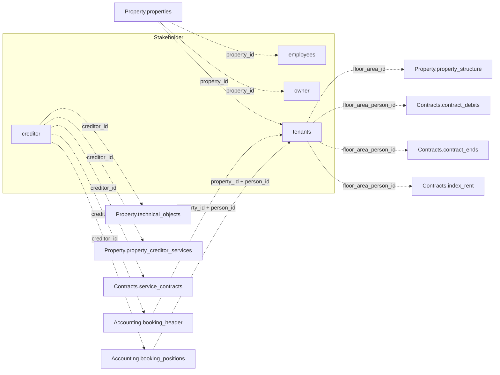

Keine der vier Tabellen unten verknüpft sich direkt mit einer anderen. `employees`, `owner`
und `tenants` verknüpfen sich über `property_id` mit Property; `tenants` überbrückt zusätzlich
über `floor_area_person_id` nach Contracts. `creditor` ist eine eigenständige Entität ohne
`property_id`-Spalte, referenziert aus Property und Accounting über `creditor_id`. Das
vollständige domänenübergreifende Diagramm steht in der
[Datenmodell-Übersicht](/de/v1/data-model/overview).

*Jede Kante hier wechselt in eine andere Domäne — keine der vier Stakeholder-Tabellen
verknüpft sich direkt mit einer anderen.*

## creditor

`GET /v1/stakeholder/creditor` — Kreditoren-Stammdaten. Der einzige Stakeholder-Endpunkt ohne
`property_id`-Spalte — ein Kreditor ist eine eigenständige Entität, die mehrere Objekte
bedienen kann, referenziert über `creditor_id` aus `Property.technical_objects`,
`Property.property_creditor_services`, `Contracts.service_contracts` und
`Accounting.booking_header`/`booking_positions`.

<ResponseField name="creditor_id" type="string" required>
  Eindeutige Kreditorenkennung.
</ResponseField>

<ResponseField name="name_1" type="string">
  Erster Namensteil (Firma oder Nachname).
</ResponseField>

<ResponseField name="name_2" type="string">
  Zweiter Namensteil.
</ResponseField>

<ResponseField name="type" type="string">
  Kreditorentyp.
</ResponseField>

<ResponseField name="address_line_1" type="string">
  Erste Adresszeile, oberhalb von `street_nr`.
</ResponseField>

<ResponseField name="street_nr" type="string">
  Straße und Hausnummer.
</ResponseField>

<ResponseField name="zipcode_city" type="string">
  Postleitzahl und Ort, zu einem Feld zusammengefasst.
</ResponseField>

<ResponseField name="mail" type="string">
  E-Mail-Adresse.
</ResponseField>

<ResponseField name="homepage" type="string">
  Website-URL. Ein wörtlicher Platzhalter `"---"` im Quellsystem wird zu `null`.
</ResponseField>

<ResponseField name="contact_person" type="string">
  Benannter Ansprechpartner beim Kreditor.
</ResponseField>

<ResponseField name="phones" type="string[]">
  Telefonnummern, bis zu drei je Datensatz. Leere Einträge werden weggelassen.
</ResponseField>

<ResponseField name="bank" type="string">
  Bankname.
</ResponseField>

<ResponseField name="iban" type="string">
  IBAN.
</ResponseField>

<ResponseField name="swift" type="string">
  SWIFT/BIC-Code der Bank des Kreditors — dasselbe, was `owner` `bic` nennt.
</ResponseField>

<ResponseField name="tax_id" type="string">
  Steuernummer.
</ResponseField>

<ResponseField name="exemption_certificate" type="boolean">
  Ob eine Freistellungsbescheinigung (§48b EStG) vorliegt. Relevant, wenn der Kreditor
  Bauleistungen erbringt.
</ResponseField>

<ResponseField name="exemption_certificate_date" type="date">
  Datum auf der Freistellungsbescheinigung. Welches Datum das ist — Ausstellung oder
  Gültigkeitsende — ist nicht dokumentiert; vor Verwendung beim Support nachfragen.
</ResponseField>

<ResponseField name="industry" type="string">
  Branchenzuordnung.
</ResponseField>

<ResponseField name="industry_info" type="string">
  Zusätzliche Brancheninformation. Der Zusammenhang mit `industry` ist nicht dokumentiert —
  vor Verwendung beim Support nachfragen.
</ResponseField>

<ResponseField name="dms_link" type="string">
  Link zum verknüpften Dokument im DMS.
</ResponseField>

## employees

`GET /v1/stakeholder/employees` — das für ein Objekt zuständige Verwaltungsteam.

<ResponseField name="property_id" type="string" required>
  Eindeutige Objektkennung.
</ResponseField>

<ResponseField name="team" type="string">
  Teambezeichnung, die für das Objekt zuständig ist.
</ResponseField>

<ResponseField name="first_name" type="string">
  Vorname des Mitarbeiters.
</ResponseField>

<ResponseField name="last_name" type="string">
  Nachname des Mitarbeiters.
</ResponseField>

<ResponseField name="phone" type="string">
  Kontakt-Telefonnummer.
</ResponseField>

<ResponseField name="mail" type="string">
  Kontakt-E-Mail-Adresse.
</ResponseField>

<ResponseField name="inactive" type="boolean">
  Ob der Mitarbeiter-Datensatz inaktiv ist.
</ResponseField>

<Note>
  Dieser Endpunkt liefert eine Zeile je Objekt mit dem zuständigen Team/Mitarbeiter — kein
  allgemeines Mitarbeiterverzeichnis.
</Note>

## owner

`GET /v1/stakeholder/owner` — Eigentümer-Stammdaten inklusive Eigentumsanteil bei
Miteigentum.

<ResponseField name="property_id" type="string" required>
  Eindeutige Objektkennung.
</ResponseField>

<ResponseField name="debitor_id" type="integer" required>
  Eigentümerkennung.
</ResponseField>

<ResponseField name="share" type="number">
  Eigentumsanteil in Prozent, auf 100 gekappt. `null` bedeutet: kein Anteil erfasst. Ein
  Objekt kann mehrere `owner`-Zeilen haben, die sich zum Gesamtanteil summieren.
</ResponseField>

<ResponseField name="salutation" type="string">
  Anrede/Titel.
</ResponseField>

<ResponseField name="name" type="string">
  Eigentümername (Person oder Firma).
</ResponseField>

<ResponseField name="name_2" type="string">
  Zweiter Namensteil.
</ResponseField>

<ResponseField name="street_nr" type="string">
  Straße und Hausnummer.
</ResponseField>

<ResponseField name="zipcode_city" type="string">
  Postleitzahl und Ort, zu einem Feld zusammengefasst.
</ResponseField>

<ResponseField name="phone" type="string">
  Kontakt-Telefonnummer.
</ResponseField>

<ResponseField name="bank" type="string">
  Bankname.
</ResponseField>

<ResponseField name="fax" type="string">
  Faxnummer.
</ResponseField>

<ResponseField name="mail" type="string">
  Kontakt-E-Mail-Adresse.
</ResponseField>

<ResponseField name="bic" type="string">
  BIC-Code der Bank des Eigentümers — dasselbe, was `creditor` `swift` nennt.
</ResponseField>

<ResponseField name="iban" type="string">
  IBAN.
</ResponseField>

<ResponseField name="account_number" type="string">
  Eigene Kontonummer des Eigentümers, zusammen mit `iban`. Nicht zu verwechseln mit
  `Accounting.accounts.account_number`, das ein Sachkonto identifiziert.
</ResponseField>

## tenants

`GET /v1/stakeholder/tenants` — Mieter-Stammdaten und aktuelle Mietvertragskonditionen.

<ResponseField name="property_id" type="string" required>
  Eindeutige Objektkennung.
</ResponseField>

<ResponseField name="floor_area_person_id" type="string" required>
  Kennzeichnet ein Mietverhältnis. Wird von `Contracts.contract_debits`,
  `Contracts.contract_ends` und `Contracts.index_rent` geteilt —
  die vollständige Schlüsselreferenz steht in der
  [Datenmodell-Übersicht](/de/v1/data-model/overview#join-keys-in-detail).
</ResponseField>

<ResponseField name="floor_area_id" type="integer">
  Fläche, die der Mieter belegt. Verknüpft sich mit
  `Property.property_structure.floor_area_id`.
</ResponseField>

<ResponseField name="person_id" type="string">
  Kennzeichnet den Mieter. Nur in Kombination mit `property_id` gültig, da die Nummerierung
  je Objekt neu beginnt — siehe die
  [Datenmodell-Übersicht](/de/v1/data-model/overview#join-keys-in-detail).
</ResponseField>

<ResponseField name="person_name" type="string">
  Vollständiger Mietername als ein Feld. Kein getrennter Vor-/Nachname verfügbar.
</ResponseField>

<ResponseField name="name_1" type="string">
  Erster Namensteil der eigenen Kontaktadresse des Mieters, sofern abweichend von der
  Flächenadresse.
</ResponseField>

<ResponseField name="name_2" type="string">
  Zweiter Namensteil der eigenen Kontaktadresse des Mieters.
</ResponseField>

<ResponseField name="street_nr" type="string">
  Straße und Hausnummer der eigenen Kontaktadresse des Mieters.
</ResponseField>

<ResponseField name="zipcode_city" type="string">
  Postleitzahl und Ort der eigenen Kontaktadresse des Mieters, zu einem Feld zusammengefasst.
</ResponseField>

<ResponseField name="contact_phone_main" type="string">
  Haupttelefonnummer.
</ResponseField>

<ResponseField name="contact_mail" type="string">
  Kontakt-E-Mail-Adresse.
</ResponseField>

<ResponseField name="phones" type="string[]">
  Weitere Telefonnummern, bis zu drei je Datensatz — dieselbe Form wie
  `Stakeholder.creditor.phones`. Leere Einträge werden weggelassen.
</ResponseField>

<ResponseField name="iban" type="string">
  IBAN.
</ResponseField>

<ResponseField name="bank" type="string">
  Bankname.
</ResponseField>

<ResponseField name="contract_period" type="object">
  Der Mietvertragszeitraum.
  <Expandable title="properties">
    <ResponseField name="start" type="date">
      Vertragsbeginn.
    </ResponseField>
    <ResponseField name="end" type="date">
      Vertragsende.
    </ResponseField>
  </Expandable>
</ResponseField>

<ResponseField name="contract_end_option" type="date">
  Vertragsende bei Ausübung einer Verlängerungsoption.
</ResponseField>

<ResponseField name="dms_link" type="string">
  Link zum verknüpften Dokument im DMS.
</ResponseField>
