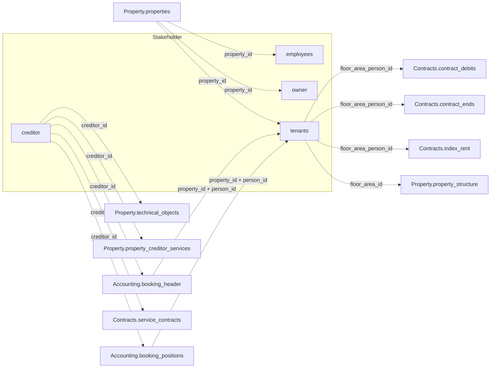

Die v1-Stakeholder-Domäne umfasst vier Tabellen: `creditor`, `employees`, `owner` und
`tenants`, die alle den Regeln der
[Response-Struktur](/de/v1/response-shape-conventions) folgen.

## Wie Stakeholder mit anderen Domänen zusammenhängt

`property_id` verknüpft `tenants`, `owner` und `employees` mit `Property.properties`.
`creditor` ist die Ausnahme — eine eigenständige Entität, referenziert über `creditor_id`,
ohne eigene `property_id`.

*Durchgezogene Kanten sind Joins innerhalb einer Domäne; gestrichelte Kanten gehen in eine andere Domäne. Diese Domäne hat keine direkten internen Joins — jede Tabelle hier verknüpft stattdessen in eine andere Domäne.*

Das vollständige domänenübergreifende Diagramm und die Kardinalitäten der Join-Keys stehen
in der [v1-Datenmodell-Übersicht](/de/v1/data-model/overview#wie-die-v1-tabellen-zusammenhängen).

## creditor

`GET /v1/stakeholder/creditor` — Lieferanten- und Kreditorenstammdaten. Dies ist der
einzige Stakeholder-Endpunkt ohne `property_id`-Spalte — ein Kreditor ist eine
eigenständige Entität, die mehreren Objekten dienen kann, referenziert über `creditor_id`
auf anderen Tabellen.

<ResponseField name="creditor_id" type="string" required>
  Eindeutige Kreditor-ID.
</ResponseField>

<ResponseField name="name_1" type="string">
  Erste Namenszeile (Firma oder Nachname).
</ResponseField>

<ResponseField name="name_2" type="string">
  Zweite Namenszeile.
</ResponseField>

<ResponseField name="type" type="string">
  Kreditortyp.
</ResponseField>

<ResponseField name="address_line_1" type="string">
  Erste Zeile der Postadresse, oberhalb von `street_nr`.
</ResponseField>

<ResponseField name="street_nr" type="string">
  Straße und Hausnummer.
</ResponseField>

<ResponseField name="zipcode_city" type="string">
  Postleitzahl und Ort, in einem Feld kombiniert.
</ResponseField>

<ResponseField name="mail" type="string">
  E-Mail-Adresse.
</ResponseField>

<ResponseField name="homepage" type="string">
  Webseite.
</ResponseField>

<ResponseField name="contact_person" type="string">
  Benannte Ansprechperson beim Kreditor.
</ResponseField>

<ResponseField name="phones" type="string[]">
  Telefonnummern, als Array mit einem Eintrag pro Nummer — dieselbe Struktur wie bei
  `Stakeholder.tenants.phones`.
</ResponseField>

<ResponseField name="iban" type="string">
  Bankkonto-IBAN.
</ResponseField>

<ResponseField name="swift" type="string">
  SWIFT/BIC der Bank des Kreditors — dasselbe, was `owner` als `bic` führt.
</ResponseField>

<ResponseField name="bank" type="string">
  Bankname.
</ResponseField>

<ResponseField name="tax_id" type="string">
  Steuer-Identifikationsnummer.
</ResponseField>

<ResponseField name="exemption_certificate" type="boolean">
  Ob eine Freistellungsbescheinigung zur Bauabzugsteuer (§ 48b EStG) vorliegt. Relevant, wenn
  der Kreditor Bauleistungen erbringt.
</ResponseField>

<ResponseField name="exemption_certificate_date" type="date">
  Datum auf der Freistellungsbescheinigung. Welches Datum gemeint ist — Ausstellung oder
  Ablauf — ist nicht dokumentiert; vor der Nutzung beim Support nachfragen.
</ResponseField>

<ResponseField name="industry" type="string">
  Branchenklassifikation.
</ResponseField>

<ResponseField name="industry_info" type="string">
  Zusätzliche Branchenangabe. Das Verhältnis zu `industry` ist nicht dokumentiert — vor der
  Nutzung beim Support nachfragen.
</ResponseField>

<ResponseField name="okdn" type="string">
  Nicht dokumentiert. Vor der Nutzung beim Support nachfragen.
</ResponseField>

<ResponseField name="dms_link" type="string">
  Link zum Dokumentenordner des Kreditors im Dokumentenmanagementsystem, falls vorhanden.
</ResponseField>

## employees

`GET /v1/stakeholder/employees` — das für ein Objekt verantwortliche
Property-Management-Team.

<ResponseField name="property_id" type="string" required>
  Eindeutige Objekt-ID.
</ResponseField>

<ResponseField name="team" type="string">
  Team, dem der Mitarbeiter angehört, als lesbarer Name (z. B. `"Objektmanagement"`,
  `"Buchhaltung / Abrechnung"`). Passt zu
  [`Operations.projects.responsible_team`](/de/v1/data-model/operations) — so lässt sich das
  Team eines Projekts auf seine Mitglieder auflösen. Passt **nicht** zu
  `Operations.notifications.responsible_team`, das numerische Codes statt Namen enthält.
</ResponseField>

<ResponseField name="first_name" type="string">
  Vorname des Mitarbeiters.
</ResponseField>

<ResponseField name="last_name" type="string">
  Nachname des Mitarbeiters.
</ResponseField>

<ResponseField name="phone" type="string">
  Kontakt-Telefonnummer.
</ResponseField>

<ResponseField name="mail" type="string">
  Kontakt-E-Mail-Adresse.
</ResponseField>

<ResponseField name="inactive" type="boolean">
  Ob der Mitarbeiter-Datensatz inaktiv ist.
</ResponseField>

<Note>
  Das ist die Zuordnung von Personen zu Objekten, kein allgemeines Mitarbeiterverzeichnis: ein
  Objekt kann mehrere Zeilen haben (eine pro beteiligtem Team), und dieselbe Person erscheint
  einmal pro Objekt, für das sie verantwortlich ist. Eine Mitarbeiter-ID gibt es nicht — zum
  Entdoppeln über Objekte hinweg auf `mail` abgleichen.
</Note>

## owner

`GET /v1/stakeholder/owner` — Stammdaten zu Objekteigentümern, einschließlich des
Eigentumsanteils bei Objekten mit mehreren Eigentümern.

<ResponseField name="property_id" type="string" required>
  Eindeutige Objekt-ID.
</ResponseField>

<ResponseField name="debitor_id" type="integer" required>
  Eigentümer-ID.
</ResponseField>

<ResponseField name="share" type="string" required>
  Eigentumsanteil in Prozent. Dezimalwert als String serialisiert, keine JSON-Zahl — vor
  Rechenoperationen casten. Ein Objekt kann mehrere `owner`-Zeilen haben, deren Summe den
  gesamten Anteil ergibt.
</ResponseField>

<ResponseField name="salutation" type="string">
  Anrede/Titel.
</ResponseField>

<ResponseField name="name" type="string">
  Name des Eigentümers (Privatperson oder Firma).
</ResponseField>

<ResponseField name="name_2" type="string">
  Zweite Namenszeile.
</ResponseField>

<ResponseField name="street_nr" type="string">
  Straße und Hausnummer.
</ResponseField>

<ResponseField name="zipcode_city" type="string">
  Postleitzahl und Ort, in einem Feld kombiniert.
</ResponseField>

<ResponseField name="phone" type="string">
  Kontakt-Telefonnummer.
</ResponseField>

<ResponseField name="partner" type="string">
  Nicht dokumentiert. Vor der Nutzung beim Support nachfragen.
</ResponseField>

<ResponseField name="bank" type="string">
  Bankname.
</ResponseField>

<ResponseField name="fax" type="string">
  Faxnummer, falls hinterlegt.
</ResponseField>

<ResponseField name="mail" type="string">
  Kontakt-E-Mail-Adresse.
</ResponseField>

<ResponseField name="bic" type="string">
  Bank Identifier Code (BIC), falls hinterlegt.
</ResponseField>

<ResponseField name="iban" type="string">
  IBAN des Bankkontos.
</ResponseField>

<ResponseField name="account_number" type="string">
  Kontonummer des Eigentümers für Auszahlungen. Unabhängig von
  `Accounting.accounts.account_number`, das ein Sachkonto bezeichnet.
</ResponseField>

<Warning>
  `owner.debitor_id` nicht mit `creditor.creditor_id` verknüpfen. Beide sind numerische
  Sequenzen und überschneiden sich zufällig — von den IDs, die in beiden vorkommen, gehören
  mehr als die Hälfte zu unterschiedlichen Parteien. Eigentümer und Kreditoren sind getrennte
  ID-Räume, zwischen denen es in `/v1/` keinen Join-Key gibt.
</Warning>

## tenants

`GET /v1/stakeholder/tenants` — Mieterstammdaten und aktuelle Mietvertragskonditionen.

<ResponseField name="property_id" type="string" required>
  Eindeutige Objekt-ID.
</ResponseField>

<ResponseField name="floor_area_person_id" type="string" required>
  Eindeutige ID dieses Mietverhältnisses. Zusammengesetzt aus `floor_area_id` und `person_id`
  — das Feld wie angegeben nutzen, nicht selbst herleiten.
</ResponseField>

<ResponseField name="floor_area_id" type="integer">
  Einheit, die der Mieter belegt. Referenziert
  [`Property.property_structure.floor_area_id`](/de/v1/data-model/property#property_structure).
</ResponseField>

<ResponseField name="person_id" type="string" required>
  Mieter-ID, pro Objekt und nicht global vergeben. `Accounting.booking_header` und
  `Accounting.booking_positions` referenzieren sie — so kommst du von einer Buchung zum
  Mieter: über `property_id` **und** `person_id` gemeinsam verknüpfen und
  `booking_positions.person_id` vorher in einen String casten, da der Wert dort als Zahl
  zurückkommt.
</ResponseField>

<ResponseField name="person_name" type="string">
  Vollständiger Mietername als ein einzelnes Feld. Keine getrennten Vor-/Nachnamen
  verfügbar.
</ResponseField>

<ResponseField name="name_1" type="string">
  Erste Namenszeile im Mieterdatensatz. Vor der Nutzung des Verhältnisses zu `person_name`
  beim Support nachfragen.
</ResponseField>

<ResponseField name="name_2" type="string">
  Zweite Namenszeile im Mieterdatensatz, falls vorhanden.
</ResponseField>

<ResponseField name="street_nr" type="string">
  Straße und Hausnummer der Kontaktadresse des Mieters.
</ResponseField>

<ResponseField name="zipcode_city" type="string">
  Postleitzahl und Ort der Kontaktadresse des Mieters, in einem Feld kombiniert.
</ResponseField>

<ResponseField name="contact_phone_main" type="string">
  Primäre Kontakttelefonnummer.
</ResponseField>

<ResponseField name="contact_mail" type="string">
  Kontakt-E-Mail-Adresse.
</ResponseField>

<ResponseField name="phones" type="string[]">
  Zusätzliche Telefonnummern, als Array mit einem Eintrag pro Nummer.
</ResponseField>

<ResponseField name="iban" type="string">
  IBAN des Mieters, falls hinterlegt.
</ResponseField>

<ResponseField name="bank" type="string">
  Bank des Mieters, falls hinterlegt.
</ResponseField>

<ResponseField name="contract_period" type="object">
  Mietvertragslaufzeit — `{start, end}` (Datumsstrings).
</ResponseField>

<ResponseField name="contract_end_option" type="date">
  Mietvertragsende bei Ausübung einer Verlängerungsoption.
</ResponseField>

<ResponseField name="option_valid_until" type="date">
  Frist zur Ausübung der Verlängerungsoption.
</ResponseField>

<ResponseField name="dms_link" type="string">
  Link zum Mietvertragsdokument im Dokumentenmanagementsystem, falls vorhanden.
</ResponseField>

<Note>
  Um ein Mietverhältnis einer Einheit zuzuordnen, über `property_id` und `floor_area_id`
  verknüpfen. `floor_area_person_id` ist das einzige Feld, das eine Zeile allein identifiziert
  — eine Person kann mehrere Mietverhältnisse im selben Objekt haben, ein Join über
  `property_id` plus `person_id` kann also mehr als eine Zeile pro Person liefern.
  `floor_area_person_id` ist außerdem das Feld, auf das sich
  [`Contracts.contract_debits`, `Contracts.contract_ends` und
  `Contracts.index_rent`](/de/v1/data-model/contracts) beziehen — auf allen vier Tabellen ein
  String, diese Joins brauchen also keinen Cast.
</Note>
