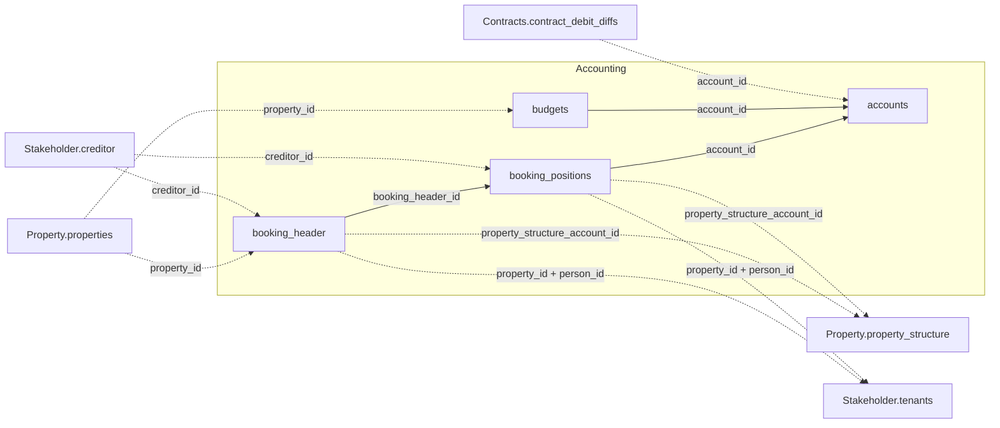

The v1 Accounting domain covers four tables: `accounts`, `booking_header`,
`booking_positions`, and `budgets`. All four follow the [response
structure](/v1/response-shape-conventions) rules — nested `period`/`amount` objects and flat
join keys.

## How Accounting connects to other domains

`property_id` links `booking_header` and `budgets` back to `Property.properties`.
`account_id` chains `booking_positions` and `budgets` into `accounts`, and reaches out to
`Contracts.contract_debit_diffs`.

*Solid edges are joins within a domain; dashed edges cross into another domain.*

For the full cross-domain diagram and join-key cardinalities, see the
[v1 data model overview](/v1/data-model/overview#how-the-v1-tables-connect).

## accounts

`GET /v1/accounting/accounts` — the chart of accounts.

<ResponseField name="property_id" type="string" required>
  Unique property identifier.
</ResponseField>

<ResponseField name="account_id" type="integer" required>
  Internal account identifier. Referenced by `booking_positions` and `budgets` as
  `account_id`.
</ResponseField>

<ResponseField name="account_number" type="string">
  Human-readable account number. `null` on some rows (e.g. summary/total accounts).
</ResponseField>

<ResponseField name="account_name" type="string">
  Account name.
</ResponseField>

<ResponseField name="account_balance_type" type="object">
  Balance-side code for the account — `{code, label}` (e.g. `{"code": 1, "label":
  "Aufwandskonto"}`). `label` is absent for some `code` values.
</ResponseField>

<ResponseField name="account_type_name" type="string">
  Human-readable account type.
</ResponseField>

<ResponseField name="account_group" type="string">
  Account group assignment. Related to, but not derived from, `kontenmapping_ranges`.
</ResponseField>

<ResponseField name="group" type="string">
  Top level of the reporting classification — either `"A – Einnahmen- / Ausgabenkonten"`
  (income/expense accounts) or `"B – Bestandskonten"` (balance-sheet accounts). Fully
  determined by `category`. Distinct from `account_group` above.
</ResponseField>

<ResponseField name="category" type="string">
  Reporting category within `group`, as a numbered German label — one of `"01 – Erträge"`,
  `"02 – Ausgaben"`, `"03 – Investitionen"`, `"04 – Forderungen & Verbindlichkeiten /
  Finanzamt"`, `"05 – Geldkonten"`, `"06 – Kapitalkonten"`, `"07 – Anlagevermögen"`.
</ResponseField>

<ResponseField name="nr" type="integer">
  Sub-group number within `category`, from 1 to 13. Many accounts share the same
  `category`/`nr` pair, so it groups accounts rather than identifying one — and it is not an
  account number: it never equals `account_number`.
</ResponseField>

<ResponseField name="property_success_model" type="integer">
  Undocumented numeric code, with no label field alongside it. Contact support before relying
  on it.
</ResponseField>

<ResponseField name="property_tax_type" type="integer">
  Undocumented numeric code, with no label field alongside it. Not the same thing as
  `Property.properties.tax_model`, which is a readable string. Contact support before relying
  on it.
</ResponseField>

<ResponseField name="accounting_entity" type="string">
  Undocumented. It may carry the same join concept as
  `Property.properties.accounting_property_id` — contact support before building a join on
  it.
</ResponseField>

<ResponseField name="account_tax_code" type="integer">
  Undocumented tax code. Contact support before relying on it.
</ResponseField>

<ResponseField name="account_tax_appliance" type="integer">
  Undocumented tax code. Contact support before relying on it.
</ResponseField>

<Note>
  `group`, `category`, and `nr` are the reporting classification and are populated together on
  roughly a tenth of the rows — an account with all three `null` simply isn't mapped into that
  classification, which is not an error. `property_success_model` and `property_tax_type` are
  populated on every row.
</Note>

## booking_header

`GET /v1/accounting/booking_header` — general ledger booking headers. No `period` or
`amount` object here: the table has only a single `booking_date` field and a single
`booking_value` field, so those two conventions don't apply structurally.

<ResponseField name="property_id" type="string" required>
  Unique property identifier.
</ResponseField>

<ResponseField name="booking_header_id" type="integer" required>
  Unique identifier for the booking header. `booking_positions` references this as
  `booking_header_id`.
</ResponseField>

<ResponseField name="booking_nr" type="integer">
  Booking number.
</ResponseField>

<ResponseField name="creditor_id" type="string">
  Creditor linked to the booking. References `Stakeholder.creditor` — see the
  [Stakeholder field reference](/v1/data-model/stakeholder).
</ResponseField>

<ResponseField name="person_id" type="string">
  Tenant or contact person linked to the booking, using a local per-property numbering
  scheme. Joins to `Stakeholder.tenants` on `property_id` **and** `person_id` together —
  never on `person_id` alone, since the numbering restarts per property. Treat the value as an
  opaque string: it keeps its leading zeros and some values carry a suffix (`"2001-1"`), so
  converting it to a number and back breaks the match. This is also the field to route through
  when you need the tenant behind a `booking_positions` row. Not every person is a tenant, so
  some rows have no match. Don't treat this as the same identifier space as `person_id` on
  `Operations.notifications`, which is a separate sequence from another subsystem.
</ResponseField>

<ResponseField name="booking_date" type="date">
  Date of the booking.
</ResponseField>

<ResponseField name="booking_value" type="string">
  Total value of the booking header. Decimal value serialized as a string (e.g. `"-500.0000"`),
  not a JSON number — cast before doing arithmetic on it.
</ResponseField>

<ResponseField name="m2" type="string">
  Floor area in square metres associated with the booking, if applicable. Same string
  serialization as `booking_value`.
</ResponseField>

<ResponseField name="booking_text" type="string">
  Free-text description of the booking.
</ResponseField>

<ResponseField name="initial_booking_text" type="string">
  Original booking text, before any later correction.
</ResponseField>

<ResponseField name="booking_barcode" type="string">
  Barcode reference for the booking document, if scanned.
</ResponseField>

<ResponseField name="dms_link" type="string">
  Link to the booking document in the document management system, if attached.
</ResponseField>

<ResponseField name="cost_center_id_name_concat" type="string">
  Combined cost-centre ID and name — the only source of this label; there's no separate
  ID/name pair to join against instead.
</ResponseField>

<ResponseField name="ledger_id_name_concat" type="string">
  Combined ledger ID and name, for the same reason as `cost_center_id_name_concat`.
</ResponseField>

<ResponseField name="person_name_concat" type="string">
  Combined person ID and name, for the same reason as `cost_center_id_name_concat`.
</ResponseField>

<ResponseField name="property_structure_account_id" type="string">
  Foreign key into [`Property.property_structure`](/v1/data-model/property#property_structure),
  matching `property_structure.account_id`. Always populated, and the only way to resolve a
  booking down to a single unit — `booking_header` carries no `floor_area_id`.
</ResponseField>

## booking_positions

`GET /v1/accounting/booking_positions` — individual booking line items, joined to a header
via `booking_header_id`.

<ResponseField name="property_id" type="string" required>
  Unique property identifier.
</ResponseField>

<ResponseField name="booking_position_id" type="integer" required>
  Unique identifier for the line item.
</ResponseField>

<ResponseField name="booking_header_id" type="integer" required>
  Identifier of the parent booking header. Joins to `booking_header.booking_header_id`.
</ResponseField>

<ResponseField name="account_id" type="integer" required>
  Account the line item is posted to. Joins to `accounts.account_id` above.
</ResponseField>

<ResponseField name="contra_account_id" type="integer">
  Contra account for the posting.
</ResponseField>

<ResponseField name="contra_account_name" type="string">
  Name of the contra account. Not derivable by joining `contra_account_id` against
  `accounts` — the two don't correspond.
</ResponseField>

<ResponseField name="creditor_id" type="string">
  Creditor linked to the posting. References `Stakeholder.creditor` — see the
  [Stakeholder field reference](/v1/data-model/stakeholder).
</ResponseField>

<ResponseField name="person_id" type="integer">
  Tenant or contact person linked to the posting, as a number. Don't join it against
  `Stakeholder.tenants` directly: `tenants.person_id` is an opaque string that keeps leading
  zeros in varying widths (`"001"`, `"0001"`) and sometimes carries a suffix (`"2001-1"`), so
  casting this number to a string does not reproduce it — the join silently returns no rows.
  Route through `booking_header_id` instead and use
  [`booking_header.person_id`](#booking_header), which is already in the string form `tenants`
  uses.
</ResponseField>

<ResponseField name="property_id_person_id" type="integer">
  Composite key identifying the tenant this posting applies to. It resembles a
  concatenation of `property_id` and `person_id`, but isn't always exactly that — use the
  field as given rather than deriving it yourself. No `/v1/` table exposes a matching
  counterpart, so to reach the tenant use `property_id` plus `person_id` instead.
</ResponseField>

<ResponseField name="period" type="object">
  Booking period — `{start, end}` (date strings).
</ResponseField>

<ResponseField name="amount" type="object">
  Posting amount — `{net, tax, gross}`.
</ResponseField>

<ResponseField name="amount_per_sqm" type="object">
  Posting amount normalised per square metre — `{net, tax, gross}`.
</ResponseField>

<ResponseField name="account_group" type="string">
  Account group assignment.
</ResponseField>

<ResponseField name="booking_date" type="date">
  Date of the posting.
</ResponseField>

<ResponseField name="booking_nr" type="integer">
  Booking number.
</ResponseField>

<ResponseField name="booking_Lfd_nr" type="integer">
  Sequential line number within the booking.
</ResponseField>

<ResponseField name="booking_type" type="integer">
  Booking type code.
</ResponseField>

<ResponseField name="booking_position_text" type="string">
  Free-text description of the line item.
</ResponseField>

<ResponseField name="sh" type="string">
  Debit/credit indicator (`S`/`H`). Don't infer it from the sign of `amount.net` — about
  3.55% of rows (reversal/correction postings) have a sign that contradicts this indicator.
</ResponseField>

<ResponseField name="HNDL" type="string">
  Decimal value serialized as a string (e.g. `"0.0000"`), not a JSON number — cast before
  doing arithmetic on it. Undocumented: about 99.2% of rows are `"0.0000"`, and where
  non-zero the value tends to sit close to `amount.net` on booking types tied to recoverable
  operating costs. Contact support before relying on it.
</ResponseField>

<ResponseField name="property_structure_account_id" type="string">
  Foreign key into `Property.property_structure`, matching `property_structure.account_id`
  — the same always-populated unit-level join key as on `booking_header`.
</ResponseField>

## budgets

`GET /v1/accounting/budgets` — budget amounts, one row per property, account, and month.

<ResponseField name="property_id" type="string" required>
  Unique property identifier.
</ResponseField>

<ResponseField name="account_id" type="integer" required>
  Account the budget applies to. Joins to `accounts.account_id` above.
</ResponseField>

<ResponseField name="account_number" type="integer">
  Human-readable account number. An integer here, while `accounts.account_number` is a
  string — compare them as strings if you need to match rows across the two tables.
</ResponseField>

<ResponseField name="date" type="date" required>
  Month the budget row applies to.
</ResponseField>

<ResponseField name="budget" type="string" required>
  Budget amount for the specific month and account. Decimal value serialized as a string
  (e.g. `"24862.3300"`), not a JSON number — cast before doing arithmetic on it.
</ResponseField>
