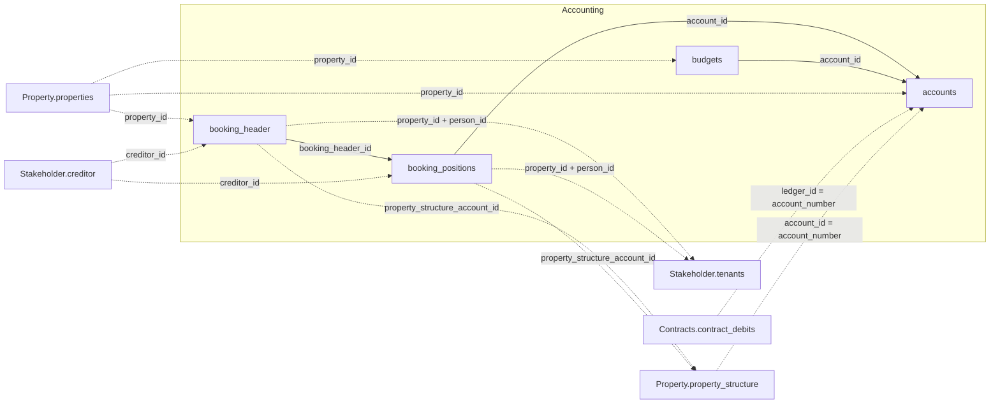

The four tables below join to each other and to three other domains — Property, Contracts,
and Stakeholder. See the [Data Model Overview](/v1/data-model/overview) for the complete
cross-domain diagram.

*Solid edges are joins within Accounting; dashed edges cross into another domain.*

## accounts

`GET /v1/accounting/accounts` — the chart of accounts. Covers general ledger accounts,
tenant accounts, creditor accounts, project accounts, cost centres, and asset accounts —
see `account_type_name`.

<ResponseField name="property_id" type="integer" required>
  Unique property identifier.
</ResponseField>

<ResponseField name="account_id" type="integer" required>
  Internal account identifier. Referenced by `booking_positions` and `budgets` as
  `account_id`.
</ResponseField>

<ResponseField name="account_number" type="string">
  Account number. `null` for account types that aren't numbered (e.g. tenant and creditor
  accounts).
</ResponseField>

<ResponseField name="account_name" type="string">
  Account name.
</ResponseField>

<ResponseField name="account_type_name" type="string">
  Account type: general ledger account, tenant account, creditor account, project account,
  cost centre, or asset account.
</ResponseField>

<ResponseField name="category" type="string">
  Reporting category from the account-range mapping (e.g. income, expenses, depreciation).
</ResponseField>

<ResponseField name="group" type="string">
  Income-affecting vs. balance-neutral classification from the account-range mapping.
</ResponseField>

<ResponseField name="nr" type="integer">
  Sort order of the reporting position within its category.
</ResponseField>

<Note>
  `category`, `group`, and `nr` are `null` for accounts still on the older account-range
  classification — that classification doesn't produce these three fields.
</Note>

<ResponseField name="account_group" type="string">
  Account group assigned by the account-range mapping.
</ResponseField>

<ResponseField name="account_tax_code" type="integer">
  Tax code of the account.
</ResponseField>

<ResponseField name="account_tax_appliance" type="integer">
  VAT treatment method of the account.
</ResponseField>

<ResponseField name="account_balance_type" type="object">
  Balance-side classification, as recorded on the account.
  <Expandable title="properties">
    <ResponseField name="code" type="integer">
      Balance-side code: `1` or `2`; `0` when not classified.
    </ResponseField>
    <ResponseField name="label" type="string">
      Human-readable label for the code (e.g. "Aufwandskonto", "Ertragskonto").
    </ResponseField>
  </Expandable>
</ResponseField>

<ResponseField name="accounting_entity" type="string">
  Property identifier of the accounting entity the account is booked under.
</ResponseField>

<ResponseField name="property_success_model" type="integer">
  Income-model code of the property.
</ResponseField>

<ResponseField name="property_tax_type" type="integer">
  Tax-model code of the property.
</ResponseField>

## booking_header

`GET /v1/accounting/booking_header` — general ledger booking headers. Each header groups
related line items.

<ResponseField name="property_id" type="integer" required>
  Unique property identifier.
</ResponseField>

<ResponseField name="booking_header_id" type="integer" required>
  Unique identifier for the booking header. `booking_positions` references this as
  `booking_header_id`.
</ResponseField>

<ResponseField name="booking_nr" type="string">
  Sequential number of the booking within the journal (Primanota) — the chronological log of all bookings.
</ResponseField>

<ResponseField name="creditor_id" type="integer">
  Creditor linked to the booking. References `Stakeholder.creditor`.
</ResponseField>

<ResponseField name="person_id" type="string">
  Tenant or contact person linked to the booking.
</ResponseField>

<ResponseField name="booking_date" type="date">
  Date of the booking.
</ResponseField>

<ResponseField name="booking_value" type="number">
  Total value of the booking header.
</ResponseField>

<ResponseField name="m2" type="number">
  Floor area in square metres associated with the booking, if applicable.
</ResponseField>

<ResponseField name="booking_text" type="string">
  Free-text description of the booking transaction as a whole. Individual line items can
  carry a different text — see `booking_positions.booking_position_text`.
</ResponseField>

<ResponseField name="initial_booking_text" type="string">
  Original booking text, before edits.
</ResponseField>

<ResponseField name="booking_barcode" type="string">
  Voucher number / barcode.
</ResponseField>

<ResponseField name="dms_link" type="string">
  Link to the linked document in the DMS.
</ResponseField>

<ResponseField name="cost_center_id_name_concat" type="string">
  Cost-centre ID and name, pre-combined into one display string for convenience (e.g. in
  Power BI). Not a join key.
</ResponseField>

<ResponseField name="property_structure_account_id" type="string">
  Bridges this booking to a cost centre or unit in `Property.property_structure`.
</ResponseField>

## booking_positions

`GET /v1/accounting/booking_positions` — individual booking line items. Each position
belongs to exactly one booking header via `booking_header_id`.

<ResponseField name="booking_position_id" type="integer" required>
  Unique identifier for the line item.
</ResponseField>

<ResponseField name="booking_header_id" type="integer" required>
  Identifier of the parent booking header. Joins to `booking_header.booking_header_id`.
</ResponseField>

<ResponseField name="account_id" type="integer" required>
  Account the line item is posted to. Joins to `accounts.account_id`.
</ResponseField>

<ResponseField name="contra_account_id" type="string">
  Contra account for the posting, as an account number — not the same identifier space as
  `accounts.account_id`.
</ResponseField>

<ResponseField name="property_id" type="string" required>
  Unique property identifier.
</ResponseField>

<ResponseField name="property_id_person_id" type="integer">
  Composite identifier for the tenant this posting applies to. Not reliably
  reconstructable by concatenating `property_id` and `person_id` — read it directly.
</ResponseField>

<ResponseField name="creditor_id" type="string">
  Creditor linked to the posting. References `Stakeholder.creditor`.
</ResponseField>

<ResponseField name="person_id" type="string">
  Tenant or contact person linked to the posting.
</ResponseField>

<ResponseField name="property_structure_account_id" type="string">
  Bridges this posting to a cost centre or unit in `Property.property_structure`.
</ResponseField>

<ResponseField name="period" type="object">
  Booking period the line item covers.
  <Expandable title="properties">
    <ResponseField name="start" type="date">
      Start of the booking period.
    </ResponseField>
    <ResponseField name="end" type="date">
      End of the booking period.
    </ResponseField>
  </Expandable>
</ResponseField>

<ResponseField name="amount" type="object">
  Net, tax, and gross amount of the line item.
  <Expandable title="properties">
    <ResponseField name="net" type="number">
      Net amount.
    </ResponseField>
    <ResponseField name="tax" type="number">
      Tax amount.
    </ResponseField>
    <ResponseField name="gross" type="number">
      Gross amount including tax.
    </ResponseField>
  </Expandable>
</ResponseField>

<ResponseField name="amount_per_sqm" type="object">
  `amount`, normalised per square metre.
  <Expandable title="properties">
    <ResponseField name="net" type="number">
      Net amount per square metre.
    </ResponseField>
    <ResponseField name="tax" type="number">
      Tax amount per square metre.
    </ResponseField>
    <ResponseField name="gross" type="number">
      Gross amount per square metre.
    </ResponseField>
  </Expandable>
</ResponseField>

<ResponseField name="account_group" type="string">
  Account group assigned by the account-range mapping.
</ResponseField>

<ResponseField name="booking_date" type="date">
  Date of the posting.
</ResponseField>

<ResponseField name="booking_nr" type="integer">
  Sequential number of the booking within the journal (Primanota) — the chronological log of all bookings.
</ResponseField>

<ResponseField name="booking_Lfd_nr" type="integer">
  Sequential position number within the booking.
</ResponseField>

<ResponseField name="booking_type" type="integer">
  Booking-type code.
</ResponseField>

<ResponseField name="contra_account_name" type="string">
  Name of the contra account. Carried directly on this table — not derivable by joining
  `contra_account_id` against `accounts`.
</ResponseField>

<ResponseField name="booking_position_text" type="string">
  Free-text description of this line item. Can differ from the parent booking's
  `booking_header.booking_text`.
</ResponseField>

<ResponseField name="sh" type="string">
  Debit/credit indicator. Not reliably derivable from the sign of `amount.net`.
</ResponseField>

## budgets

`GET /v1/accounting/budgets` — budget amounts, one row per property, account, and month.

<ResponseField name="property_id" type="string" required>
  Unique property identifier.
</ResponseField>

<ResponseField name="account_id" type="integer" required>
  Account the budget applies to. Joins to `accounts.account_id`.
</ResponseField>

<ResponseField name="account_number" type="integer">
  Account number.
</ResponseField>

<ResponseField name="date" type="date" required>
  Month the budget row applies to.
</ResponseField>

<ResponseField name="budget" type="number" required>
  Budget amount for the specific month and account.
</ResponseField>
