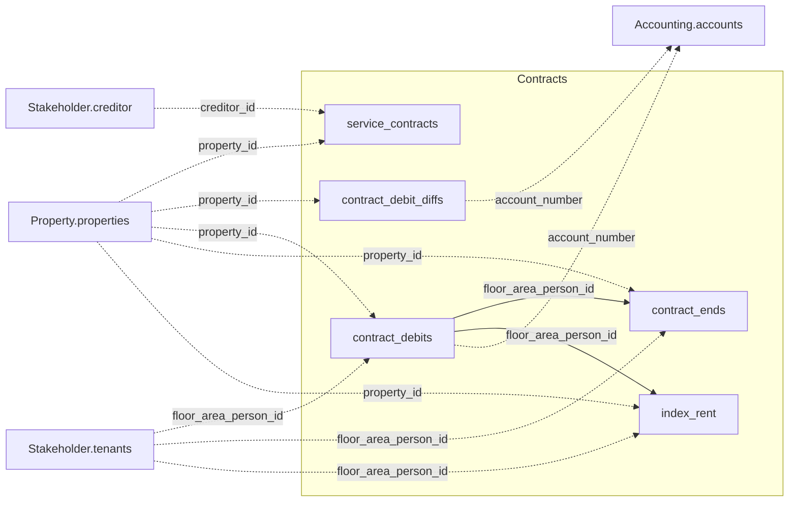

The five tables below join to each other and to three other domains — Property, Accounting,
and Stakeholder. See the [Data Model Overview](/v1/data-model/overview) for the complete
cross-domain diagram.

*Solid edges are joins within Contracts; dashed edges cross into another domain.*

## service_contracts

`GET /v1/contracts/service_contracts` — maintenance and service contracts.

<ResponseField name="property_id" type="string" required>
  Unique property identifier.
</ResponseField>

<ResponseField name="contract_period" type="object">
  Validity period of the contract.
  <Expandable title="properties">
    <ResponseField name="start" type="date">
      Contract start date.
    </ResponseField>
    <ResponseField name="end" type="date">
      Contract end date.
    </ResponseField>
  </Expandable>
</ResponseField>

<ResponseField name="creditor_id" type="string" required>
  Identifies the service provider. References `Stakeholder.creditor`.
</ResponseField>

<ResponseField name="creditor_name" type="string">
  Display name of the service provider.
</ResponseField>

<ResponseField name="contract_id" type="string" required>
  Contract identifier.
</ResponseField>

<ResponseField name="contract_number" type="string">
  Human-readable contract number.
</ResponseField>

<ResponseField name="contract_name" type="string">
  Contract name.
</ResponseField>

<ResponseField name="contract_category" type="string">
  Contract category.
</ResponseField>

<ResponseField name="contract_type" type="string">
  Contract type.
</ResponseField>

<ResponseField name="contract_value" type="number">
  Contract value.
</ResponseField>

<ResponseField name="contract_value_year" type="number">
  Contract value, normalised to an annual figure.
</ResponseField>

<ResponseField name="contract_reasoning" type="string">
  Reason code for the contract.
</ResponseField>

<ResponseField name="contract_reasoning_comment" type="string">
  Free-text comment on the contract reasoning.
</ResponseField>

## contract_debit_diffs

`GET /v1/contracts/contract_debit_diffs` — monthly deviations between the debit target and
the actual account movements. Use this to reconcile planned debits against realised cash
flow.

<ResponseField name="property_id" type="string" required>
  Unique property identifier.
</ResponseField>

<ResponseField name="debit_diff_value" type="object">
  Net, tax, and gross deviation amount for the period.
  <Expandable title="properties">
    <ResponseField name="net" type="number">
      Net deviation amount.
    </ResponseField>
    <ResponseField name="tax" type="number">
      Tax portion of the deviation.
    </ResponseField>
    <ResponseField name="gross" type="number">
      Gross deviation amount including tax.
    </ResponseField>
  </Expandable>
</ResponseField>

<ResponseField name="account_number" type="string">
  General ledger account the deviation applies to. Matches
  `Accounting.accounts.account_number` — not the same thing as
  `contract_debits.debit_type.code`, despite the similar-sounding names.
</ResponseField>

<ResponseField name="person_id" type="string">
  Tenant identifier.
</ResponseField>

<ResponseField name="valid_from" type="date" required>
  Month the deviation applies to.
</ResponseField>

<ResponseField name="debit_diff_reminder_from" type="date">
  Date from which a payment reminder applies to this deviation, if any.
</ResponseField>

<ResponseField name="debit_diff_reminder_manual" type="boolean">
  Whether the reminder was set manually rather than generated automatically.
</ResponseField>

## contract_debits

`GET /v1/contracts/contract_debits` — rental debit positions as a time series. Each record
represents a scheduled debit with a validity interval.

<ResponseField name="property_id" type="string" required>
  Unique property identifier.
</ResponseField>

<ResponseField name="floor_area_id" type="integer">
  References the unit in `Property.property_structure`.
</ResponseField>

<ResponseField name="floor_area_person_id" type="string">
  Identifies the tenancy this debit applies to.
</ResponseField>

<ResponseField name="property_id_person_id" type="integer">
  Composite key identifying the tenant at property level.
</ResponseField>

<ResponseField name="account_number" type="string">
  General ledger account the debit posts to. Matches
  `Accounting.accounts.account_number`, not `account_id`.
</ResponseField>

<ResponseField name="debit_period" type="object">
  Validity interval of the debit.
  <Expandable title="properties">
    <ResponseField name="start" type="date">
      Start of the validity interval.
    </ResponseField>
    <ResponseField name="end" type="date">
      End of the validity interval. `null` for an open-ended debit.
    </ResponseField>
  </Expandable>
</ResponseField>

<ResponseField name="due_date_day" type="integer">
  Day of the month the debit is due. `null` where the source system has no day set.
</ResponseField>

<ResponseField name="debit_type" type="object">
  The type of debit, as a code + label pair (e.g. rent or ancillary charges).
  <Expandable title="properties">
    <ResponseField name="code" type="integer">
      Debit-type code. Not a ledger account reference — don't confuse this with this same
      table's own `account_number` field, or with `contract_debit_diffs.account_number`.
    </ResponseField>
    <ResponseField name="label" type="string">
      Human-readable label, e.g. "Nettokaltmiete Wohnung".
    </ResponseField>
  </Expandable>
</ResponseField>

<ResponseField name="debit_amount" type="number" required>
  The debit amount for the validity interval.
</ResponseField>

<ResponseField name="account_group" type="string">
  Account group from the account-range mapping.
</ResponseField>

<ResponseField name="state" type="string">
  Status of the debit record.
</ResponseField>

<ResponseField name="tax_type" type="boolean">
  Whether the debit is subject to VAT.
</ResponseField>

<ResponseField name="net_rent" type="boolean">
  Whether the debit includes a net-rent component.
</ResponseField>

<ResponseField name="side_costs" type="boolean">
  Whether the debit includes an ancillary-cost component.
</ResponseField>

<Tip>
  Use `floor_area_id` to join debit data to `Property.property_structure`, or
  `floor_area_person_id` to join to a specific tenancy in `Stakeholder.tenants`.
</Tip>

## contract_ends

`GET /v1/contracts/contract_ends` — lease end dates and extension/option handling. Use this
to track upcoming expiries, deadlines for exercising options, and the current exercise
status.

<Note>
  This endpoint requires a `property_id` query parameter — a request without it returns
  `400 Bad Request` with `"Missing required filter(s): ['property_id']"`. See
  [Filtering](/concepts/filtering).
</Note>

<ResponseField name="property_id" type="string" required>
  Unique property identifier.
</ResponseField>

<ResponseField name="floor_area_id" type="integer">
  References the unit in `Property.property_structure`.
</ResponseField>

<ResponseField name="floor_area_person_id" type="string">
  Identifies the tenancy this record applies to.
</ResponseField>

<ResponseField name="period" type="object">
  Start of the lease and its effective end date, after applying any option logic.
  <Expandable title="properties">
    <ResponseField name="start" type="date">
      Start of the lease.
    </ResponseField>
    <ResponseField name="end" type="date">
      Effective end date of the lease.
    </ResponseField>
  </Expandable>
</ResponseField>

<ResponseField name="contract_end_new" type="date">
  New end date if the lease was extended.
</ResponseField>

<ResponseField name="contract_prolongation_months" type="integer">
  Extension length in months.
</ResponseField>

<ResponseField name="request_date" type="date">
  Date the tenant was asked to decide on an extension option.
</ResponseField>

<ResponseField name="response_deadline" type="date">
  Deadline for the tenant's response.
</ResponseField>

<ResponseField name="tenant_response_date" type="date">
  Date the tenant actually responded.
</ResponseField>

<ResponseField name="response_type" type="integer">
  Code for how the tenant responded.
</ResponseField>

<ResponseField name="option_deadline" type="date">
  Deadline by which an extension option must be exercised.
</ResponseField>

<ResponseField name="deadline_lead_time" type="integer">
  Lead time, in days, before `option_deadline` used to trigger reminders.
</ResponseField>

<ResponseField name="auto_use_option" type="boolean">
  Whether the option is exercised automatically if the tenant does not respond.
</ResponseField>

<ResponseField name="options_used" type="integer">
  Number of extension options already used.
</ResponseField>

<ResponseField name="options_not_used" type="integer">
  Number of extension options still available.
</ResponseField>

<ResponseField name="is_terminated" type="boolean">
  Whether the lease has been terminated.
</ResponseField>

<ResponseField name="termination_reason" type="string">
  Reason for the termination, if `is_terminated` is `true`.
</ResponseField>

<ResponseField name="option_state" type="object">
  Status of the extension option, as a code + label pair.
  <Expandable title="properties">
    <ResponseField name="code" type="integer">
      Status code, `1`–`4`.
    </ResponseField>
    <ResponseField name="label" type="string">
      German label for the code: `1` = "Offen" (open), `2` = "Ausgeübt" (exercised),
      `3` = "Nicht ausgeübt" (not exercised), `4` = "Abgelaufen" (expired).
    </ResponseField>
  </Expandable>
</ResponseField>

<ResponseField name="option_remarks" type="string[]">
  Free-text remarks on the extension option. Empty positions are omitted from the array.
</ResponseField>

<Warning>
  `floor_area_person_id` alone does not uniquely identify a row, since a tenancy can have
  multiple option/extension entries. Treat rows as a set per `floor_area_person_id`, not as
  individually addressable records.
</Warning>

## index_rent

`GET /v1/contracts/index_rent` — indexed-rent adjustment configuration and state, based on
a consumer price index (VPI).

<ResponseField name="property_id" type="string" required>
  Unique property identifier.
</ResponseField>

<ResponseField name="floor_area_person_id" type="string">
  Identifies the tenancy this index-rent state applies to.
</ResponseField>

<ResponseField name="validity_period" type="object">
  Validity interval of this index-rent state.
  <Expandable title="properties">
    <ResponseField name="start" type="date">
      Start of the validity interval.
    </ResponseField>
    <ResponseField name="end" type="date">
      End of the validity interval.
    </ResponseField>
  </Expandable>
</ResponseField>

<ResponseField name="calculation_model" type="object">
  The index-calculation model applied, as a code + label pair.
  <Expandable title="properties">
    <ResponseField name="code" type="integer">
      Model code. `label` is `null` for the small number of rows still on code `0` — no
      label is defined for it in the source system.
    </ResponseField>
    <ResponseField name="label" type="string">
      Human-readable model name.
    </ResponseField>
  </Expandable>
</ResponseField>

<ResponseField name="is_current" type="boolean">
  Whether this is the currently active index-rent state for the tenancy, as opposed to a
  superseded historical one.
</ResponseField>

<ResponseField name="account_id" type="integer">
  Debit-type code this index-rent state applies to. Not a ledger account reference — matches
  `contract_debits.debit_type.code`.
</ResponseField>

<ResponseField name="index_name" type="string">
  Name of the underlying consumer price index series, e.g. "VPI 2020".
</ResponseField>

<ResponseField name="base_year" type="integer">
  Base year the index series is normalised to (index = 100).
</ResponseField>

<ResponseField name="index_value_used" type="number">
  Index value for the calendar month this state begins — the basis value the current index
  is compared against to calculate a change.
</ResponseField>

<ResponseField name="adjustment_threshold" type="number">
  Minimum index change required before a rent adjustment is triggered, in the unit given by
  `adjustment_unit`.
</ResponseField>

<ResponseField name="adjustment_unit" type="string">
  Unit of `adjustment_threshold` and of the index-change comparison: `"Prozent"`
  (percentage change) or `"Punkte"` (absolute index points).
</ResponseField>

<ResponseField name="passing_value" type="number">
  Percentage of the index change actually passed on to the rent — `100` passes on the full
  change, a lower value only a fraction of it.
</ResponseField>

<ResponseField name="adjustment_locked" type="boolean">
  Whether a rent adjustment is currently blocked for this tenancy.
</ResponseField>

<ResponseField name="adjustment_locked_until" type="date">
  Date until which `adjustment_locked` applies.
</ResponseField>

<ResponseField name="notification_required" type="boolean">
  Whether formal notice to the tenant is required for the adjustment to take effect —
  relevant when `adjustment_type` is date-based.
</ResponseField>

<ResponseField name="adjustment_after_months" type="integer">
  Number of months after which an adjustment becomes possible. Used together with
  `adjustment_type = "Anpassung nach Ablauf Monaten"`.
</ResponseField>

<ResponseField name="calculation_period" type="integer">
  Numeric period parameter consumed by `calculation_model`. Its unit and exact meaning per
  model are not documented in the source system.
</ResponseField>

<ResponseField name="recalculation_after_months" type="integer">
  Maximum number of months after which a recalculation must be performed.
</ResponseField>

<ResponseField name="adjustment_type" type="string">
  Whether the adjustment triggers on a fixed calendar date (`"Anpassung zu Datum"`) or after
  a defined number of months has elapsed (`"Anpassung nach Ablauf Monaten"`).
</ResponseField>

<ResponseField name="comment" type="string">
  Free-text comment.
</ResponseField>

<ResponseField name="min_date" type="date">
  Start of a contract-clipped variant of the validity interval.
</ResponseField>

<ResponseField name="max_date" type="date">
  End of a contract-clipped variant of the validity interval.
</ResponseField>

<ResponseField name="begin_contract" type="date">
  Tenancy start date, as carried on this record.
</ResponseField>

<ResponseField name="end_contract" type="date">
  Tenancy end date, as carried on this record.
</ResponseField>

