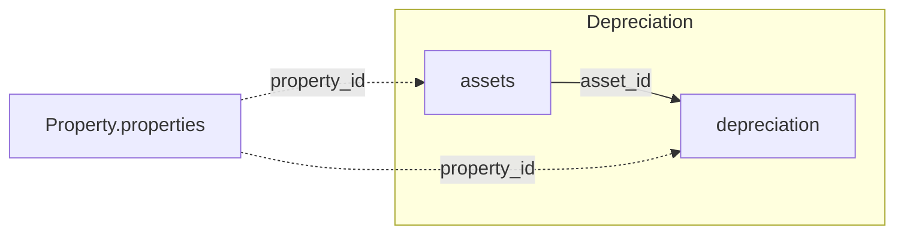

The two tables below join to each other and to the Property domain. See the
[Data Model Overview](/v1/data-model/overview) for the complete cross-domain diagram.

*Solid edges are joins within Depreciation; dashed edges cross into another domain.*

## assets

`GET /v1/depreciation/assets` — fixed-asset master data, including the depreciation
configuration applied to each asset.

<ResponseField name="property_id" type="string" required>
  Unique property identifier.
</ResponseField>

<ResponseField name="asset_id" type="integer" required>
  Internal asset identifier. Referenced by `depreciation.asset_id`.
</ResponseField>

<ResponseField name="acquisition_date" type="date">
  Date the asset was acquired.
</ResponseField>

<ResponseField name="built_date" type="date">
  Date the asset was put into service.
</ResponseField>

<ResponseField name="afa_period" type="object">
  Start and end date of the asset's own depreciation schedule.
  <Expandable title="properties">
    <ResponseField name="start" type="date">
      Start date of the depreciation schedule.
    </ResponseField>
    <ResponseField name="end" type="date">
      End date of the depreciation schedule.
    </ResponseField>
  </Expandable>
</ResponseField>

<ResponseField name="depreciation_active" type="boolean">
  Whether depreciation is currently active for this asset.
</ResponseField>

<ResponseField name="asset_name" type="string">
  Asset name.
</ResponseField>

<ResponseField name="afa_duration" type="string">
  Useful life of the asset, in months.
</ResponseField>

<ResponseField name="afa_validity" type="string">
  Validity date of the depreciation-rate configuration applied to this asset.
</ResponseField>

<Note>
  `afa_validity` is not the same as `afa_period.start`. `afa_period.start` is when this
  asset's own depreciation schedule begins; `afa_validity` is when the depreciation-rate
  configuration it uses became valid. The two can differ.
</Note>

<ResponseField name="afa_method" type="string">
  Depreciation method applied, as a label (e.g. straight-line).
</ResponseField>

<ResponseField name="afa_buch_id" type="string">
  Identifier of the depreciation account this asset's postings are booked to.
</ResponseField>

<ResponseField name="afa_group" type="string">
  Asset posting group this asset is classified under.
</ResponseField>

<ResponseField name="account_name" type="string">
  Name of the depreciation account this asset's postings are booked to.
</ResponseField>

<ResponseField name="asset_number" type="string">
  Asset number (business identifier), distinct from `asset_id`.
</ResponseField>

## depreciation

`GET /v1/depreciation/depreciation` — individual depreciation postings, one row per booking.

<ResponseField name="property_id" type="string" required>
  Unique property identifier.
</ResponseField>

<ResponseField name="asset_id" type="integer" required>
  References the asset this posting writes down. Joins to `assets.asset_id`.
</ResponseField>

<ResponseField name="booking_date" type="date" required>
  Date of the depreciation posting.
</ResponseField>

<ResponseField name="booking_net_value" type="number" required>
  Net value posted in this depreciation entry.
</ResponseField>

<ResponseField name="booking_text" type="string">
  Free-text description of the posting.
</ResponseField>

<ResponseField name="asset_number" type="string">
  Asset number (business identifier), matches the same field on `assets`.
</ResponseField>

<Tip>
  One `assets` row typically has many `depreciation` rows over its useful life — join on
  `asset_id` to build a full depreciation schedule for an asset.
</Tip>
