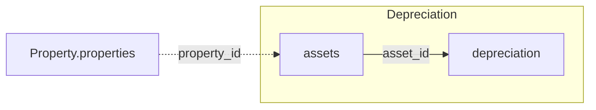

The v1 Depreciation domain covers two tables: `assets` (the fixed-asset master data) and
`depreciation` (the postings against them), both following the [response
structure](/v1/response-shape-conventions) rules. Join them on `asset_id` to assemble a
full depreciation schedule for an asset.

## How Depreciation connects to other domains

`property_id` links `assets` back to `Property.properties`; `asset_id` chains `assets`
into `depreciation`.

*Solid edges are joins within a domain; dashed edges cross into another domain.*

For the full cross-domain diagram and join-key cardinalities, see the
[v1 data model overview](/v1/data-model/overview#how-the-v1-tables-connect).

## assets

`GET /v1/depreciation/assets` — fixed-asset master data.

<ResponseField name="property_id" type="string" required>
  Unique property identifier.
</ResponseField>

<ResponseField name="asset_id" type="integer" required>
  Internal asset identifier — the same `*_id` / `*_number` split as
  `Accounting.accounts.account_id`/`account_number`.
</ResponseField>

<ResponseField name="asset_number" type="string">
  Human-readable asset number.
</ResponseField>

<ResponseField name="asset_name" type="string">
  Asset name.
</ResponseField>

<ResponseField name="acquisition_date" type="date">
  Date the asset was acquired.
</ResponseField>

<ResponseField name="built_date" type="date">
  Date the asset was put into service.
</ResponseField>

<ResponseField name="afa_period" type="object">
  Depreciation schedule — `{start, end}` (date strings).
</ResponseField>

<ResponseField name="depreciation_active" type="boolean">
  Whether depreciation is currently active for this asset.
</ResponseField>

<ResponseField name="afa_duration" type="string">
  Depreciation duration in years, as a string (e.g. `"50"`).
</ResponseField>

<ResponseField name="afa_method" type="string">
  Depreciation method applied.
</ResponseField>

<ResponseField name="afa_validity" type="string">
  Date the depreciation method became valid, formatted `DD.MM.YYYY` (e.g. `"01.05.2019"`) —
  not ISO-8601 like the other date fields on this table. Don't parse it the same way.
</ResponseField>

<ResponseField name="afa_group" type="string">
  Depreciation category the asset belongs to (e.g. `"Gebäude"`, `"Garagen"`).
</ResponseField>

<ResponseField name="afa_buch_id" type="string">
  Undocumented. Contact support before relying on it.
</ResponseField>

<ResponseField name="account_name" type="string">
  Accounting basis this depreciation record is booked under (e.g. `"Handelsrecht"`,
  `"Steuerrecht"`) — German GAAP vs. tax law depreciation can differ for the same asset.
</ResponseField>

## depreciation

`GET /v1/depreciation/depreciation` — the individual depreciation postings. One row per
posting, so an asset depreciated over 50 years has many rows here and exactly one in
`assets`.

<ResponseField name="property_id" type="string" required>
  Unique property identifier.
</ResponseField>

<ResponseField name="asset_id" type="integer" required>
  Asset this posting depreciates. Joins to `assets.asset_id` above.
</ResponseField>

<ResponseField name="asset_number" type="string">
  Human-readable asset number, carried over from `assets.asset_number`.
</ResponseField>

<ResponseField name="booking_date" type="date">
  Date the depreciation was posted.
</ResponseField>

<ResponseField name="booking_net_value" type="string">
  Net amount depreciated. Decimal value serialized as a string — cast before doing
  arithmetic on it.
</ResponseField>

<ResponseField name="booking_text" type="string">
  Free-text description of the posting.
</ResponseField>

<Note>
  These are the depreciation postings only — they are not part of
  [`Accounting.booking_positions`](/v1/data-model/accounting) and carry no
  `booking_header_id`, so they can't be tied back to a general-ledger booking through
  `/v1/`.
</Note>
