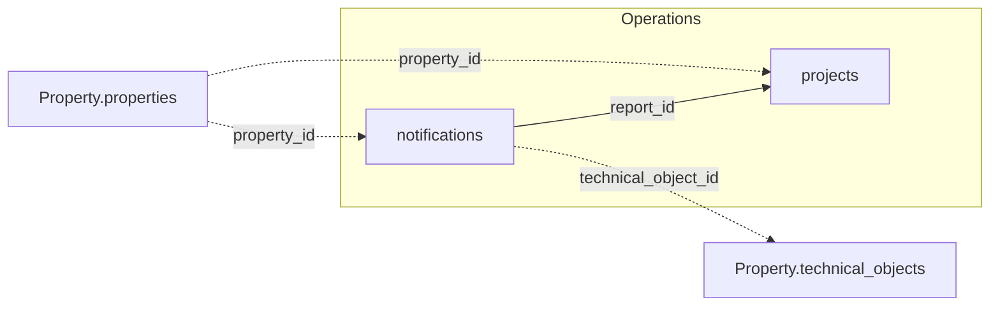

The two tables below join to each other and to the Property domain. See the
[Data Model Overview](/v1/data-model/overview) for the complete cross-domain diagram.

*Solid edges are joins within Operations; dashed edges cross into another domain.*

## notifications

`GET /v1/operations/notifications` — maintenance reports and damage notifications.

<ResponseField name="property_id" type="string" required>
  Unique property identifier.
</ResponseField>

<ResponseField name="report_id" type="integer" required>
  Unique identifier for the notification. `projects` references this as `report_id` — a
  verified foreign key.
</ResponseField>

<ResponseField name="technical_object_id" type="integer">
  Technical object the report concerns.
</ResponseField>

<ResponseField name="person_id" type="integer">
  Person who filed the report. Uses a different identifier space than
  `Stakeholder.tenants.person_id` — don't treat the two as the same entity.
</ResponseField>

<ResponseField name="cost_center" type="object">
  Cost centre the report is booked against, as a structured object.
  <Expandable title="properties">
    <ResponseField name="code" type="string">
      Cost-centre code.
    </ResponseField>
    <ResponseField name="label" type="string">
      Cost-centre name.
    </ResponseField>
  </Expandable>
</ResponseField>

<ResponseField name="to_do_period" type="object">
  Deadline window for resolving the report.
  <Expandable title="properties">
    <ResponseField name="start" type="date">
      Start of the window.
    </ResponseField>
    <ResponseField name="end" type="date">
      Deadline for resolution.
    </ResponseField>
  </Expandable>
</ResponseField>

<ResponseField name="report_name" type="string">
  Subject / title of the report.
</ResponseField>

<ResponseField name="report_type" type="string">
  Type of report.
</ResponseField>

<ResponseField name="reporter_type" type="string">
  Who filed the report: tenant, creditor, owner, user, or partner.
</ResponseField>

<ResponseField name="reporter_person" type="string">
  Details of the reporting person.
</ResponseField>

<ResponseField name="report_nr" type="string">
  Report number.
</ResponseField>

<ResponseField name="user_creation" type="string">
  User who created the report.
</ResponseField>

<ResponseField name="report_date" type="date">
  Date the report was filed.
</ResponseField>

<ResponseField name="responsible_team" type="string">
  Team responsible for handling the report.
</ResponseField>

<ResponseField name="responsible_user" type="string">
  Individual responsible for handling the report.
</ResponseField>

<ResponseField name="priority_text" type="string">
  Priority level.
</ResponseField>

<ResponseField name="status" type="string">
  Current status of the report.
</ResponseField>

<ResponseField name="status_date" type="date">
  Date of the last status change.
</ResponseField>

<ResponseField name="duration_days" type="integer">
  Number of days the report has been in process.
</ResponseField>

<ResponseField name="insurance_case" type="boolean">
  Whether this report is an insurance claim.
</ResponseField>

<ResponseField name="comment" type="string">
  Free-text comment.
</ResponseField>

## projects

`GET /v1/operations/projects` — capital projects and larger maintenance initiatives.

<ResponseField name="property_id" type="string" required>
  Unique property identifier.
</ResponseField>

<ResponseField name="project_id" type="integer" required>
  Unique identifier for the project. Not the same value as `project_number` below.
</ResponseField>

<ResponseField name="report_id" type="integer">
  Notification the project originated from, if any. Verified foreign key to
  `notifications.report_id`.
</ResponseField>

<ResponseField name="to_hdr_id" type="integer">
  Internal technical-object reference.
</ResponseField>

<ResponseField name="request_hdr_id" type="integer">
  Internal reference to the originating request.
</ResponseField>

<ResponseField name="creditor_id" type="string">
  Primary creditor for the project.
</ResponseField>

<ResponseField name="offer_id" type="integer">
  Internal reference to a related offer.
</ResponseField>

<ResponseField name="hierarchy" type="string[]">
  Where the project sits in the accounting chart of accounts, as an ordered list from
  coarse to fine (e.g. `["4", "4.2", "4.2.1"]` — top-level cost category, subcategory,
  specific account). Like a folder path, just numeric instead of named. Empty, deeper
  levels are omitted.
</ResponseField>

<ResponseField name="cost_center" type="object">
  Cost centre the project is booked against, as a structured object.
  <Expandable title="properties">
    <ResponseField name="code" type="string">
      Cost-centre code.
    </ResponseField>
    <ResponseField name="label" type="string">
      Cost-centre name.
    </ResponseField>
  </Expandable>
</ResponseField>

<ResponseField name="project_period" type="object">
  Planned duration of the project.
  <Expandable title="properties">
    <ResponseField name="start" type="date">
      Project start date.
    </ResponseField>
    <ResponseField name="end" type="date">
      Project end date.
    </ResponseField>
  </Expandable>
</ResponseField>

<ResponseField name="budget_period" type="object">
  Period the project's budget covers.
  <Expandable title="properties">
    <ResponseField name="start" type="date">
      Start of the budget period.
    </ResponseField>
    <ResponseField name="end" type="date">
      End of the budget period.
    </ResponseField>
  </Expandable>
</ResponseField>

<ResponseField name="account_name" type="string">
  Name of the project account.
</ResponseField>

<ResponseField name="ledger_account" type="string">
  General ledger account number for the project.
</ResponseField>

<ResponseField name="ledger_account_nr" type="string">
  Internal identifier of the general ledger account — despite the name, this is not the
  account number. Use `ledger_account` for that.
</ResponseField>

<ResponseField name="project_type" type="string">
  Project type.
</ResponseField>

<ResponseField name="status" type="string">
  Current project status.
</ResponseField>

<ResponseField name="comments" type="object[]">
  Comments and notes, as a list of objects. Combines what were four separate fields —
  `comment` (a status comment) and `comment_1`/`comment_2`/`comment_3` (notes) — into one
  array; empty entries are omitted. Each entry keeps its origin via `type`.
  <Expandable title="properties">
    <ResponseField name="type" type="string">
      Where the entry came from: `status`, `hint_1`, `hint_2`, or `hint_3`.
    </ResponseField>
    <ResponseField name="text" type="string">
      The comment or note text.
    </ResponseField>
  </Expandable>
</ResponseField>

<ResponseField name="percentage_completed" type="number">
  Completion percentage.
</ResponseField>

<ResponseField name="project_budget" type="number">
  Total budgeted amount for the project.
</ResponseField>

<ResponseField name="funding_limit_obligo" type="number">
  Committed-but-not-yet-invoiced budget limit.
</ResponseField>

<ResponseField name="is_value" type="number">
  Actual, booked value to date.
</ResponseField>

<ResponseField name="entered_value" type="number">
  Recorded value.
</ResponseField>

<ResponseField name="activated_value" type="number">
  Capitalised value.
</ResponseField>

<ResponseField name="modernized_value" type="number">
  Modernisation value.
</ResponseField>

<ResponseField name="maintenance_value" type="number">
  Maintenance value.
</ResponseField>

<ResponseField name="is_project_management_flag" type="string">
  Project management classification flag (`"0"`/`"1"`).
</ResponseField>

<ResponseField name="project_lead_budget" type="number">
  Budget allocated to the project lead.
</ResponseField>

<ResponseField name="overhead_charge_mode" type="integer">
  Overhead-charge calculation mode.
</ResponseField>

<ResponseField name="overhead_charge_percent" type="number">
  Overhead charge, as a percentage.
</ResponseField>

<ResponseField name="overhead_charge_value" type="number">
  Overhead charge amount.
</ResponseField>

<ResponseField name="industry_name" type="string">
  Trade / industry the project belongs to.
</ResponseField>

<ResponseField name="responsible_team" type="string">
  Team responsible for the project.
</ResponseField>

<ResponseField name="responsible_user" type="string">
  Individual responsible for the project.
</ResponseField>

<ResponseField name="to_name" type="string">
  Name of the related technical object.
</ResponseField>

<ResponseField name="request_nr" type="string">
  Business number of the originating request.
</ResponseField>

<ResponseField name="offer_nr" type="string">
  Business number of the related offer.
</ResponseField>

<ResponseField name="budget_text" type="string">
  Budget description.
</ResponseField>

<ResponseField name="budget_comment" type="string">
  Comment on the budget.
</ResponseField>

<ResponseField name="dms_link" type="string">
  Link to the linked document in the DMS.
</ResponseField>

<ResponseField name="project_number" type="string">
  Business/display project number. Not the same identifier as `project_id` above.
</ResponseField>

<ResponseField name="report_number" type="string">
  Business/display number of the originating notification. Not the same identifier as
  `report_id` above.
</ResponseField>
