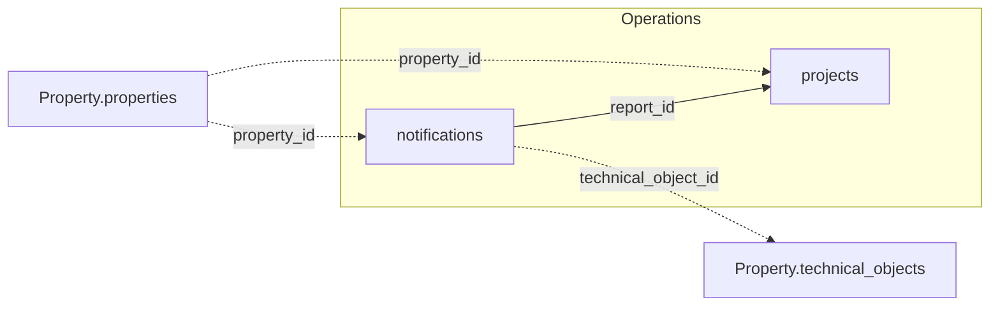

The v1 Operations domain covers two tables: `notifications` and `projects`.

<Note>
  `offers` and `orders` have no `/v1/` endpoint yet — fetch them via the unversioned path in
  the meantime, see the [full data model](/data-model/operations).
</Note>

## How Operations connects to other domains

`property_id` links both tables back to `Property.properties`; `technical_object_id`
connects `notifications` to `Property.technical_objects`.

*Solid edges are joins within a domain; dashed edges cross into another domain.*

For the full cross-domain diagram and join-key cardinalities, see the
[v1 data model overview](/v1/data-model/overview#how-the-v1-tables-connect).

## notifications

`GET /v1/operations/notifications` — maintenance reports and damage notifications.

<ResponseField name="report_id" type="integer" required>
  Unique notification identifier.
</ResponseField>

<ResponseField name="property_id" type="string" required>
  Unique property identifier.
</ResponseField>

<ResponseField name="report_nr" type="string">
  Human-readable report number. Not unique — the same number recurs on different reports,
  including within one property. `report_id` is the only field that identifies a row.
</ResponseField>

<ResponseField name="report_name" type="string">
  Short title of the report. Free text, populated on every row.
</ResponseField>

<ResponseField name="technical_object_id" type="integer">
  Technical object the report concerns. References `Property.technical_objects.to_id`.
</ResponseField>

<ResponseField name="person_id" type="integer">
  Reporting person. This is a `bigint` sequence from a different subsystem — don't treat it
  as the same identifier space as `person_id` on `Accounting.booking_header` or
  `Stakeholder.tenants`.
</ResponseField>

<ResponseField name="reporter_person" type="string">
  Name of the party that filed the report — the readable counterpart to `person_id`. An empty
  string on a small number of rows.
</ResponseField>

<ResponseField name="reporter_type" type="string">
  What kind of party filed the report — one of `"Person"`, `"Eigentümer"`,
  `"Kreditor/Firma"`, `"Partner"`, `"iX-Haus Benutzer"`. Populated on every row.
</ResponseField>

<ResponseField name="cost_center_id" type="string">
  Cost centre the notification is attributed to.
</ResponseField>

<ResponseField name="cost_center_id_name" type="string">
  Readable name of `cost_center_id`. Exactly one name per identifier, so you can display it
  directly instead of looking the cost centre up.
</ResponseField>

<ResponseField name="report_type" type="string">
  Type of report.
</ResponseField>

<ResponseField name="priority_text" type="string">
  Priority level.
</ResponseField>

<ResponseField name="Status" type="string">
  Current status of the notification. Note the capital `S` — the field name really is
  `Status`, unlike the lower-case `status` on `projects`.
</ResponseField>

<ResponseField name="status_date" type="date">
  Date the current `Status` was set. Populated on every row.
</ResponseField>

<ResponseField name="report_date" type="date">
  Date the report was created.
</ResponseField>

<ResponseField name="to_do_period" type="object">
  Planned window for the work — `{start, end}` (date strings). Both bounds are populated on
  every row.
</ResponseField>

<ResponseField name="duration_days" type="integer">
  Duration in days, populated on roughly a third of the rows. Which two dates it spans is
  undocumented — contact support before relying on it.
</ResponseField>

<ResponseField name="insurance_case" type="boolean">
  Whether the notification is linked to an insurance claim.
</ResponseField>

<ResponseField name="responsible_team" type="string">
  Team responsible, as a numeric code inside a string (e.g. `"1"`, `"2"`) — **not** the
  readable team names used by
  [`Stakeholder.employees.team`](/v1/data-model/stakeholder). Populated on well under 2% of
  rows, so don't build assignment logic on it.
</ResponseField>

<ResponseField name="responsible_user" type="string">
  Display name of the user the report is assigned to. An empty string on the large majority of
  rows, and some of the remaining values are technical import accounts rather than people.
</ResponseField>

<ResponseField name="user_creation" type="string">
  Display name of the user who created the report. Same caveats as `responsible_user`: mostly
  empty, with technical accounts among the values.
</ResponseField>

<ResponseField name="comment" type="string">
  Free-text comment, populated on nearly every row.
</ResponseField>

## projects

`GET /v1/operations/projects` — capital projects and larger multi-order initiatives.

<ResponseField name="project_id" type="integer" required>
  Unique project identifier.
</ResponseField>

<ResponseField name="project_number" type="string">
  Human-readable project number — distinct from `project_id` above, which is the
  identifier to use for lookups and joins.
</ResponseField>

<ResponseField name="property_id" type="string" required>
  Unique property identifier.
</ResponseField>

<ResponseField name="account_name" type="string">
  Description of the work the project covers, typically trade plus location (e.g.
  `"Malerarbeiten"`). Despite the name it is not an `Accounting.accounts` name — and there is
  no separate project-name field, so this is the project's label.
</ResponseField>

<ResponseField name="cost_center" type="object">
  Cost centre the project is booked against — `{code, label}`.
</ResponseField>

<ResponseField name="ledger_account" type="string">
  Ledger accounts the project's costs post to, as a **comma-separated list inside a single
  string** (e.g. `"641100,650100,651100"`) — not a single value. Split on commas before
  matching against `Accounting.accounts.account_number`; every part resolves there, though not
  always within the project's own property.
</ResponseField>

<ResponseField name="ledger_account_nr" type="string">
  Identical to `cost_center.code` on every row where it is populated — it carries the cost
  centre, not a ledger account number. Use `cost_center` and ignore this field.
</ResponseField>

<ResponseField name="creditor_id" type="string">
  Primary creditor for the project. Its values sit in a different identifier space than
  `Stakeholder.creditor.creditor_id` and don't resolve against it — don't rely on it as a
  foreign key.
</ResponseField>

<ResponseField name="offer_id" type="integer">
  Related offer, populated on roughly 60% of rows. `offers` has no `/v1/` endpoint yet (see
  the note above), so this can't be resolved through `/v1/` today.
</ResponseField>

<ResponseField name="offer_nr" type="string">
  Human-readable number of that offer.
</ResponseField>

<ResponseField name="report_id" type="integer">
  Related notification, if the project originated from one. Populated on very few rows, and
  every populated value resolves against
  [`notifications.report_id`](#notifications).
</ResponseField>

<ResponseField name="report_number" type="string">
  Human-readable number of that notification, populated on the same few rows as `report_id`.
</ResponseField>

<ResponseField name="request_hdr_id" type="integer">
  Internal identifier of the request (`Anfrage`) the project came out of. Populated on about
  70% of rows and shared by several projects, so it groups projects rather than identifying
  one. No `/v1/` endpoint exposes requests — treat it as an opaque grouping key.
</ResponseField>

<ResponseField name="request_nr" type="string">
  Human-readable number of that request.
</ResponseField>

<ResponseField name="to_hdr_id" type="integer">
  Despite the name, this does not resolve against `technical_objects.to_id` (only about 3.5%
  of rows match). Don't rely on it as a foreign key — use `report_id` or `offer_id` for the
  links that do work.
</ResponseField>

<ResponseField name="to_name" type="string">
  Name of the technical object, populated on a few dozen rows only.
</ResponseField>

<ResponseField name="hierarchy" type="string[]">
  Position in the cost-breakdown hierarchy, as an ordered array from the top level down.
  Empty levels are omitted, so the array length varies per project.
</ResponseField>

<ResponseField name="project_type" type="string">
  Project type.
</ResponseField>

<ResponseField name="status" type="string">
  Current project status.
</ResponseField>

<ResponseField name="industry_name" type="string">
  Trade the work belongs to. Populated on about three quarters of the rows.
</ResponseField>

<ResponseField name="responsible_team" type="string">
  Team responsible for the project, as a readable name. Uses the same vocabulary as
  [`Stakeholder.employees.team`](/v1/data-model/stakeholder), but holds `"Objektmanagement"`
  on every row today — it doesn't distinguish projects.
</ResponseField>

<ResponseField name="responsible_user" type="string">
  Display name of the user responsible. Whitespace or a technical account on the large
  majority of rows.
</ResponseField>

<ResponseField name="project_period" type="object">
  Project term — `{start, end}` (date strings).
</ResponseField>

<ResponseField name="budget_period" type="object">
  Period the project budget applies to — `{start, end}` (date strings).
</ResponseField>

<ResponseField name="project_budget" type="string">
  Total budgeted amount for the project. Decimal value serialized as a string, not a JSON
  number — cast before doing arithmetic on it. Zero rather than `null` on about a fifth of the
  rows.
</ResponseField>

<ResponseField name="percentage_completed" type="string">
  Completion percentage, between 0 and 100. Same string serialization as `project_budget`, and
  zero on about three quarters of the rows.
</ResponseField>

<ResponseField name="funding_limit_obligo" type="string">
  Undocumented monetary field (`Obligo`, a commitment limit). Non-zero on roughly a quarter of
  the rows; how it relates to `project_budget` is undocumented — contact support before
  relying on it.
</ResponseField>

<ResponseField name="is_value" type="string">
  Undocumented monetary field. It is **not** the spend behind `percentage_completed` — the
  ratio to `project_budget` does not reproduce that percentage. Contact support before relying
  on it.
</ResponseField>

<ResponseField name="entered_value" type="string">
  Undocumented monetary field, carrying the same amount as `is_value` on about seven of ten
  rows. Contact support before relying on either.
</ResponseField>

<ResponseField name="activated_value" type="string">
  Exposed but zero on every row today.
</ResponseField>

<ResponseField name="modernized_value" type="string">
  Exposed but zero on every row today.
</ResponseField>

<ResponseField name="maintenance_value" type="string">
  Exposed but zero on every row today.
</ResponseField>

<ResponseField name="projektleitung" type="string">
  Project-lead flag, a `'0'`/`'1'` string rather than a boolean. Contact support before
  relying on the two values.
</ResponseField>

<ResponseField name="project_lead_budget" type="string">
  Undocumented monetary field, non-zero on a few dozen rows only. Contact support before
  relying on it.
</ResponseField>

<ResponseField name="overhead_charge_mode" type="integer">
  `0` or `1` — an integer flag rather than a boolean. Which mode each value selects is
  undocumented; contact support before relying on it.
</ResponseField>

<ResponseField name="overhead_charge_percent" type="string">
  Overhead charge as a percentage, non-zero on roughly one in ten rows.
</ResponseField>

<ResponseField name="overhead_charge_value" type="string">
  Overhead charge as an absolute amount, non-zero on a handful of rows. Which of the two
  overhead fields applies is presumably driven by `overhead_charge_mode`, which is
  undocumented.
</ResponseField>

<ResponseField name="comment" type="string">
  Free-text comment, populated on roughly one in six rows.
</ResponseField>

<ResponseField name="comment_1" type="string">
  Additional comment field, empty on effectively every row — `comment` is the one that carries
  text.
</ResponseField>

<ResponseField name="comment_2" type="string">
  Additional comment field, empty on every row today.
</ResponseField>

<ResponseField name="comment_3" type="string">
  Additional comment field, empty on effectively every row.
</ResponseField>

<ResponseField name="budget_text" type="string">
  Exposed but empty on every row today.
</ResponseField>

<ResponseField name="budget_comment" type="string">
  Exposed but empty on every row today.
</ResponseField>

<ResponseField name="dms_link" type="string">
  Link to the project's document folder in the document management system. Populated on every
  row.
</ResponseField>

<Warning>
  Every monetary field on `projects` is returned on every row, with `0` standing in for "not
  set" — there are no `null`s to filter on. Only `project_budget` and `percentage_completed`
  have a documented meaning; the rest are exposed as the source system stores them and three of
  them are zero throughout. Don't build project financial reporting on them without confirming
  the definitions with support first.
</Warning>
