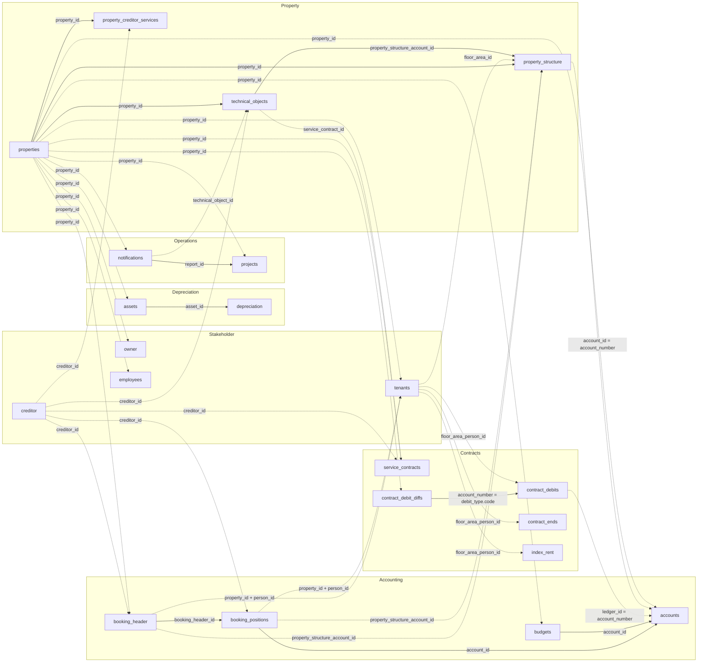

`/v1/` covers six data domains, listed by table below. Field-level detail lives in the
[API reference](/v1/api-reference/introduction) for each endpoint.

<CardGroup cols={2}>
  <Card title="Accounting" icon="book">
    `accounts`, `booking_header`, `booking_positions`, and `budgets`.
  </Card>

  <Card title="Contracts" icon="file-contract">
    `service_contracts`, `contract_debits`, `contract_debit_diffs`, `contract_ends`, and `index_rent`.
  </Card>

  <Card title="Depreciation" icon="chart-line-down">
    `assets` and `depreciation`.
  </Card>

  <Card title="Operations" icon="clipboard-list">
    `notifications` and `projects`.
  </Card>

  <Card title="Property" icon="building">
    `properties`, `property_structure`, `property_creditor_services`, and `technical_objects`.
  </Card>

  <Card title="Stakeholder" icon="users">
    `creditor`, `employees`, `owner`, and `tenants`.
  </Card>
</CardGroup>

## How the tables connect

`property_id` is the join key shared across every table on this page.

A booking transaction produces one `booking_header` row, which groups every line item it
posts (`booking_positions`). Line items post to accounts of different types — general
ledger, tenant, creditor, project, or cost centre, see `accounts.account_type_name`. Since a
transaction usually posts to at most one creditor, tenant, or cost centre, `booking_header`
already carries `creditor_id`, `person_id`, and `property_structure_account_id` directly,
without going through `booking_positions`. Each account can have a `budget` for a given
month. For a cost centre, `property_structure.account_id` matches the
`accounts.account_number` of the corresponding accounts row — not its `accounts.account_id`.
`contract_debits` references the
general ledger account it posts to via `ledger_id`, again matching `accounts.account_number`
— `contract_debit_diffs.account_number` is a different thing, a debit-type code, not a
ledger reference (see the `account_id` row below).



*Solid edges are joins within a domain; dashed edges cross into another domain.*

### Join keys in detail

| Key | Meaning | Cardinality |
|---|---|---|
| `property_id` | Identifies a property. Present on every table on this page except `creditor` (a standalone entity, referenced via `creditor_id` instead). | 1 property → many rows in each domain |
| `booking_header_id` | Groups booking line items under one header. | 1 `booking_header` → many `booking_positions` |
| `account_id` | Internal account identifier on `accounts`, `booking_positions`, and `budgets` — joins across those three. `index_rent.account_id` and `contract_debits.debit_type.code` mean something unrelated: a debit-type code — don't join those to `accounts`. `contract_debit_diffs.account_number` matches the same debit-type code under a different field name. On `property_structure`, it means something else again: a cost-centre business code, matching `accounts.account_number` for the corresponding cost-centre row, not `accounts.account_id`. | 1 `accounts` row → many `booking_positions`/`budgets` rows |
| `ledger_id` | General ledger account a debit line posts to, on `contract_debits`. Matches `accounts.account_number`, not `accounts.account_id`. | 1 `accounts` row → many `contract_debits` rows |
| `creditor_id` | Identifies a creditor. Referenced by `technical_objects`, `property_creditor_services`, `service_contracts`, `booking_header`, and `booking_positions`. | 1 creditor → many rows across domains |
| `technical_object_id` | Present on `notifications` and `orders`, resolves against `technical_objects.to_id`. | 1 technical object → many notifications |
| `report_id` | Links a project back to the notification it originated from, if any. | 1 notification → 0..N projects |
| `service_contract_id` | Links a technical object to the service contract covering it. References `service_contracts.contract_id`. | 1 contract → many technical objects |
| `person_id` | Links a booking to the tenant it applies to. Only valid combined with `property_id`, since the numbering restarts per property. A string on `tenants`/`booking_header`, a number on `booking_positions` — don't join `booking_positions` to a tenant on `person_id` directly, go through `booking_header_id` instead. Bookings link to a tenant only at the property level, not down to the individual unit — if the same tenant holds multiple units in one property, their bookings can't be separated by unit. | 1 person → 1..N tenancies per property |
| `floor_area_person_id` | Identifies a tenancy. Shared by `tenants`, `contract_debits`, `contract_ends`, and `index_rent` as the same underlying value and the same type (string) — join across them directly, without `property_id` and without a cast. | 1 tenancy → many debit/end/index rows |
| `floor_area_id` | Identifies a unit in `property_structure`. Also present on `technical_objects`, `tenants`, `contract_debits`, and `contract_ends`. | 1 unit → many rows |
| `asset_id` | Links a depreciation posting to the asset it writes down. Every `depreciation` row resolves against `assets`. | 1 asset → many postings |
| `property_structure_account_id` | Foreign key into `property_structure`, present on `booking_header`, `booking_positions`, and `technical_objects`. Always populated on the two booking tables, where it's the only route from a booking down to a unit; on `technical_objects` it's the fallback for rows without a `floor_area_id`. | 1 unit → many rows |

<Note>
  Cardinalities above describe the intended data model.
</Note>

### Key structure: composed, but not decomposable

The identifiers are hierarchical. Each one carries the identifier above it as a literal left
prefix, so a tenancy key spells out which unit and which property it belongs to:

```
property_id                    1002
└─ floor_area_id               100210001         property_id + unit number
   └─ floor_area_person_id     100210001100001   floor_area_id + person_id
```

<Warning>
  The key is built by appending: `1002` (property) + `10001` (unit number) = `floor_area_id`
  `100210001`; `100210001` + `100001` (tenant number) = `floor_area_person_id`
  `100210001100001`. Still, don't parse it back apart to extract the components. Segment widths
  aren't fixed — the same property can carry both `45111` and `451110` as `floor_area_id`, so
  `45111` is itself a prefix of `451110` and prefix matching is ambiguous. Building the key also
  drops separators, so a `person_id` of `"010-1"` ends up as the suffix `0101` and can't be
  recovered. Read `property_id`, `floor_area_id`, and `person_id` directly instead of slicing
  the composite.
</Warning>

