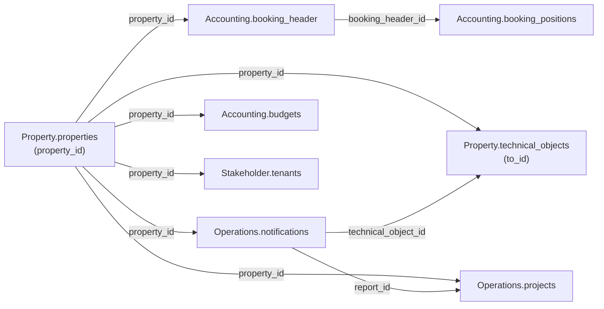

`/v1/` only documents a table once it's live. Four domains currently have at least one
documented table.

<CardGroup cols={2}>
  <Card title="Accounting" icon="book" href="/v1/data-model/accounting">
    `booking_header`, `booking_positions`, and `budgets`, with `period`, `amount`, and `amount_per_sqm` objects.
  </Card>

  <Card title="Operations" icon="clipboard-list" href="/v1/data-model/operations">
    `notifications` and `projects`, with the `technical_object_id` rename and the `hierarchy` array.
  </Card>

  <Card title="Property" icon="building" href="/v1/data-model/property">
    `properties`, with the `entrances` array and `mandate_period` object, and `technical_objects`, with the conditional `property_structure_account_id` fallback.
  </Card>

  <Card title="Stakeholder" icon="users" href="/v1/data-model/stakeholder">
    `tenants`, with lease dates, contact fields, and the `phones` array.
  </Card>
</CardGroup>

<Note>
  The rest of the unversioned data model isn't live under `/v1/` yet: the whole Contracts
  and Depreciation domains, plus `Accounting.accounts`, `Operations.offers`/`orders`,
  `Property.property_structure`/`property_creditor_services`, and
  `Stakeholder.creditor`/`employees`/`owner`. Use their unversioned equivalents in the [full
  data model](/data-model/overview) for now.
</Note>

## How the v1 tables connect

`property_id` is the join key shared across every table on this page.

### Join keys in detail

| Key | Meaning | Cardinality |
|---|---|---|
| `property_id` | Identifies a property. Present on every table on this page. | 1 property → many rows in each domain |
| `booking_header_id` | Groups booking line items under one header. | 1 `booking_header` → many `booking_positions` |
| `technical_object_id` | Links a notification to the technical object it concerns. References `technical_objects.to_id`. | 1 technical object → many notifications |
| `report_id` | Links a project back to the notification it originated from, if any. | 1 notification → 0..N projects |
| `property_structure_account_id` | Conditional fallback foreign key into the unversioned `Property.property_structure`, present on `booking_header`, `booking_positions`, and `technical_objects`. Populated only where the table's primary join key doesn't cover the row — see each table's field reference for the exact condition. | varies per table, see field reference |

`budgets` and `tenants` only carry `property_id` as a join key into the tables on this
page — see their field references for other, external join keys (`account_id`,
`floor_area_id`).

<Note>
  Cardinalities above describe the intended data model, not independently verified row
  counts. `projects.creditor_id` and `projects.to_hdr_id` are deliberately left out of this
  diagram — both are flagged as unreliable in the [Operations field
  reference](/v1/data-model/operations), so don't treat them as working joins.
</Note>
