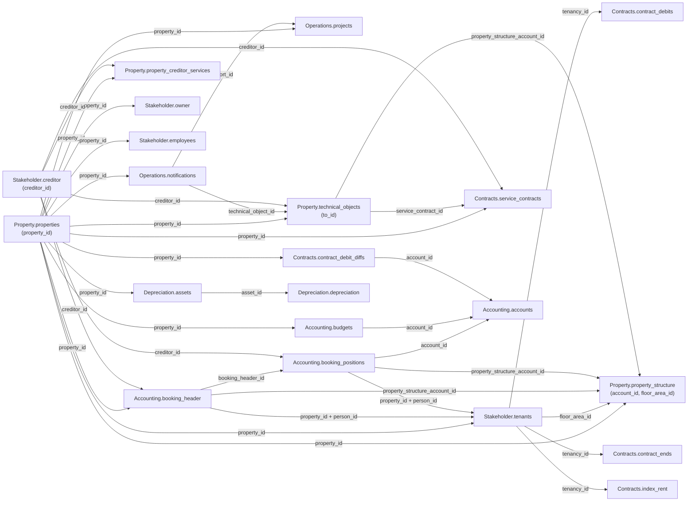

`/v1/` covers six data domains. Each domain page holds the field reference for its tables.

<CardGroup cols={2}>
  <Card title="Accounting" icon="book" href="/v1/data-model/accounting">
    `accounts`, `booking_header`, `booking_positions`, and `budgets`, with `period`, `amount`, and `amount_per_sqm` objects.
  </Card>

  <Card title="Contracts" icon="file-contract" href="/v1/data-model/contracts">
    `service_contracts`, `contract_debits`, `contract_debit_diffs`, `contract_ends`, and `index_rent`, with the `contract_period`, `debit_period`, `debit_type`, `period`, `option_state`, `validity_period`, and `calculation_model` objects.
  </Card>

  <Card title="Depreciation" icon="chart-line-down" href="/v1/data-model/depreciation">
    `assets` and `depreciation`, with the `afa_period` object and the `asset_id`/`asset_number` pair.
  </Card>

  <Card title="Operations" icon="clipboard-list" href="/v1/data-model/operations">
    `notifications` and `projects`, with `technical_object_id` and the `hierarchy` array.
  </Card>

  <Card title="Property" icon="building" href="/v1/data-model/property">
    `properties`, `property_structure`, `property_creditor_services`, and `technical_objects`, with the `entrances` array, `mandate_period` object, `levels` array, and conditional `property_structure_account_id` fallback.
  </Card>

  <Card title="Stakeholder" icon="users" href="/v1/data-model/stakeholder">
    `creditor`, `employees`, `owner`, and `tenants`, with a `phones` array on `creditor` and `tenants`.
  </Card>
</CardGroup>

<Note>
  These tables have no `/v1/` endpoint yet: `Accounting.kontenmapping_ranges` and
  `Operations.offers`/`orders`. Fetch them via the unversioned path in the meantime — see the
  [full data model](/data-model/overview).
</Note>

## How the v1 tables connect

`property_id` is the join key shared across every table on this page.

### Join keys in detail

| Key | Meaning | Cardinality |
|---|---|---|
| `property_id` | Identifies a property. Present on every table on this page except `creditor` (a standalone entity, referenced via `creditor_id` instead). | 1 property → many rows in each domain |
| `booking_header_id` | Groups booking line items under one header. | 1 `booking_header` → many `booking_positions` |
| `account_id` | Internal account identifier. | 1 `accounts` row → many `booking_positions`/`budgets` rows |
| `creditor_id` | Identifies a creditor. Referenced by `technical_objects`, `property_creditor_services`, `service_contracts`, `booking_header`, and `booking_positions` — unreliable on `projects`, see below. | 1 creditor → many rows across domains |
| `technical_object_id` | Links a notification to the technical object it concerns. References `technical_objects.to_id`. | 1 technical object → many notifications |
| `report_id` | Links a project back to the notification it originated from, if any. | 1 notification → 0..N projects |
| `service_contract_id` | Links a technical object to the service contract covering it. References `service_contracts.contract_id`. | 1 contract → many technical objects |
| `person_id` | Links a booking to the tenant it applies to. Only valid combined with `property_id`, since the numbering restarts per property. A string on `tenants`/`booking_header`, a number on `booking_positions` — see the warning below before joining across that boundary. | 1 person → 1..N tenancies per property |
| `tenancy_id` | Identifies a tenancy. Shared by `tenants`, `contract_debits`, `contract_ends`, and `index_rent` as the same underlying value — join across them directly, without `property_id`. | 1 tenancy → many debit/end/index rows |
| `floor_area_id` | Identifies a unit in `property_structure`. Also present on `technical_objects`, `tenants`, `contract_debits`, and `contract_ends`. | 1 unit → many rows |
| `asset_id` | Links a depreciation posting to the asset it writes down. Every `depreciation` row resolves against `assets`. | 1 asset → many postings |
| `property_structure_account_id` | Foreign key into [`Property.property_structure`](/v1/data-model/property#property_structure), present on `booking_header`, `booking_positions`, and `technical_objects`. Always populated on the two booking tables, where it's the only route from a booking down to a unit; on `technical_objects` it's the fallback for rows without a `floor_area_id`. | 1 unit → many rows |

<Note>
  Cardinalities above describe the intended data model, not independently verified row
  counts. `projects.creditor_id` and `projects.to_hdr_id` are deliberately left out of this
  diagram — both are flagged as unreliable in the [Operations field
  reference](/v1/data-model/operations), so don't treat them as working joins.
</Note>

<Warning>
  `person_id` comes back as a JSON string on `tenants` and `booking_header` but as a number on
  `booking_positions`, and the string form is opaque — leading zeros in varying widths and some
  values with a `"2001-1"` style suffix. Casting the number to a string does **not** reproduce
  it, so don't join `booking_positions` to a tenant on `person_id` at all: go through
  `booking_header_id` and use the header's `person_id`. `floor_area_id` has a milder version of
  the same problem: a number everywhere except `contract_debits`, where it's a string, but there
  a plain cast does work.
</Warning>
