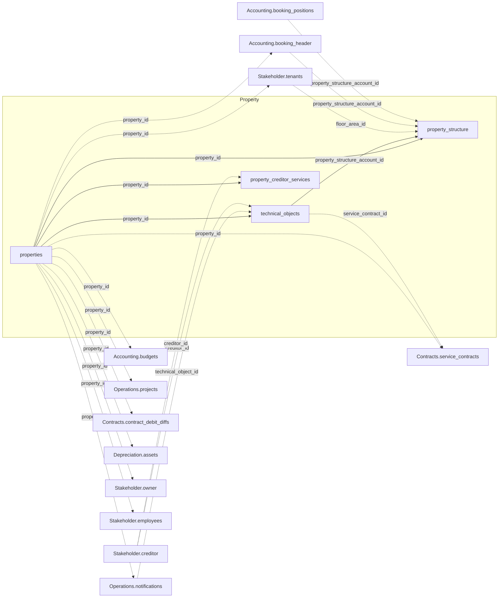

The v1 Property domain covers four tables: `properties`, `property_structure`,
`property_creditor_services`, and `technical_objects`.

## How Property connects to other domains

`properties` is the hub every other domain on this page joins to via `property_id`. Solid
edges are the internal Property joins; dashed edges are outbound joins into other domains.

For the full cross-domain diagram and join-key cardinalities, see the
[v1 data model overview](/v1/data-model/overview#how-the-v1-tables-connect).

## properties

`GET /v1/property/properties` — one row per property object.

<ResponseField name="property_id" type="string" required>
  Unique property identifier.
</ResponseField>

<ResponseField name="entrances" type="string[]">
  Building entrances / street address components, as an array with one entry per entrance.
</ResponseField>

<ResponseField name="mandate_period" type="object">
  Management mandate period — `{start, end}` (date strings).
</ResponseField>

<ResponseField name="accounting_property_id" type="string">
  Join key into the accounting-side property reference. Treat it as an opaque identifier —
  don't derive further structure from its value.
</ResponseField>

<ResponseField name="obj_name" type="string">
  Property name.
</ResponseField>

<ResponseField name="postcode" type="string">
  Postal code.
</ResponseField>

<ResponseField name="adr_city" type="string">
  City component of the property's address.
</ResponseField>

<ResponseField name="city" type="string">
  City. Distinct from `adr_city`; contact support before picking one of the two for display.
</ResponseField>

<ResponseField name="country" type="string">
  Country.
</ResponseField>

<ResponseField name="construction_year" type="integer">
  Year the property was built.
</ResponseField>

<ResponseField name="longitude" type="string">
  Longitude coordinate. Decimal value serialized as a string (e.g. `"10.01074219"`), not a JSON
  number — cast before doing arithmetic on it.
</ResponseField>

<ResponseField name="latitude" type="string">
  Latitude coordinate. Same string serialization as `longitude`.
</ResponseField>

<ResponseField name="state_name" type="string">
  Federal state.
</ResponseField>

<ResponseField name="use_type" type="string">
  Usage type of the property.
</ResponseField>

<ResponseField name="property_type" type="string">
  Property type.
</ResponseField>

<ResponseField name="tax_model" type="string">
  Tax model applied to the property.
</ResponseField>

<ResponseField name="dms_link" type="string">
  Link to the property document in the document management system, if attached.
</ResponseField>

## property_structure

`GET /v1/property/property_structure` — the hierarchy tree that connects buildings,
floors, cost centres, and floor areas (units) within a property.

<ResponseField name="property_id" type="string" required>
  Unique property identifier.
</ResponseField>

<ResponseField name="account_id" type="string" required>
  Business key for this structure node (cost centre or floor area) — format varies by node
  type (e.g. `"ALLE/5"` for a cost centre, `"9990/91021"` for a floor area). Referenced by
  `Property.technical_objects.property_structure_account_id`,
  `Accounting.booking_header.property_structure_account_id`, and
  `Accounting.booking_positions.property_structure_account_id`. Unrelated to the integer
  `account_id` used on `Accounting.accounts`/`booking_positions`/`budgets` — see the [Field
  Glossary](/v1/data-model/field-glossary) for that distinction.
</ResponseField>

<ResponseField name="floor_area_id" type="integer">
  Floor-area identifier, populated only on rows where `account_type.code` is `"F"` (a
  floor area / unit).
</ResponseField>

<ResponseField name="levels" type="object[]">
  Hierarchy path from the property down to this node, one entry per level (e.g. floor, then
  floor area) — `{name, type}`. Empty for cost-centre nodes.
</ResponseField>

<ResponseField name="account_type" type="object">
  Node type — `{code, label}` (e.g. `{"code": "F", "label": "Fläche"}`, `{"code": "K",
  "label": "Kostenstelle"}`). Many codes exist beyond cost centre/floor area (building,
  floor, building part, and customer-specific groupings) — treat `code` as an opaque
  classification rather than an enum you exhaustively branch on.
</ResponseField>

<ResponseField name="mandate_period" type="object">
  Management mandate period for this node — `{start, end}` (date strings). A missing key
  (rather than `null`) means that boundary isn't set; an empty object means neither is.
</ResponseField>

<ResponseField name="floor_area_period" type="object">
  Period this floor area has been on file, same shape as `mandate_period` above.
</ResponseField>

<ResponseField name="active_period" type="object">
  Period this node has been active, same shape as `mandate_period` above.
</ResponseField>

<ResponseField name="bt_hdr_id" type="integer">
  Identifier of the cost-allocation group (`Beteiligungskreis`) this row defines. Populated on
  exactly the rows where `is_beteiligungskreis` is `true`, `null` on all others.
</ResponseField>

<ResponseField name="is_beteiligungskreis" type="boolean">
  Whether this node is a cost-allocation group — a set of areas that share an operating-cost
  position, rather than a physical part of the building.
</ResponseField>

<ResponseField name="is_core_structure" type="boolean">
  Whether this node belongs to the physical building hierarchy (building, building part,
  floor) as opposed to a unit or a cost-allocation group.
</ResponseField>

<ResponseField name="structure_level_type" type="string">
  Level name for physical hierarchy nodes (`"Gebäude"`, `"Gebäudeteil"`, `"Geschoss"`), `null`
  for everything else. Where set it repeats `account_type.label` exactly — prefer
  `account_type`, which is populated on every row.
</ResponseField>

<ResponseField name="property_name" type="string">
  Property name.
</ResponseField>

<ResponseField name="account_name" type="string">
  Display name of the structure node (cost centre or unit name).
</ResponseField>

<ResponseField name="floor_area_nr" type="string">
  Floor-area number, populated only on floor-area rows.
</ResponseField>

<ResponseField name="address" type="string">
  Address of this node, populated only on floor-area rows.
</ResponseField>

<ResponseField name="entrance" type="string">
  Building entrance, if this node has one.
</ResponseField>

<ResponseField name="building_part" type="string">
  Building part / wing, if applicable.
</ResponseField>

<ResponseField name="floor" type="string">
  Floor within the building, if applicable.
</ResponseField>

<ResponseField name="floor_area_name" type="string">
  Name of the floor area (unit), populated only on floor-area rows.
</ResponseField>

<ResponseField name="location" type="string">
  Position of the unit within the building (e.g. left/right), if recorded.
</ResponseField>

<ResponseField name="floor_area_type" type="string">
  Usage type of the unit (e.g. `"Wohnung"` for residential), populated only on floor-area
  rows.
</ResponseField>

<ResponseField name="no_marketing" type="boolean">
  Whether this unit is excluded from vacancy marketing.
</ResponseField>

<ResponseField name="target_rent_per_m2" type="string">
  Target (budgeted) rent per square metre for this unit. Decimal value serialized as a
  string, not a JSON number — cast before doing arithmetic on it.
</ResponseField>

<ResponseField name="market_rent_per_m2" type="string">
  Market rent per square metre for this unit. Same serialization as `target_rent_per_m2`
  above.
</ResponseField>

<ResponseField name="heating" type="string">
  Heating type for this unit, if recorded.
</ResponseField>

<ResponseField name="vacancy_reason" type="string">
  Reason code for this unit's vacancy, if currently vacant.
</ResponseField>

<ResponseField name="vacancy_reason_comment" type="string">
  Free-text comment on the vacancy reason.
</ResponseField>

<ResponseField name="vacancy_reason_begin_date" type="date">
  Date the current vacancy began.
</ResponseField>

<ResponseField name="url" type="string">
  Link to a property photo, if available.
</ResponseField>

<ResponseField name="m2" type="string">
  Floor area in square metres. Decimal value serialized as a string, not a JSON number —
  cast before doing arithmetic on it.
</ResponseField>

<ResponseField name="target_rent_total" type="string">
  Target (budgeted) rent total for this unit. Decimal value serialized as a string, not a
  JSON number — cast before doing arithmetic on it.
</ResponseField>

<ResponseField name="market_rent_total" type="string">
  Market rent total for this unit. Same serialization as `target_rent_total` above.
</ResponseField>

<ResponseField name="dms_link" type="string">
  Link to the related document in the document management system, if attached.
</ResponseField>

<Note>
  Not every column is populated for every node type — `floor_area_id`, `floor_area_nr`,
  `address`, `floor_area_name`, `floor_area_type`, and the rent/vacancy fields are only set
  on floor-area rows (`account_type.code` = `"F"`); `levels` is empty on cost-centre rows.
  `m2` is populated on structural and allocation nodes too, so summing it across all rows of a
  property double-counts — filter to `account_type.code` = `"F"` first.
</Note>

<Warning>
  `floor_area_id` comes back as a number here and on `Stakeholder.tenants` and
  `Contracts.contract_ends`, but as a JSON string on `Contracts.contract_debits`. Cast to a
  common type before joining across that boundary.
</Warning>

## property_creditor_services

`GET /v1/property/property_creditor_services` — which creditor provides which service for
a property, and whether that assignment is exclusive.

<ResponseField name="property_id" type="string" required>
  Unique property identifier.
</ResponseField>

<ResponseField name="creditor_id" type="string" required>
  References `Stakeholder.creditor` — see the [Stakeholder field
  reference](/v1/data-model/stakeholder).
</ResponseField>

<ResponseField name="service" type="string">
  Service name (e.g. cleaning, elevator maintenance).
</ResponseField>

<ResponseField name="exclusivity" type="object">
  Whether the creditor holds an exclusive assignment for this service at this property —
  `{code, label}` (e.g. `{"code": 1, "label": "Exklusiv"}`), per the [response
  structure](/v1/response-shape-conventions) rules.
</ResponseField>

## technical_objects

`GET /v1/property/technical_objects` — technical/metered installations at a property
(elevators, heating systems, meters, and similar equipment).

The inspection, maintenance, and warranty fields are part of the response but barely
populated in practice — see the warning at the end of this section before you build on them.

<ResponseField name="to_id" type="integer" required>
  Technical object identifier.
</ResponseField>

<ResponseField name="property_id" type="string" required>
  Unique property identifier.
</ResponseField>

<ResponseField name="floor_area_id" type="integer">
  Floor area the technical object is installed in, if applicable. Set on every row that has
  no `property_structure_account_id` — exactly one of the two is always present.
</ResponseField>

<ResponseField name="creditor_id" type="string">
  Creditor responsible for the object. References `Stakeholder.creditor` — see
  the [Stakeholder field reference](/v1/data-model/stakeholder). `null` on most rows.
</ResponseField>

<ResponseField name="service_contract_id" type="string">
  Service contract covering this object. References
  [`Contracts.service_contracts.contract_id`](/v1/data-model/contracts). `null` on most
  rows, and not every value resolves — treat a missing match as "no contract on file"
  rather than an error.
</ResponseField>

<ResponseField name="to_nr" type="string">
  Technical object number.
</ResponseField>

<ResponseField name="name" type="string">
  Object name.
</ResponseField>

<ResponseField name="type" type="string">
  Object type.
</ResponseField>

<ResponseField name="built_date" type="date">
  Installation/build date.
</ResponseField>

<ResponseField name="is_meter" type="boolean">
  Whether this object represents a meter.
</ResponseField>

<ResponseField name="inactive" type="boolean">
  Whether the object is decommissioned. `false` on every row today.
</ResponseField>

<ResponseField name="responsible_person" type="string">
  Person responsible for the object. Only a handful of distinct values, and an empty string on
  about a third of the rows.
</ResponseField>

<ResponseField name="comment" type="string">
  Free-text comment on the object.
</ResponseField>

<ResponseField name="is_inspection_relevant" type="boolean">
  Whether the object is subject to a recurring inspection (`Prüfung`). `true` on roughly 20 of
  1,250 rows.
</ResponseField>

<ResponseField name="inspection_type" type="string">
  Kind of inspection required.
</ResponseField>

<ResponseField name="inspection_date" type="date">
  Date of the inspection. Populated on a single row — treat it as unavailable rather than as
  "no inspection due".
</ResponseField>

<ResponseField name="is_maintenance_relevant" type="boolean">
  Whether the object is subject to recurring maintenance (`Wartung`). `true` on roughly 20 of
  1,250 rows.
</ResponseField>

<ResponseField name="maintenance_type" type="string">
  Kind of maintenance required.
</ResponseField>

<ResponseField name="maintenance_date" type="date">
  Date of the maintenance. `null` on every row today.
</ResponseField>

<ResponseField name="maintenance_creditor_id" type="string">
  Creditor contracted for the maintenance. `null` on every row today — use
  `service_contract_id` to find who maintains the object.
</ResponseField>

<ResponseField name="maintenance_creditor_name" type="string">
  Name of the maintenance creditor. An empty string on every row today, matching
  `maintenance_creditor_id`.
</ResponseField>

<ResponseField name="warranty_period" type="object">
  Warranty term — `{start, end}` (date strings). The object is present on every row, but both
  members are `null` on all but one, so there is effectively no warranty data here yet.
</ResponseField>

<ResponseField name="property_structure_account_id" type="string">
  Foreign key into [`Property.property_structure`](#property_structure), matching its
  `account_id`. Populated conditionally: set only for rows without a `floor_area_id`;
  everywhere else it's `null` and `floor_area_id` is the join key. The two never appear
  together and never both `null`.
</ResponseField>

<Note>
  There is no separate meter-reading endpoint. A `technical_objects` row can represent a
  meter, but this endpoint only returns the object's master data (type, location,
  responsible creditor) — not consumption readings.
</Note>

<Warning>
  The inspection, maintenance, and warranty fields are exposed but almost entirely unpopulated
  in the source system. Don't build compliance or scheduling logic on them without checking the
  actual fill rate for your own data first.
</Warning>
