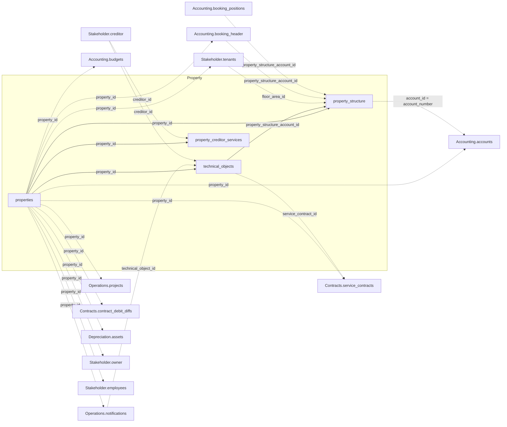

`property_id` is the join key shared with every other domain — see the
[Data Model Overview](/v1/data-model/overview) for the complete cross-domain diagram and the
join-key reference table. The diagram below repeats the Property-internal joins (solid) plus
every edge that touches a Property table from elsewhere (dashed).

*Solid edges are joins within Property; dashed edges cross into another domain.*

## properties

`GET /v1/property/properties` — property master data: address, usage type, and coordinates.

<ResponseField name="property_id" type="string" required>
  Unique property identifier.
</ResponseField>

<ResponseField name="entrances" type="string[]">
  Entrance / street labels for the property, up to five. Empty entries are omitted.
</ResponseField>

<ResponseField name="mandate_period" type="object">
  The management mandate period for this property.
  <Expandable title="properties">
    <ResponseField name="start" type="date">
      Start of the mandate.
    </ResponseField>
    <ResponseField name="end" type="date">
      End of the mandate.
    </ResponseField>
  </Expandable>
</ResponseField>

<ResponseField name="accounting_property_id" type="string">
  Property number of the accounting unit this property books under. A verified,
  self-referencing foreign key back onto `property_id` — resolve it against another row on
  this same endpoint.
</ResponseField>

<ResponseField name="obj_name" type="string">
  Property name.
</ResponseField>

<ResponseField name="postcode" type="string">
  Postal code.
</ResponseField>

<ResponseField name="adr_city" type="string">
  City, cleaned.
</ResponseField>

<ResponseField name="city" type="string">
  City, as originally entered. Can differ from `adr_city` where the source data wasn't
  normalized.
</ResponseField>

<ResponseField name="country" type="string">
  Country. Currently always empty across all properties.
</ResponseField>

<ResponseField name="construction_year" type="integer">
  Year the property was built.
</ResponseField>

<ResponseField name="longitude" type="number">
  Geographic longitude.
</ResponseField>

<ResponseField name="latitude" type="number">
  Geographic latitude.
</ResponseField>

<ResponseField name="state_name" type="string">
  Federal state.
</ResponseField>

<ResponseField name="use_type" type="string">
  Usage type of the property.
</ResponseField>

<ResponseField name="property_type" type="string">
  Property category: rental property, general-ledger entity, client, or management entity.
</ResponseField>

<ResponseField name="tax_model" type="string">
  Tax-model code. No documented label mapping exists for this code.
</ResponseField>

<ResponseField name="dms_link" type="string">
  Link to the associated document in the DMS.
</ResponseField>

## property_structure

`GET /v1/property/property_structure` — every structural component of a property, flattened
into one row per component: the property itself, a building, a building part / entrance, a
floor, or a unit / rental area.

<ResponseField name="property_id" type="string" required>
  Unique property identifier.
</ResponseField>

<ResponseField name="account_id" type="string">
  Cost-centre business code for this row. Matches `accounts.account_number`, not
  `accounts.account_id` — see the [Overview](/v1/data-model/overview#join-keys-in-detail) for
  the full join-key reference.
</ResponseField>

<ResponseField name="floor_area_id" type="integer">
  Identifies a unit. Only populated for rows that represent a unit / rental area.
</ResponseField>

<ResponseField name="levels" type="object[]">
  The component's position in the property's structural hierarchy, as an ordered list of
  `{name, type}` levels. Empty levels are omitted.
</ResponseField>

<ResponseField name="account_type" type="object">
  What kind of structural component this row is.
  <Expandable title="properties">
    <ResponseField name="code" type="string">
      Short code.
    </ResponseField>
    <ResponseField name="label" type="string">
      Unit, building, floor, property, or person.
    </ResponseField>
  </Expandable>
</ResponseField>

<ResponseField name="mandate_period" type="object">
  Mandate period for this component.
  <Expandable title="properties">
    <ResponseField name="start" type="date">
      Start of the mandate.
    </ResponseField>
    <ResponseField name="end" type="date">
      End of the mandate.
    </ResponseField>
  </Expandable>
</ResponseField>

<ResponseField name="floor_area_period" type="object">
  Validity period of the unit.
  <Expandable title="properties">
    <ResponseField name="start" type="date">
      Start of validity.
    </ResponseField>
    <ResponseField name="end" type="date">
      End of validity.
    </ResponseField>
  </Expandable>
</ResponseField>

<ResponseField name="active_period" type="object">
  Combined active window across the underlying source periods.
  <Expandable title="properties">
    <ResponseField name="start" type="date">
      Latest of the underlying start dates.
    </ResponseField>
    <ResponseField name="end" type="date">
      Earliest of the underlying end dates.
    </ResponseField>
  </Expandable>
</ResponseField>

<ResponseField name="is_beteiligungskreis" type="boolean">
  Whether this row comes from a genuine "Beteiligungskreis" (shared-ownership group),
  independent of client.
</ResponseField>

<ResponseField name="is_core_structure" type="boolean">
  Whether this row belongs to the property's core building structure (building, building
  part, or floor) rather than a unit.
</ResponseField>

<ResponseField name="structure_level_type" type="string">
  Level of the core building structure: building, building part, or floor. `null` when
  `is_core_structure` is `false`.
</ResponseField>

<ResponseField name="property_name" type="string">
  Property name.
</ResponseField>

<ResponseField name="account_name" type="string">
  Cost-centre name.
</ResponseField>

<ResponseField name="floor_area_nr" type="string">
  Unit number.
</ResponseField>

<ResponseField name="address" type="string">
  Address of this component.
</ResponseField>

<ResponseField name="entrance" type="string">
  Entrance label.
</ResponseField>

<ResponseField name="building_part" type="string">
  Building-part label.
</ResponseField>

<ResponseField name="floor" type="string">
  Floor label.
</ResponseField>

<ResponseField name="floor_area_name" type="string">
  Unit name.
</ResponseField>

<ResponseField name="location" type="string">
  Location description.
</ResponseField>

<ResponseField name="floor_area_type" type="string">
  Usage type of the unit.
</ResponseField>

<ResponseField name="no_marketing" type="boolean">
  Whether this unit is excluded from marketing.
</ResponseField>

<ResponseField name="target_rent_per_m2" type="number">
  Target rent per square metre.
</ResponseField>

<ResponseField name="market_rent_per_m2" type="number">
  Market rent per square metre.
</ResponseField>

<ResponseField name="heating" type="string">
  Heating type.
</ResponseField>

<ResponseField name="vacancy_reason" type="string">
  Vacancy-reason code.
</ResponseField>

<ResponseField name="vacancy_reason_comment" type="string">
  Free-text comment on the vacancy reason.
</ResponseField>

<ResponseField name="vacancy_reason_begin_date" type="date">
  Start of the vacancy.
</ResponseField>

<ResponseField name="url" type="string">
  URL of a photo of the unit.
</ResponseField>

<ResponseField name="m2" type="number">
  Unit size in square metres.
</ResponseField>

<ResponseField name="target_rent_total" type="number">
  Total target rent.
</ResponseField>

<ResponseField name="market_rent_total" type="number">
  Total market rent.
</ResponseField>

<ResponseField name="dms_link" type="string">
  Link to the associated document in the DMS.
</ResponseField>

## property_creditor_services

`GET /v1/property/property_creditor_services` — which creditors (service providers) are
assigned to a property, by trade.

<ResponseField name="property_id" type="string" required>
  Unique property identifier.
</ResponseField>

<ResponseField name="creditor_id" type="string" required>
  Identifies the creditor. See `Stakeholder.creditor`.
</ResponseField>

<ResponseField name="exclusivity" type="object">
  Whether this creditor holds this trade exclusively for the property.
  <Expandable title="properties">
    <ResponseField name="code" type="string">
      Short code.
    </ResponseField>
    <ResponseField name="label" type="string">
      Human-readable label.
    </ResponseField>
  </Expandable>
</ResponseField>

<ResponseField name="service" type="string">
  The trade this assignment covers.
</ResponseField>

## technical_objects

`GET /v1/property/technical_objects` — technical installations and equipment, with location,
maintenance, and inspection details.

<ResponseField name="property_id" type="string" required>
  Unique property identifier.
</ResponseField>

<ResponseField name="creditor_id" type="string">
  Creditor responsible for the object, if any.
</ResponseField>

<ResponseField name="floor_area_id" type="integer">
  Unit the object is located in, if assigned at that level.
</ResponseField>

<ResponseField name="technical_object_id" type="integer" required>
  Unique identifier for the technical object.
</ResponseField>

<ResponseField name="technical_object_nr" type="string">
  Business number of the technical object.
</ResponseField>

<ResponseField name="name" type="string">
  Name of the technical object.
</ResponseField>

<ResponseField name="type" type="string">
  Type / category of the object.
</ResponseField>

<ResponseField name="responsible_person" type="string">
  Employee responsible for the object.
</ResponseField>

<ResponseField name="built_date" type="date">
  Installation / manufacture date.
</ResponseField>

<ResponseField name="inspection_date" type="date">
  Date of the last inspection.
</ResponseField>

<ResponseField name="maintenance_date" type="date">
  Date of the last maintenance.
</ResponseField>

<ResponseField name="comment" type="string">
  Free-text comment.
</ResponseField>

<ResponseField name="is_meter" type="boolean">
  Whether this object is a meter.
</ResponseField>

<ResponseField name="is_maintenance_relevant" type="boolean">
  Whether this object is subject to maintenance.
</ResponseField>

<ResponseField name="maintenance_type" type="string">
  Maintenance-type code.
</ResponseField>

<ResponseField name="maintenance_creditor_id" type="string">
  Creditor responsible for maintenance.
</ResponseField>

<ResponseField name="maintenance_creditor_name" type="string">
  Name of the maintenance creditor.
</ResponseField>

<ResponseField name="is_inspection_relevant" type="boolean">
  Whether this object is subject to inspection.
</ResponseField>

<ResponseField name="inspection_type" type="string">
  Inspection-type code.
</ResponseField>

<ResponseField name="inactive" type="boolean">
  Whether this object is decommissioned.
</ResponseField>

<ResponseField name="service_contract_id" type="string">
  Service contract covering this object, if any. See `Contracts.service_contracts`.
</ResponseField>

<ResponseField name="property_structure_account_id" type="string">
  Foreign key into `property_structure`. Only set for rows without a `floor_area_id` (roughly
  a quarter of rows) — where `floor_area_id` is set, that's already the join path to the unit
  and this field stays empty.
</ResponseField>

<ResponseField name="warranty_period" type="object">
  Warranty period, if recorded. Rarely populated.
  <Expandable title="properties">
    <ResponseField name="start" type="date">
      Start of the warranty.
    </ResponseField>
    <ResponseField name="end" type="date">
      End of the warranty.
    </ResponseField>
  </Expandable>
</ResponseField>
