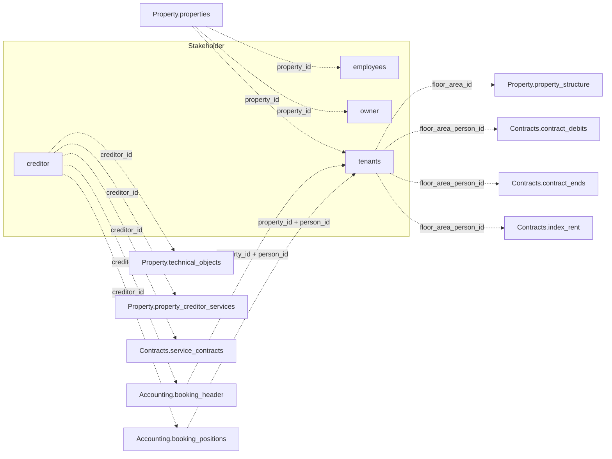

None of the four tables below join each other directly. `employees`, `owner`, and `tenants`
join to Property via `property_id`; `tenants` also bridges into Contracts via
`floor_area_person_id`. `creditor` is a standalone entity with no `property_id` column,
referenced from Property and Accounting via `creditor_id`. See the
[Data Model Overview](/v1/data-model/overview) for the complete cross-domain diagram.

*Every edge here crosses into another domain — none of the four Stakeholder tables join each
other directly.*

## creditor

`GET /v1/stakeholder/creditor` — vendor and creditor master data. This is the only
Stakeholder endpoint without a `property_id` column — a creditor is a standalone entity that
can serve multiple properties, referenced by `creditor_id` from `Property.technical_objects`,
`Property.property_creditor_services`, `Contracts.service_contracts`, and
`Accounting.booking_header`/`booking_positions`.

<ResponseField name="creditor_id" type="string" required>
  Unique creditor identifier.
</ResponseField>

<ResponseField name="name_1" type="string">
  Primary name line (company or last name).
</ResponseField>

<ResponseField name="name_2" type="string">
  Secondary name line.
</ResponseField>

<ResponseField name="type" type="string">
  Creditor type.
</ResponseField>

<ResponseField name="address_line_1" type="string">
  First line of the postal address, above `street_nr`.
</ResponseField>

<ResponseField name="street_nr" type="string">
  Street and house number.
</ResponseField>

<ResponseField name="zipcode_city" type="string">
  Postal code and city, combined into one field.
</ResponseField>

<ResponseField name="mail" type="string">
  Email address.
</ResponseField>

<ResponseField name="homepage" type="string">
  Website URL. A literal `"---"` placeholder in the source system is converted to `null`.
</ResponseField>

<ResponseField name="contact_person" type="string">
  Named contact at the creditor.
</ResponseField>

<ResponseField name="phones" type="string[]">
  Phone numbers, up to three per record. Empty entries are omitted.
</ResponseField>

<ResponseField name="bank" type="string">
  Bank name.
</ResponseField>

<ResponseField name="iban" type="string">
  Bank account IBAN.
</ResponseField>

<ResponseField name="swift" type="string">
  SWIFT/BIC code of the creditor's bank — the same thing `owner` calls `bic`.
</ResponseField>

<ResponseField name="tax_id" type="string">
  Tax identification number.
</ResponseField>

<ResponseField name="exemption_certificate" type="boolean">
  Whether a construction-withholding-tax exemption certificate
  (`Freistellungsbescheinigung`, §48b EStG) is on file. Relevant when the creditor performs
  construction work.
</ResponseField>

<ResponseField name="exemption_certificate_date" type="date">
  Date on the exemption certificate. Which date it is — issued or expiring — is undocumented;
  contact support before relying on it.
</ResponseField>

<ResponseField name="industry" type="string">
  Industry classification.
</ResponseField>

<ResponseField name="industry_info" type="string">
  Additional industry detail. How it relates to `industry` is undocumented — contact support
  before relying on it.
</ResponseField>

<ResponseField name="dms_link" type="string">
  Link to the associated document in the DMS.
</ResponseField>

## employees

`GET /v1/stakeholder/employees` — the property management team responsible for a property.

<ResponseField name="property_id" type="string" required>
  Unique property identifier.
</ResponseField>

<ResponseField name="team" type="string">
  Team name responsible for the property.
</ResponseField>

<ResponseField name="first_name" type="string">
  Employee first name.
</ResponseField>

<ResponseField name="last_name" type="string">
  Employee last name.
</ResponseField>

<ResponseField name="phone" type="string">
  Contact phone number.
</ResponseField>

<ResponseField name="mail" type="string">
  Contact email address.
</ResponseField>

<ResponseField name="inactive" type="boolean">
  Whether the employee record is inactive.
</ResponseField>

<Note>
  This endpoint returns one row per property showing the responsible team/employee — it is
  not a general employee directory.
</Note>

## owner

`GET /v1/stakeholder/owner` — property owner master data, including ownership share for
co-owned properties.

<ResponseField name="property_id" type="string" required>
  Unique property identifier.
</ResponseField>

<ResponseField name="debitor_id" type="integer" required>
  Owner identifier.
</ResponseField>

<ResponseField name="share" type="number">
  Ownership share as a percentage, capped at 100. `null` means no share is recorded. A
  property can have multiple `owner` rows that sum to the total share.
</ResponseField>

<ResponseField name="salutation" type="string">
  Salutation/title.
</ResponseField>

<ResponseField name="name" type="string">
  Owner name (individual or company).
</ResponseField>

<ResponseField name="name_2" type="string">
  Secondary name line.
</ResponseField>

<ResponseField name="street_nr" type="string">
  Street and house number.
</ResponseField>

<ResponseField name="zipcode_city" type="string">
  Postal code and city, combined into one field.
</ResponseField>

<ResponseField name="phone" type="string">
  Contact phone number.
</ResponseField>

<ResponseField name="bank" type="string">
  Bank name.
</ResponseField>

<ResponseField name="fax" type="string">
  Fax number.
</ResponseField>

<ResponseField name="mail" type="string">
  Contact email address.
</ResponseField>

<ResponseField name="bic" type="string">
  BIC code of the owner's bank — the same thing `creditor` calls `swift`.
</ResponseField>

<ResponseField name="iban" type="string">
  Bank account IBAN.
</ResponseField>

<ResponseField name="account_number" type="string">
  The owner's own bank account number, paired with `iban`. Unrelated to
  `Accounting.accounts.account_number`, which identifies a ledger account.
</ResponseField>

## tenants

`GET /v1/stakeholder/tenants` — tenant master data and current lease terms.

<ResponseField name="property_id" type="string" required>
  Unique property identifier.
</ResponseField>

<ResponseField name="floor_area_person_id" type="string" required>
  Identifies a tenancy. Shared with `Contracts.contract_debits`, `Contracts.contract_ends`,
  and `Contracts.index_rent` — see the
  [Data Model Overview](/v1/data-model/overview#join-keys-in-detail) for the full join-key
  reference.
</ResponseField>

<ResponseField name="floor_area_id" type="integer">
  Unit the tenant occupies. Joins to `Property.property_structure.floor_area_id`.
</ResponseField>

<ResponseField name="person_id" type="string">
  Identifies the tenant. Only valid combined with `property_id`, since numbering restarts per
  property — see the [Data Model Overview](/v1/data-model/overview#join-keys-in-detail).
</ResponseField>

<ResponseField name="person_name" type="string">
  Full tenant name as a single field. No separate first/last name available.
</ResponseField>

<ResponseField name="name_1" type="string">
  Primary name line of the tenant's own contact address, if different from the unit address.
</ResponseField>

<ResponseField name="name_2" type="string">
  Secondary name line of the tenant's own contact address.
</ResponseField>

<ResponseField name="street_nr" type="string">
  Street and house number of the tenant's own contact address.
</ResponseField>

<ResponseField name="zipcode_city" type="string">
  Postal code and city of the tenant's own contact address, combined into one field.
</ResponseField>

<ResponseField name="contact_phone_main" type="string">
  Main phone number.
</ResponseField>

<ResponseField name="contact_mail" type="string">
  Contact email address.
</ResponseField>

<ResponseField name="phones" type="string[]">
  Additional phone numbers, up to three per record — same shape as `Stakeholder.creditor.phones`.
  Empty entries are omitted.
</ResponseField>

<ResponseField name="iban" type="string">
  Bank account IBAN.
</ResponseField>

<ResponseField name="bank" type="string">
  Bank name.
</ResponseField>

<ResponseField name="contract_period" type="object">
  The lease period.
  <Expandable title="properties">
    <ResponseField name="start" type="date">
      Lease start date.
    </ResponseField>
    <ResponseField name="end" type="date">
      Lease end date.
    </ResponseField>
  </Expandable>
</ResponseField>

<ResponseField name="contract_end_option" type="date">
  Lease end date if an extension option is exercised.
</ResponseField>

<ResponseField name="dms_link" type="string">
  Link to the associated document in the DMS.
</ResponseField>
